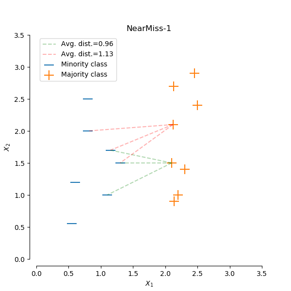
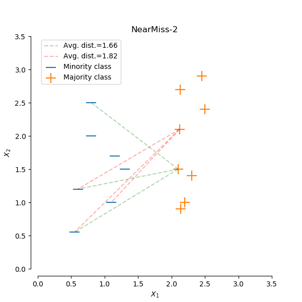
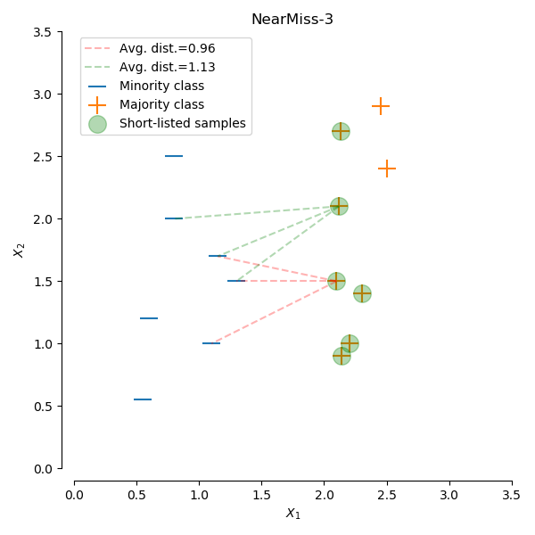
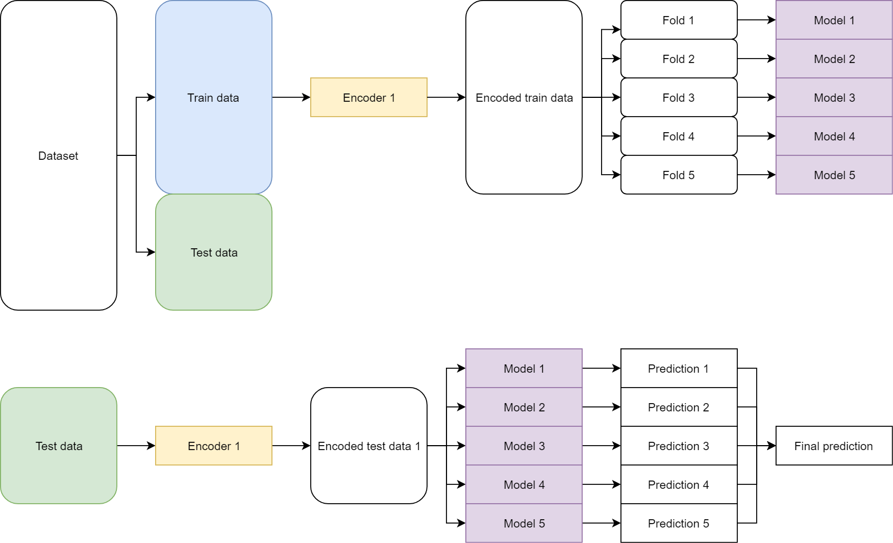
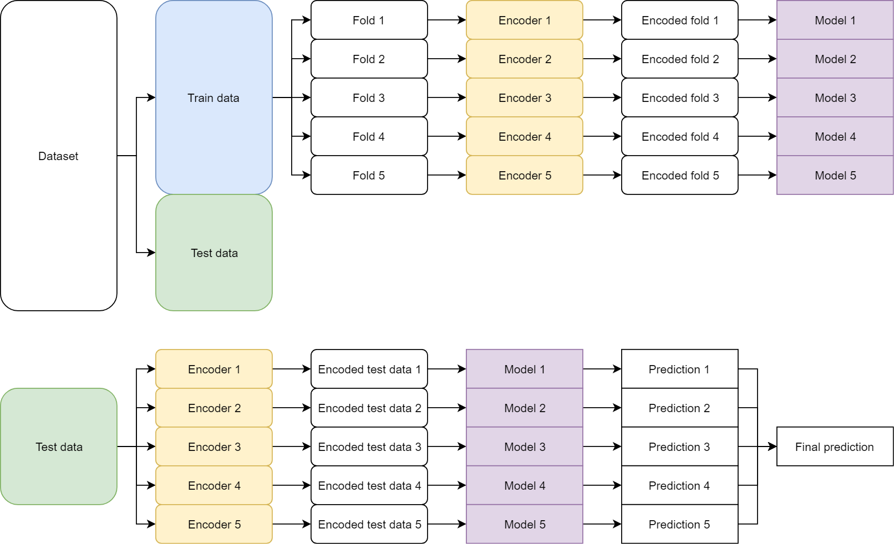
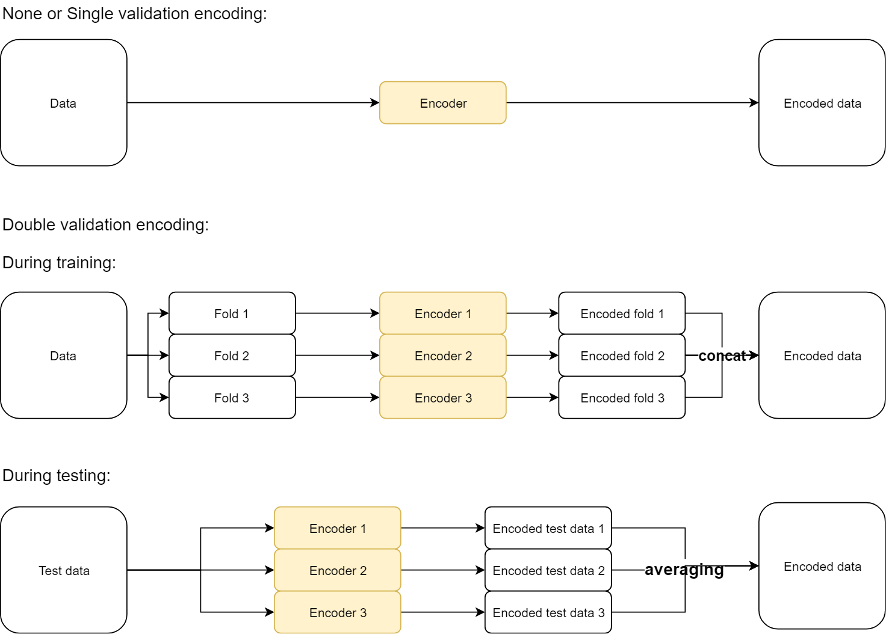

Start:2019.05.30

# 应用问题

* 时效性
* 非平衡数据

# 预处理

## 少就是多

例如group\agg，目的是：

* 减少内存占用，降低处理时间
* 转换范围（std）、标度（scale），使对象行为更稳定。像LR这种就需要对标度进行统一预处理，当前的Boost系列对scale基本没有要求

缺点就是丢失处理后丢失细节，原始指标的直观的可解释性没了。

## 特征子集搜索

* 所有特征全用；逐步排除特征，若结果持平或者更好，就有效
* 特征加权（不同的算法实现方式不同，最原始的办法就是重复数据）

## 离散化

* 类别特征：one-hot、dummy code
* 连续特征：非监督方法，等宽（易受离群点影响），等频率（qcut），KMeans；监督方法，纯度（就是树模型的划分方法）

## 变量变换

* 函数，把数据分布修正为想要的分布，如$x^k$，logx，$e^x$，$\sqrt{x}$，1/x，sinx，$|x|$。一种说法是log transform降低方差，因为$x^2$->log(x)->2logx；还有一种说法是根据自己的研究目标，例如线性数据看的是绝对变换，取log之后看的是相对变化。[解答链接](https://stats.stackexchange.com/questions/18844/when-and-why-should-you-take-the-log-of-a-distribution-of-numbers)
* standardization\normalization，为了避免outlier的影响，用中位数替代mean，或者用绝对标准差$\sigma_A=\sum{_{i=1}^{m}|x_i-\mu|}$。

# 距离、相似度指标

## 距离的三个条件

非负；对称；三角不等式（$d_{AB}+d_{BC}<d_{AC}$）

## minkowski distance

$d(x,y)=(\sum_{k=1}^{n}|x_k-y_k|^r)^{\frac{1}{r}}$

r=1，曼哈顿距离

r=2，欧式距离

$r=\infin$，上确界，也叫$L_{max}$、$L_\infin$范数。

《统计学习方法》上面有直观的图解，网上也有。

## 简单匹配系数（simple matching coefficient, SMC）

$SMC=\frac{值的匹配个数}{属性个数}=\frac{f_{11}+f_{00}}{f_{11}+f_{00}+f_{10}+f_{01}}$

## Jaccard系数

$J=\frac{匹配个数}{不含00的匹配个数}=\frac{f_{11}}{f_{11}+f_{10}+f_{01}}$

## 余弦相似度（稀疏向量适用）

$cos(x,y)=\frac{x}{||x||}·\frac{y}{||y||}$

## pearson相关系数

$corr(x,y)=\frac{covariance(x,y)}{standard\_deviation(x)·std(y)}=\frac{S_{xy}}{S_x·S_y}$

协方差：$S_{xy}=\frac{1}{n-1}\sum_{k=1}^n(x_k-\bar{x})(y_k-\bar{y})$

标准差：$S_x=\sqrt{\frac{1}{n-1}\sum_{i=1}^n{(x_k-\bar{x})^2}}$

## spearman相关系数

查看特征之间的单调关系，单调增or单调减。

先对数据进行排序，得到x、y的序号，用序号作为corr方程的输入，这样就可以判断x、y是否有单调关系了。

## 马氏距离

考虑变量之间的关系。[图解](https://www.cnblogs.com/-Sai-/p/6795156.html)

# 统计量

* 频率
* 众数
* 百分位数（percentile）
* 均值
* 中位数
* 方差
* 绝对平均偏差$AAD=\frac{1}{m}\sum_{i=1}^{m}|x_i-\bar{x}|$
* 中位数绝对偏差$MAD=median(|x_1-\bar{x}|,x_2-\bar{x},...,x_n-\bar{x})$
* 四分位数偏差$interquantile range=x_{75\%}-x_{25\%}$
* 协方差矩阵
* 相关性矩阵
* 偏度skewness
* 峰度kurtosis

# 异常检测

对于outlier，尽管出现的概率低，但是基数大时，出现次数也会很可观。

## 应用领域

* 欺诈检测
* 入侵检测（系统、网络异常）
* 生态系统失调（自然灾害成因）
* 公共卫生
* 医疗

## 异常的成因

* 数据来源于不同的类
* 自然变异（如正态分布建模，总有原理mean的极端值）
* 数据测量和收集误差（目标是删除之，因为它不提供有意义的信息，只会降低数据和之后EDA的质量）

## 发现方法

* 基于模型：用概率分布来拟合，如GMM
* 基于距离
* 基于密度：当一个点的局部密度显著低于它的大部分近邻时判为outlier

## 处理

* **定义异常的属性个数**：即使一个对象的所有属性值都在正常范围之内，但组合起来未必正常。例如，身高160cm，体重100kg
* 全局or局部（其实就是密度尺度问题）：从全局上看是异常，但与其近邻相比差异却不大
* 异常程度，同上：outlier score不是简单的二元划分
* 评估：需要用有监督学习
* 有效性：计算开销、复杂度

### 基于统计

* 一元正态

* ==马氏距离（怎么用？？？）==

* 混合模型（现在应该有个更先进的工具了，如isolate forest）：

  假定数据集D来自两个概率分布：M是正常对象的分布，A是异常对象的分布

  $D(x)=(1-\lambda)M(x)+\lambda A(x)$

  likelihood $L_t(D)=\pi_{x_i\in D}P_D(x_i)$

  之后就是GMM的过程。先默认所有x正常，尝试依次把x放到$A(x)$里面，如果$LL_{t+1}(D)-LL_{t}>threshold$，那么就把x判定为outlier，更新M、A

  因为正常对象数量大，移动x时对$LL(M_t)$影响不大，又因为A取均匀分布，所以当x加入A时，对$LL(A_t)$贡献一个常数值，因此大于threshold时，可以认为$x\in A$

  **问题在于**，随着x的移除，M的分布可能显著改变

* 函数变换，如log transform，让异常不那么明显
* sklearn.preprocessing.robust_scale或者scipy.stats.boxcox

### 基于近邻度

KNN、DBSCAN

### 基于原型聚类

所谓原型，就是指样本空间内具有代表的点

### 基于聚类

KMeans

# NaN修复

* <20%

  numeric：mean（小心被outlier拉偏）、median

  categorical：单算一类、众数fill

* 20%~80%

  numeric： 同上

  categorical：dummy code

* 80%+：dummy code，原始特征不用

在ieee-fraud-detection的比赛中，V系列缺失值占80%以上，实际对最终模型指标贡献非常小

# 不平衡数据的问题

## 评价指标

* $precision=\frac{TP}{TP+FP}$

* $recall=\frac{TP}{TP+FN}$

* $f1-score=2\frac{P\cdot R}{P+R}$；$\frac{1}{f1-score}=\frac{1}{2}\cdot(\frac{1}{P}+\frac{1}{R})$

* **roc-auc**：y轴为TP，x轴为FP。代码很简单，按概率排序，从小到大扫描计数，算积分。

  百面机器学习p49：若关注主体性能，95%数据下的模型表现，可以抵抗outlier的干扰；若关注模型的整体性能，考虑pr-auc，more informative。

* pr-auc：y轴为precision，x轴为recall

* $g-mean=\sqrt{\frac{TP}{TP+FN}·\frac{TN}{TN+FP}}=\sqrt{reacall\cdot precision}$

## 学习困难的来源

* 过多的少数类样本出现在多少类样本密集的区域。
* 类别之间的分布严重重叠。
* 数据中存在噪声，尤其是少数类的噪声。
* 少数类分布的稀疏性，其子概念（sub-concepts\sub-clusters)仅含少量的样本。若模型容量不够，则分类困难。

## 解决方法

### data-level

**[imblearn](https://imbalanced-learn.org/stable/)上面有详细算法解释，实际效果还是随机采样好。**

imblearn主要还是用了sklearn的算法，在外部附加一些算法逻辑，做成一个wrapper，看tutorial的代码就知道。

好处：去噪；减少数据集规模。

坏处：存在计算效率问题，采样一般基于距离的领域关系来提取数据分布信息（kNN）；易被噪声影响，导致反向优化；过采样生成太多数据降低模型迭代速度；不适合无法计算距离的数据。

#### 欠采样

* **RandomUnderSampler**：随机抽

* **NearMiss**：有3种版本，见下面图解就能理解。缺点：受noise影响，如果有一些少数类样本混入多数类样本中，会导致周边正常的多数类样本被移除。

  **v1:**可以用kNN先fit少数类，然后predict多数类，找出多数类的kNN，去掉平均距离小的那些多数类样本。

  

  **v2:**对于每个多数类样本，计算到每个少数类样本的距离；选topk远的k个少数类样本，计算平均距离，去除平均距离大的多数类样本。==（这里可以用kd-tree这样的数据结构，避免遍历计算？）==

  

  

  **v3:**v3版内存开销大，容易OOM，分两步走：首先算少数类对于多数类的kNN（先fit多数类，然后predict少数类），这些多数类NN作为候选点；计算候选点到每个少数类的距离，移除平均距离大的那些候选点。==（这里可以用kd-tree这样的数据结构，避免遍历计算？）==

  

  

* EditedNearestNeighbours

* **Tomeklinks：**如果两个不同类样本的1NN就是彼此，那就构成一个link。有两种策略：删除link；删除多数类样本。

#### 过采样

少用，增加了模型的训练数据，导致迭代速度慢。

* SMOTE（Synthetic Minority Oversampling Technique）
* SMOTE-NC（Synthetic Minority Over-sampling Technique for Nominal and Continuous）：支持类别数据
* Borderline-SMOTE
* ADASYN

### algorithm-level

一般都是cost-sensitive learning。基本上学习框架都会提供加权的参数。

优：不增加计算复杂度；可用于多分类。

劣：需要领域知识，没有先验知识而只是根据样本数量比设定，不能保证得到好的性能；不能泛化到不同任务；对于神经网络这种结构，用mini-batch training可能会抽不到少数类，此时cost-sensitive不起作用，有可能陷入local optimal。

### ensemble

* SMOTEBoost=SMOTE+Boosting
* SMOTEBagging=SMOTE+Bagging
* 基于AdaBoost：EasyEnsemble、BalanceCascade

# 高基数类别特征（high-cardinality categorical features）

直接one-hot肯定会导致维度灾难，方法：

* 聚类+one-hot，k<<category
* 直接上catboost，用里面的target encoding

# 特征选择

[代码1](https://www.cnblogs.com/jasonfreak/p/5448385.html)

[代码2](https://www.cnblogs.com/purple5252/p/11211083.html)

## filter

**sklearn.feture_selection**

回归：f_regression、mutual_info_regression

分类：chi2、f_classif、mutual_info_classif

==基本上分数越高，p-value越小，拒绝的概率越低，表明相关性越高。？？？==

* 方差
* 相关系数
* 卡方检验：$\chi^2=\sum{\frac{(O-E)^2}{E}}$，

### 熵系列（entropy）

#### 信息量

反映不确定性的多少。一件事的$P(x)$越大，不确定性越少，信息量↓。

$H(x)=log\frac{1}{P(x)}=-logP(x)$

信息学中，底数一般为2，ML中一般用e。

#### 信息熵

相当于信息量的期望

$H(P)=Entropy(x)=-\sum_xP(x)logP(x)$

#### 条件熵

表示Y在X给定的情况下的不确定性。二者相关程度越高，越能消除不确定性。
$$
H(X,Y)-H(X)\\
=-\sum_{x,y}P(x,y)logP(x,y)+\sum_xP(x)logP(x)\\
=-\sum_{x,y}P(x,y)logP(x,y)+\sum_x(\sum_yP(x,y))·logP(x)\\
=-\sum_{x,y}P(x,y)logP(x,y)+\sum_{x,y}P(x,y)logP(x)\\
=-\sum_{x,y}P(x,y)log\frac{P(x,y)}{P(x)}\\
=-\sum_{x,y}P(x,y)logP(y|x)\\
=-\sum_xP(x)(\sum_yP(y|x)·logP(y|x))\\
=-\sum_xP(x)H(Y|X=x)
$$

#### 联合熵

$H(X,Y)=-\sum_x\sum_yP(x,y)logP(x,y)$

#### 互信息

**变量之间依赖的度量**
$$
I(X,Y)=H(X)+H(Y)-H(X,Y)\\
=-\sum_xP(x)logP(x)-\sum_xP(y)logP(y)+\sum_{x,y}P(x,y)logP(x,y)\\
=-\sum_{x,y}P(x,y)logP(x)-\sum_{x,y}P(x,y)logP(y)+\sum_{x,y}P(x,y)logP(x,y)\\
=-\sum_{x,y}P(x,y)log\frac{P(x,y)}{P(x)P(x)}
$$

#### 相对熵（KL divergence）

用分布Q去编码P，衡量两个分部之间的差异。

**这个divergence是非对称的，不能当做距离**

$D(P||Q)=\sum_xP(x)log\frac{P(x)}{Q(x)}=-H(P)-\sum_xP(x)logQ(x)$

#### 交叉熵

就是KL散度后面那一项

$-\sum_xP(x)logQ(x)$

### ANOVA（f-test，analysis of variance）

**sklearn.feature_selection.f_classif**

==只能捕捉线性关系，每次针对单个特征，判断与target、label是否关联==

#### 原理

对于一个因素（特征），有k个水平，也就是一个类，有k个取值。

在i这个水平下，第j个样本的label值为

$Y_{ij}=a_i+e_{ij}$

其中$a_i$表示水平i的均值，$e_{ij}$表示水平i下j号样本的随机误差。假设$E(e_{ij})=0,0<Var(e_{ij})=\sigma^2<\infin,e_{ij}\ i.i.d.$

我们关心的问题是：$H_0:a_1=a_2=...=a_k$，如果各$a_i$都相同，那么这个因素对Y没有什么影响。

对于$Y_{ij}$，要么$a_i$影响多，要么$e_{ij}$影响多，判断这个因素是否有用，考虑设计一下变量：

方差：$SS=\sum_{i=1}^{k}\sum_{j=1}^{n_i}(Y_{ij}-\bar{Y})^2$

Y的均值：$\bar{Y}=\sum_{i=1}^{k}\sum_{j=1}^{n_i}\frac{Y_{ij}}{n},n=n_1+n_2+...+n_k$

把SS拆分为：$SS=SS_A+SS_e$

$a_i$的算术平均估计$\bar{Y_i}=\frac{Y_{i1}+Y_{i2}+...+Y_{i_{ni}}}{n_i}$

反映随机误差的影响$SS_e=\sum_{i=1}^{k}\sum_{j=1}^{n_i}(Y_{ij}-\bar{Y_i})^2$

$a_i$的差异程度$SS_A=SS-SS_e=\sum_{i=1}^{k}n_i(\bar{Y_i}-\bar{Y})^2$，**下面e的自由度就是这个公式算出来的**

#### 检验方法

假定$e_{ij}\sim N(0,\sigma^2)$，有：

$MS_A=SS_A/(k-1)$

$MS_e=SS_e/(n-k)$

其中k-1是因素的自由度，n-k是e的自由度。当$MS_A/MS_e$大于一个界限，就否定$H_0$，否则就接受之，这就是F检验：

$MS_A/MS_e\sim F_{k-1,n-k}$

例如，给定$\alpha=0.01$这样的检验水平，如果比值$>\alpha$，则否定$H_0$，即在1%极端条件下给定的阈值都不满足$H_0$。

### 学生t-test（student's t-test）

判断两组数据的差异性，通过mean、variance

对于两组数据，有$\mu_1,\mu_2,var1,var2$

$t-value=\frac{|\mu_1-\mu_2|}{\sqrt{\frac{var_1}{n_1}+\frac{var_1}{n_1}}}$相当于$\frac{signal}{noise}$

自由度$n_1+n_2-2$，查表看critical-value。

## wrapper

递归特征消除，一开始用所有特征进行训练，根据传入的模型获取coef或者feature importance，移除最低的那个，循环直到满足设定的特征值数量。

**搭配LR时，一般用L2正则化结果比较稳定，L1会有随机性（与random seed相关）。**

## embeded

sklearn.feture_selection.SelectFromModel

设定阈值和最大特征数量。

* L1+LR，可以顺便降维
* 树模型，用mean of feature importance，或者median作为阈值。[对于rf，它的fi未必准确，存在bias，除非用permutation test](https://explained.ai/rf-importance/)
* rf的permutation test可准确评估fi，但是计算量太大，见上条链接。

# 降维

* PCA得到
* LDA

# 概率校准（probability calibration）

[sklearn.calibration:Probability Calibration](https://scikit-learn.org/stable/modules/classes.html#module-sklearn.calibration)

## 评估方法

### reliability curve

反映实际概率与模型输出概率的符合程度，对角线表示完美概率输出。

### brier score

输出概率与实际样本label的均方误差：

$\frac{1}{N}\sum_{i=1}^N(p_i-y_i)^2$

对于二分类，显然越接近0、1越可信，分数越低。

## 问题

==这个问题是在ieee-fradu-detection比赛中使用lgb的时候遇到的。当概率对实际问题重要的时候，即关心概率本身，则需要修正，然而对于排序指标，如roc-auc，用sigmoid calibration没作用，用isotonic regression反而变差。==因为0.9->1\0.1->0和0.51->1\0.49->0没有rank上面的区别。

lgb的官方文档表示对于树模型，建议把输出的概率值进行修正，本质上非生成式模型，输出概率都是通过所谓的**score**，最原始的predict_proba用的是下面这个公式：
$$
score = clf.decision\_function(X)\\
prob = \frac{prob-prob.min}{prob.max-prob.min}
$$
显然，这样输出的概率是有bias的，就算是生成式模型如naive bayes也受feature importance影响。

## 方法

### 普拉托（platt scaling，sigmoid calibration）

sklearn中SVM就用这个方法，将model输出的分数用sigmoid转换，**reliability curve是sigmoid状的时候适用**：

$P(y=1|f(x_i))=\frac{1}{1+e^{Af(x_i)+B}}$

通过最小化$NLL(negative\ log\ likelihood)=-\sum_{i=1}^n[y_ilogp_i+(1-y_i)log(1-p_i)]$得到参数A、B。

为了避免overfit，要对Y进行修正$Y_+=\frac{N_++1}{N_++2},Y_-=\frac{1}{N_-+2}$

### 保序回归（isotonic regression）

非参数方法，适用于任何形状的reliability curve，要求数据量大，有过拟合风险，实战效果未知。

# 类别特征编码

[参考博文](https://towardsdatascience.com/benchmarking-categorical-encoders-9c322bd77ee8)

## LabelEncoder(Ordinal Encoder)

按顺序编码，新类标记为-1

## OneHotEncoder

新类直接标记为0，适用于线性模型

## SumEncoder

每列和为0，新类标记全-1：

| cat  | code1 | code2 | code3 |
| ---- | ----- | ----- | ----- |
| A    | 1     |       |       |
| B    |       | 1     |       |
| C    |       |       | 1     |
| D    | -1    | -1    | -1    |

## HelmertEncoder

按类的顺序算占比，适用于有顺序的categorical特征：

| cat  | code1 | code2 | code3 |
| ---- | ----- | ----- | ----- |
| A    | 3/4   |       |       |
| B    | -1/4  | 2/3   |       |
| C    | -1/4  | -1/3  | 1/2   |
| D    | -1/4  | -1/3  | -1/2  |

## FrequencyEncoder

按出现频数排名倒序编码，新类标记为1。

==缺陷：对于不同的数据划分编码不一致。==

## TragetEncoder

见MachineLearning笔记Catboost章节。

## WOEEncoder

就是评分卡模型weight of evidence那一套：
$$
\hat{x}_k^i=ln(\frac{\frac{n^++a}{y^++2a}}{\frac{n^-+a}{y^-+2a}})
$$
$n^+$表示全部正例数，$y^+$表示当前类的正例数，负例同理。$a$算是修正项，可为0。

# 类别特征的验证方法

## direct

容易overfit。

## singal validation

效果最好，ordered ts必须要用这个方法，要不然前部数据的方差很大。

## double validation

