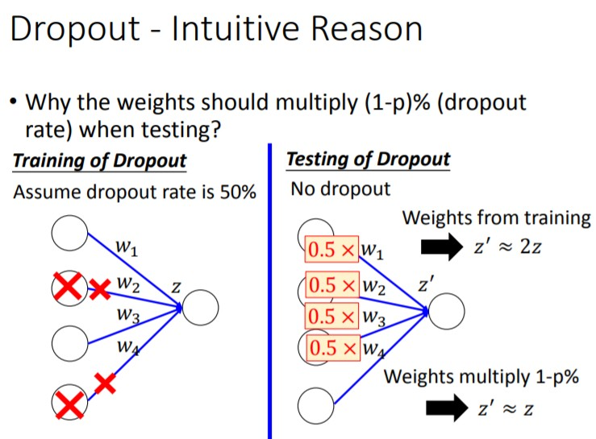
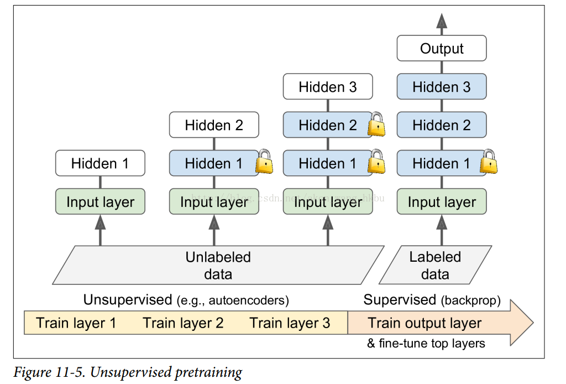
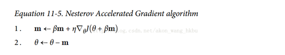
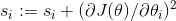
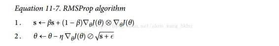
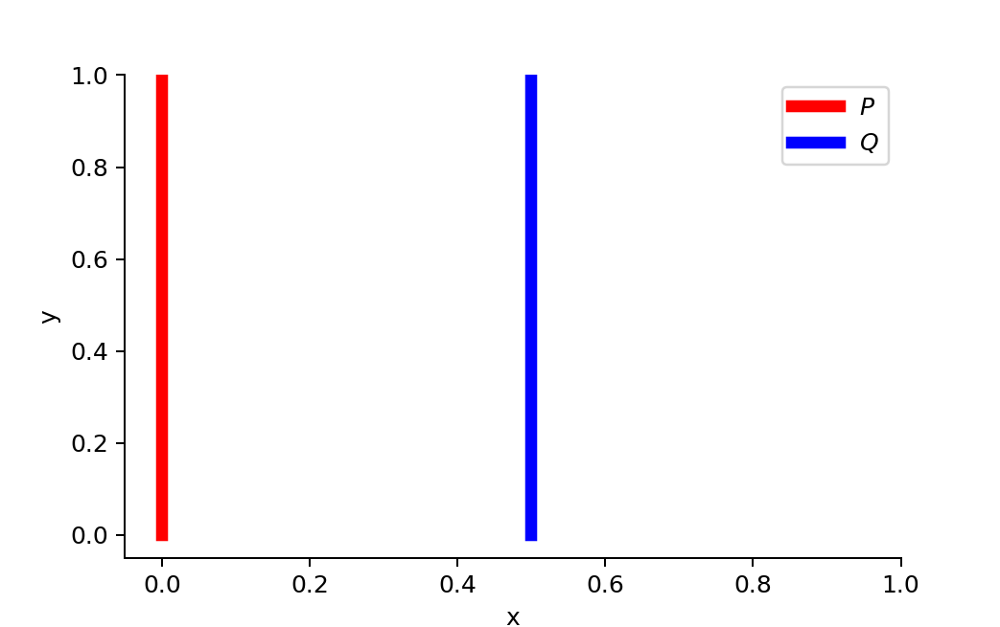

# 	DL概要

对于一个网络，给定一组参数，就代表一个方程。而网络结构，定义了一个方程集合。


# 网络参数数量和深度

为何成为深度学习，因为网络越深，越容易拟合复杂函数。如下图：


浅且大而宽的网络最终能够覆盖到目标函数，但是这样效率太低。而深且窄的网络很容易达到浅且宽的网络的能力。就像逻辑电路一样，深的逻辑门组合容易实现复杂逻辑，并且需要的组件少于直白的逻辑电路。

深的网络指数级优于浅的网络，若浅的网络需要O(n)个神经元，则深的网络神经元数为O(logn)（以2为底）。

.

我们可以利用多组ReLu形成“piecewise linear function”去拟合任意函数，只要该函数是“L-Lipschitz”函数，即函数足够平滑。如图：


# 优化

## 激活函数

ReLU的问题在于负的输入得到的输出为0，以至于神经元死亡，导致梯度消失（梯度为0），因此有了各种改进函数：

* 小斜坡确保 leaky ReLU 永不死亡；他们可能会长期昏迷，但他们有机会最终醒来。


* ELU函数在任何地方都是平滑的，有助于加速梯度下降，不会在0点处振荡。


### 选择

ELU > leaky ReLU（及其变体）> ReLU > tanh > sigmoid。 如果运行时性能，用 leaky ReLU。 

## Hessian Matrixs

因为许多深度学习任务拟合的函数是非凸的（non-convex）。梯度为0的时候，可能是局部最小、局部最大、鞍点。因此需要借助Hessian矩阵判断目前的critical point优化处于什么地方。

详细数学过程见李宏毅PPT。

* 当Hessian矩阵的特征值全大于0时，critical point处于局部最小处。

* 当Hessian矩阵的特征值全小于0时，critical point处于局部最大处。
* 若Hessian矩阵的特征值有正有负，critical point为鞍点。
* 特征值出现大于等于0或者小于等于0的时候，无法判断。


有时候优化不动的时候，可能是处于一个非常平的梯度面或者是鞍点，需要非常多次迭代才有可能离开，具体情况如下图：


## 优化方法与局部最优

不同的优化方法最终走到的局部最优不相同。


## Batch Normalization

批次归一化的好处如下，显然归一化后更容易训练，关于该方法的意义见”Machine Learning笔记“。

* 对于饱和激活函数如sigmoid、tanh等，可以修复梯度消失的问题
* 修正了interval covariate shift问题，加速了学习速度。因为数据通过前一层layer后，其分布发生了变化，此时后一层layer再学习需要花更多时间。[详解](https://www.zhihu.com/question/38102762)
* 在原算法的第4步中，添加了线性重组步骤，因此扩大模型容量。因为当$γ=sigma$ 、$β=μ$的时候，BN被还原回去了，相当于没起作用。其中$γ$、$β$是学习的参数。
* 在训练过程中，使用滑动平均记录$sigma$和$μ$，在测试的时候才能正常的输出。

算法如下：


效果如下：


## 局部最优与全局最优

根据实验，当我们训练一个大的网络时，局部最优与全局最优差别很小，而且不容易遇到局部最优。

## skip connection

该技术来自于ResNet（Residual Network），有点类似于dropout，详见[极深网络](https://blog.csdn.net/malefactor/article/details/67637785)。

## dropout

以一定概率让神经元失效，这样在每次update参数的时候，每个mini-batch所sample到的网络都不一样，增加了网络的鲁棒性，实际上==类似于aggregation==（ensemble）。有M个neuron，就可以sample出2^M^个子网络。


有个实现小细节：

* 假设dropout rate为p，那么neuron存活率为（1-p）。==因为训练的时候整体neuron的W大部分为0，所以当testing的时候，务必要对整个网络的W乘以（1-p）。==这样保证dropout网络的平均loss和最后testing的loss近似。



# Structure Learning

## One-shot learning

例如image to image或者text to image，因为图像和文本的复杂性，输入和输出空间都非常大，对于人来说或许容易判别这种数据的class，但是对于机器来说较为困难，所以一般的network难以完成这种任务。

# keras fit\fit_generator\train_on_batch

在GAN中因为精细控制generator和discriminator的训练次数，采用功能最简单的train_on_batch，如果使用fit或者fit_generator的callback，无法正确保存event，导致log容量极速膨胀。因此只能自行实现记录或者调用keras的callback模块下的类。

* train_on_batch:仅仅用输入的一批数据进行梯度更新，没有验证集，也没有再分epoch、batch_size，功能最简单，没有callback方法，意味着没法直接用tensorboard
* 其他两种方法都有训练集、验证集

```python
model.fit(x=None, y=None, batch_size=None, epochs=1, verbose=1, callbacks=None, validation_split=0.0, validation_data=None, shuffle=True, class_weight=None, sample_weight=None, initial_epoch=0, steps_per_epoch=None, validation_steps=None, validation_freq=1)

model.fit_generator(generator, steps_per_epoch=None, epochs=1, verbose=1, callbacks=None, validation_data=None, validation_steps=None, validation_freq=1, class_weight=None, max_queue_size=10, workers=1, use_multiprocessing=False, shuffle=True, initial_epoch=0)
```

# keras with tensorboard

重复创建模型实例时不会清除default_graph和session，所以log会出现重复的graph。因此在模型代码的\__init__中需要添加keras.backend.clear_session()

```python
def __init__(self):
    K.clear_session()
    ...
    self.callback = keras.callbacks.TensorBoard(log_path)
    self.callback.set_model(model)
    
def fit(self, callback, ...):
    ...
    
def write_log(self, callback, log_names, logs, epoch):
    for name, value in zip(log_names, logs):
        s = tf.Summary()
        s_val = s.value.add()
        s_val.simple_value = value
        s_val.tag = name
        callback.writer.add_summary(s, epoch)
        callback.writer.flush()
```

# 神经网络（neuron network）

## 基本设置


## 手动建模（手动设定W、b、activation、保存模型）

```python
from datetime import datetime

now = datetime.now().strftime('%Y%m%d%H%M%S')
model_data_name = 'dnn_mnist'
root_dir = 'F:/tf_logs/'
log_dir = '{}_{}_{}'.format(now[:8], now[8:], model_data_name)
save_path = root_dir + log_dir

n_inputs = 28**2
n_hidden1 = 300
n_hidden2 = 200
n_hidden3 = 100
n_outputs = 10
learning_rate = 0.01

"""
如果不reset会导致保存log的时候模型混在一起
"""
tf.reset_default_graph()

"""
如果要调整连接方式，就把W的某点设为0（我猜的）
"""
def neuron_layer(X, n_neurons, name, activation=None):
    with tf.name_scope(name):
        n_inputs = int(X.get_shape()[1])
        stddev = 2 / np.sqrt(n_inputs)
        init = tf.truncated_normal((n_inputs, n_neurons), stddev=stddev)
        W = tf.Variable(init, name='weight')
        b = tf.Variable(tf.zeros([n_neurons]), name='bias')
        Z = tf.matmul(X, W) + b
        if activation is not None:
            return activation(Z)
        else:
            return Z
        
X = tf.placeholder(tf.float32, shape=(None, n_inputs), name='X')
y = tf.placeholder(tf.int32, shape=(None), name='y')

with tf.name_scope('dnn'):
    layer1 = neuron_layer(X, n_hidden1, 'hidden1', tf.nn.relu)
    layer2 = neuron_layer(layer1, n_hidden2, 'hidden2', tf.nn.relu)
    layer3 = neuron_layer(layer2, n_hidden3, 'hidden3', tf.nn.relu)
    logits = neuron_layer(layer3, n_outputs, 'outputs')
    
with tf.name_scope('loss'):
    cross_entropy = tf.nn.sparse_softmax_cross_entropy_with_logits(labels=y, logits=logits)
    loss = tf.reduce_mean(cross_entropy, name='loss')  

with tf.name_scope('train'):
#     optimizer = tf.train.GradientDescentOptimizer(learning_rate=learning_rate) 完全train不起来，可能因为初始参数W不合适，在一个平面上
    optimizer = tf.train.AdagradOptimizer(learning_rate=learning_rate) # 不应该用这个，要用Adam
    training_op = optimizer.minimize(loss)
    
with tf.name_scope('eval'):
    correct = tf.nn.in_top_k(logits, y, 1)
    accuracy = tf.reduce_mean(tf.cast(correct, tf.float32))

with tf.name_scope('summary'):
    acc_batch_summary = tf.summary.scalar('acc_batch', accuracy)
    acc_val_summary = tf.summary.scalar('acc_val', accuracy)
    
n_epochs = 40
batch_size = 50

def shuffle_batch(X, y, batch_size):
    rnd_idx = np.random.permutation(len(X))
    n_batches = len(X) // batch_size
    for batch_idx in np.array_split(rnd_idx, n_batches):
        X_batch, y_batch = X[batch_idx], y[batch_idx]
        yield X_batch, y_batch    

"""
保存日志和模型
"""
file_writer = tf.summary.FileWriter(save_path, tf.get_default_graph())
saver = tf.train.Saver()        

init = tf.global_variables_initializer()
with tf.Session() as sess:
    init.run()
    i = 0
    for epoch in range(n_epochs):
        for X_batch, y_batch in shuffle_batch(X_train, y_train, batch_size):
            sess.run(training_op, feed_dict={X: X_batch, y: y_batch})
        acc_batch = acc_batch_summary.eval(feed_dict={X: X_batch, y: y_batch})
        acc_val = acc_val_summary.eval(feed_dict={X: X_test, y: y_test})
        file_writer.add_summary(acc_batch, i)
        file_writer.add_summary(acc_val, i)
        i += 1
        # 如果要及时print数据，需要eval对应的tf对象，summary返回的不是标量
    saver.save(sess, save_path+'/model.cpkt')
    
file_writer.close()        
```


## W的初始化策略


## 自动全连接建模（tf.layers.dense）

```python
def get_save_path():
    from datetime import datetime
    now = datetime.now().strftime('%Y%m%d%H%M%S')
    model_data_name = 'dnn_mnist'
    root_dir = 'F:/tf_logs/'
    log_dir = '{}_{}_{}'.format(now[:8], now[8:], model_data_name)
    save_path = root_dir + log_dir
    return save_path

save_path = get_save_path()

n_inputs = 28**2
n_hidden1 = 100
n_hidden2 = 100
n_hidden3 = 100
n_hidden4 = 100
n_outputs = 10
learning_rate = 0.01
n_epochs = 40
batch_size = 50

tf.reset_default_graph()
        
X = tf.placeholder(tf.float32, shape=(None, n_inputs), name='X')
y = tf.placeholder(tf.int32, shape=(None), name='y')

"""
dense函数直接创建全连接层
"""
with tf.name_scope('dnn'):
    layer1 = tf.layers.dense(X, n_hidden1, name='hidden1', activation=tf.nn.relu)
    layer2 = tf.layers.dense(layer1, n_hidden2, name='hidden2', activation=tf.nn.relu)
    layer3 = tf.layers.dense(layer2, n_hidden3, name='hidden3', activation=tf.nn.relu)
    layer4 = tf.layers.dense(layer3, n_hidden4, name='hidden4', activation=tf.nn.relu)
    logits = tf.layers.dense(layer4, n_outputs, name='outputs')
    
with tf.name_scope('loss'):
    cross_entropy = tf.nn.sparse_softmax_cross_entropy_with_logits(labels=y, logits=logits)
    loss = tf.reduce_mean(cross_entropy, name='loss')  

with tf.name_scope('train'):
    optimizer = tf.train.AdagradOptimizer(learning_rate=learning_rate) # 不应该用这个，要用Adam
    training_op = optimizer.minimize(loss)
    
with tf.name_scope('eval'):
    correct = tf.nn.in_top_k(logits, y, 1)
    accuracy = tf.reduce_mean(tf.cast(correct, tf.float32))

with tf.name_scope('summary'):
    acc_batch_summary = tf.summary.scalar('acc_batch', accuracy)
    acc_val_summary = tf.summary.scalar('acc_val', accuracy)
    
def shuffle_batch(X, y, batch_size):
    rnd_idx = np.random.permutation(len(X))
    n_batches = len(X) // batch_size
    for batch_idx in np.array_split(rnd_idx, n_batches):
        X_batch, y_batch = X[batch_idx], y[batch_idx]
        yield X_batch, y_batch    

file_writer = tf.summary.FileWriter(save_path, tf.get_default_graph())
saver = tf.train.Saver()        
init = tf.global_variables_initializer()
with tf.Session() as sess:
    init.run()
    i = 0
    for epoch in range(n_epochs):
        for X_batch, y_batch in shuffle_batch(X_train, y_train, batch_size):
            sess.run(training_op, feed_dict={X: X_batch, y: y_batch})
        acc_batch = acc_batch_summary.eval(feed_dict={X: X_batch, y: y_batch})
        acc_val = acc_val_summary.eval(feed_dict={X: X_test, y: y_test})
        file_writer.add_summary(acc_batch, i)
        file_writer.add_summary(acc_val, i)
        i += 1
    saver.save(sess, save_path+'/model.cpkt')
    
file_writer.close()
```


## early stopping（官方版）

```python
n_epochs = 10001
batch_size = 50
n_batches = int(np.ceil(m / batch_size))

checkpoint_path = "/tmp/my_deep_mnist_model.ckpt"
checkpoint_epoch_path = checkpoint_path + ".epoch"
final_model_path = "./my_deep_mnist_model"

best_loss = np.infty
epochs_without_progress = 0
max_epochs_without_progress = 50

with tf.Session() as sess:
    if os.path.isfile(checkpoint_epoch_path):
        # if the checkpoint file exists, restore the model and load the epoch number
        with open(checkpoint_epoch_path, "rb") as f:
            start_epoch = int(f.read())
        print("Training was interrupted. Continuing at epoch", start_epoch)
        saver.restore(sess, checkpoint_path)
    else:
        start_epoch = 0
        sess.run(init)

    for epoch in range(start_epoch, n_epochs):
        for X_batch, y_batch in shuffle_batch(X_train, y_train, batch_size):
            sess.run(training_op, feed_dict={X: X_batch, y: y_batch})
        accuracy_val, loss_val, accuracy_summary_str, loss_summary_str = sess.run([accuracy, loss, accuracy_summary, loss_summary], feed_dict={X: X_valid, y: y_valid})
        file_writer.add_summary(accuracy_summary_str, epoch)
        file_writer.add_summary(loss_summary_str, epoch)
        if epoch % 5 == 0:
            print("Epoch:", epoch,
                  "\tValidation accuracy: {:.3f}%".format(accuracy_val * 100),
                  "\tLoss: {:.5f}".format(loss_val))
            saver.save(sess, checkpoint_path)
            with open(checkpoint_epoch_path, "wb") as f:
                f.write(b"%d" % (epoch + 1))
            if loss_val < best_loss:
                saver.save(sess, final_model_path)
                best_loss = loss_val
            else:
                epochs_without_progress += 5
                if epochs_without_progress > max_epochs_without_progress:
                    print("Early stopping")
                    break
                    
with tf.Session() as sess:
    saver.restore(sess, final_model_path)
    accuracy_val = accuracy.eval(feed_dict={X: X_test, y: y_test})                    
```

## Batch Normalization（tf.layers.batch_normalization）

对每一层的输出都加上BN后，训练时间显著增加，如果仅给最后一层加上BN，效果也很好：

* 橙色——最后一层加BN
* 蓝色——不加BN
* 红色——每层都加BN


```python
tf.reset_default_graph()
        
save_path = get_save_path()
    
X = tf.placeholder(tf.float32, shape=(None, n_inputs), name='X')
y = tf.placeholder(tf.int32, shape=(None), name='y')
training = tf.placeholder_with_default(False, shape=(), name = 'training')

"""
下面代码有buuuuug，实际上只给最后输出那层加了BN
"""
with tf.name_scope('dnn'):
    layer1 = tf.layers.dense(X, n_hidden1, name='hidden1', activation=tf.nn.relu)
    bn1 = tf.layers.batch_normalization(layer1, training=training)
    layer2 = tf.layers.dense(layer1, n_hidden2, name='hidden2', activation=tf.nn.relu)
    bn2 = tf.layers.batch_normalization(layer2, training=training)
    layer3 = tf.layers.dense(layer2, n_hidden3, name='hidden3', activation=tf.nn.relu)
    bn3 = tf.layers.batch_normalization(layer3, training=training)
    layer4 = tf.layers.dense(layer3, n_hidden4, name='hidden4', activation=tf.nn.relu)
    bn4 = tf.layers.batch_normalization(layer4, training=training)
    logits = tf.layers.dense(layer4, n_outputs, name='outputs')
    bn_output = tf.layers.batch_normalization(logits, training=training) #最后加BN效果更好
    
"""
每层都加BN的正确版本
"""    
with tf.name_scope('dnn'):
    layer1 = tf.layers.dense(X, n_hidden1, name='hidden1', activation=tf.nn.relu)
    bn1 = tf.layers.batch_normalization(layer1, training=training)
    layer2 = tf.layers.dense(tf.nn.relu(bn1), n_hidden2, name='hidden2', activation=tf.nn.relu)
    bn2 = tf.layers.batch_normalization(layer2, training=training)
    layer3 = tf.layers.dense(tf.nn.relu(bn2), n_hidden3, name='hidden3', activation=tf.nn.relu)
    bn3 = tf.layers.batch_normalization(layer3, training=training)
    layer4 = tf.layers.dense(tf.nn.relu(bn3), n_hidden4, name='hidden4', activation=tf.nn.relu)
    bn4 = tf.layers.batch_normalization(layer4, training=training)
    logits = tf.layers.dense(tf.nn.relu(bn4), n_outputs, name='outputs')
    bn_output = tf.layers.batch_normalization(logits, training=training)

with tf.name_scope('loss'):
    cross_entropy = tf.nn.sparse_softmax_cross_entropy_with_logits(labels=y, logits=bn_output)
    loss = tf.reduce_mean(cross_entropy, name='loss')  

with tf.name_scope('train'):
    optimizer = tf.train.AdagradOptimizer(learning_rate=learning_rate) # 不应该用这个，要用Adam
    update_ops = tf.get_collection(tf.GraphKeys.UPDATE_OPS)
    train_op = optimizer.minimize(loss)
    training_op = tf.group([train_op, update_ops])
    
with tf.name_scope('eval'):
    correct = tf.nn.in_top_k(bn_output, y, 1)
    accuracy = tf.reduce_mean(tf.cast(correct, tf.float32))

with tf.name_scope('summary'):
    acc_batch_summary = tf.summary.scalar('acc_batch', accuracy)
    acc_val_summary = tf.summary.scalar('acc_val', accuracy)
    
file_writer = tf.summary.FileWriter(save_path, tf.get_default_graph())
saver = tf.train.Saver()        
init = tf.global_variables_initializer()
with tf.Session() as sess:
    init.run()
    i = 0
    for epoch in range(n_epochs):
        for X_batch, y_batch in shuffle_batch(X_train, y_train, batch_size):
            sess.run(training_op, feed_dict={training:True, X: X_batch, y: y_batch})
        acc_batch = acc_batch_summary.eval(feed_dict={X: X_batch, y: y_batch})
        acc_val = acc_val_summary.eval(feed_dict={X: X_test, y: y_test})
        file_writer.add_summary(acc_batch, i)
        file_writer.add_summary(acc_val, i)
        i += 1
    saver.save(sess, save_path+'/model.cpkt')
    
file_writer.close()    
```

## 梯度裁剪

有两种方式，第一种手动，第二种自动==（contrib包中的API随时会被更改或者移除）==。

### 手动

```python
threshold = 1.0

optimizer = tf.train.GradientDescentOptimizer(learning_rate)
grads_and_vars = optimizer.compute_gradients(loss)
capped_gvs = [(tf.clip_by_value(grad, -threshold, threshold), var)
              for grad, var in grads_and_vars]
training_op = optimizer.apply_gradients(capped_gvs)

"""
对比原来的代码，只是提取出了梯度并再裁剪后赋值
"""
train_op = optimizer.minimize(loss)
```

### 自动

==以下方法针对L2 norm，而不是针对单个梯度，务必参见tf.clip_gradients_by_norm说明==：

```python
optimizer = tf.train.XXX(learning_rate)
optimizer = tf.contrib.estimator.clip_gradients_by_norm(optimizer, clip_norm)
estimator = tf.estimator.XXX(optimizer=optimizer)
```

## 模型复用

复用前需要重构网络，saver.restore只能恢复相应变量的参数。


### 整体

```python
[...] # construct the original model

with tf.Session() as sess:
    saver.restore(sess, "./my_model_final.ckpt")
    # continue training the model...
```

### 部分

#### 公共参数

```python
def shuffle_batch(X, y, batch_size):
    rnd_idx = np.random.permutation(len(X))
    n_batches = len(X) // batch_size
    for batch_idx in np.array_split(rnd_idx, n_batches):
        X_batch, y_batch = X[batch_idx], y[batch_idx]
        yield X_batch, y_batch
        
root_dir = 'F:/tf_logs/'
log_dir = 'reuse_example'
model_name1 = '_origin'
model_name2 = '_reuse' # new
save_path1 = root_dir + log_dir + model_name1    
save_path2 = root_dir + log_dir + model_name2 # new    

n_inputs = 28**2
n_hidden1 = 100
n_hidden2 = 100 # new
n_outputs = 10
learning_rate = 0.01
n_epochs = 10
batch_sizes = 50
```

#### 原始网络

```python
tf.reset_default_graph()

X = tf.placeholder(tf.float32, shape=(None, n_inputs), name='X')
y = tf.placeholder(tf.int32, shape=(None), name='y')

with tf.name_scope('dnn'):
    layer1 = tf.layers.dense(X, n_hidden1, activation=tf.nn.relu, name='layer1')
    logits = tf.layers.dense(layer1, n_outputs, activation=tf.nn.relu, name='logits')

with tf.name_scope('loss'):
    xentropy = tf.nn.sparse_softmax_cross_entropy_with_logits(labels=y, logits=logits)
    loss = tf.reduce_mean(xentropy, name='loss')
    
with tf.name_scope('train'):
    optimizer = tf.train.GradientDescentOptimizer(learning_rate=learning_rate)
    train_op = optimizer.minimize(loss)

with tf.name_scope('eval'):
    correct = tf.nn.in_top_k(logits, y, 1)
    accuracy = tf.reduce_mean(tf.cast(correct, tf.float32))
    
file_writer = tf.summary.FileWriter(save_path1, tf.get_default_graph())    
saver = tf.train.Saver()
init = tf.global_variables_initializer()

with tf.Session() as sess:
    init.run()
    for epoch in range(n_epochs):
        for X_batch, y_batch in shuffle_batch(X_train, y_train, batch_sizes):
            sess.run(train_op, feed_dict={X: X_batch, y: y_batch})
        print(epoch,' acc_test:', accuracy.eval(feed_dict={X: X_test, y: y_test}))
    saver.save(sess, save_path1+'/'+model_name1+'.cpkt')
file_writer.close()   

0  acc_test: 0.9947
1  acc_test: 0.9852
2  acc_test: 0.5363
3  acc_test: 0.5503
4  acc_test: 0.9862
5  acc_test: 0.596
6  acc_test: 0.9851
7  acc_test: 0.9958
8  acc_test: 0.9942
9  acc_test: 0.7282
```

#### 复用网络

```python
tf.reset_default_graph()

X = tf.placeholder(tf.float32, shape=(None, n_inputs), name='X')
y = tf.placeholder(tf.int32, shape=(None), name='y')

with tf.name_scope('dnn'):
    layer1 = tf.layers.dense(X, n_hidden1, activation=tf.nn.relu, name='layer1')
    layer2 = tf.layers.dense(layer1, n_hidden2, activation=tf.nn.relu, name='layer2') # new layer
    logits = tf.layers.dense(layer2, n_outputs, activation=tf.nn.relu, name='logits')

"""
loss\eval\train三个部分完全相同
"""

file_writer = tf.summary.FileWriter(save_path2, tf.get_default_graph())    
saver = tf.train.Saver()

"""
must extract exactly what you want to restore, other wise process can't find checkpoint which leads to exceptions.
"""

reuse_vars = tf.get_collection(tf.GraphKeys.GLOBAL_VARIABLES, scope='layer[1]')
reuse_vars_dict = dict([(var.op.name, var) for var in reuse_vars])
restore_saver = tf.train.Saver(reuse_vars_dict)

init = tf.global_variables_initializer()
with tf.Session() as sess:
    init.run()
    restore_saver.restore(sess, save_path1+'/'+model_name1+'.cpkt') # just add this line
    for epoch in range(n_epochs):
        for X_batch, y_batch in shuffle_batch(X_train, y_train, batch_sizes):
            sess.run(train_op, feed_dict={X: X_batch, y: y_batch})
        print(epoch,' acc_test:', accuracy.eval(feed_dict={X: X_test, y: y_test}))
    saver.save(sess, save_path2+'/'+model_name2+'.cpkt')
file_writer.close()    

INFO:tensorflow:Restoring parameters from F:/tf_logs/reuse_example_origin/_origin.cpkt
0  acc_test: 0.9948
1  acc_test: 0.9999
2  acc_test: 0.9973
3  acc_test: 0.9999
4  acc_test: 0.9999
5  acc_test: 0.9999
6  acc_test: 0.9999
7  acc_test: 0.9999
8  acc_test: 0.9999
9  acc_test: 0.9999
```

## 冻结部分层

这部分方法可与用于迭代找出哪些层有用，哪些层可删除，通常来说低层有用。

```python
train_vars = tf.get_collection(tf.GraphKeys.TRAINABLE_VARIABLES, scope='layer[123] | logits') # 注意到要用name进行正则表达式匹配
train_op = optimizer.minimize(loss, var_list=train_vars)
```

### 缓存冻结层输出（tf.stop_gradient）

因为被冻结的层不会被训练到，所以对于这些层只需要让数据穿透一次，然后每次训练就从穿透过的数据开始训练，这样可以有效提升训练速度。需要变动的代码如下：

```python
with tf.name_scope('dnn'):
    layer1 = tf.layers.dense(X, n_hidden1, activation=tf.nn.relu, name='layer1') # frozen
    layer2 = tf.layers.dense(layer1, n_hidden2, activation=tf.nn.relu, name='layer2') # frozen & cached
    layer2_stop = tf.stop_gradient(layer2) # must add this line so as to froze layers in front
    layer3 = tf.layers.dense(layer2_stop, n_hidden3, activation=tf.nn.relu, name='layer3') # new
    logits = tf.layers.dense(layer3, n_outputs, activation=tf.nn.relu, name='logits')

"""
训练的时候输入数据不再是原数据集，而是冻结层的输出缓存（要考虑到内存问题）
"""    
with tf.Session() as sess:
    init.run()
    restore_saver.restore(sess, save_path2+'/'+model_name2+'.cpkt')
    
    layer2_cache = sess.run(layer2, feed_dict={X: X_train})
    layer2_cache_test = sess.run(layer2, feed_dict={X: X_test})
    
    for epoch in range(n_epochs):
        for layer2_batch, y_batch in shuffle_batch(layer2_cache, y_train, batch_sizes):
            sess.run(train_op, feed_dict={layer2: layer2_batch, y: y_batch})
        acc_val = accuracy.eval(feed_dict={layer2: layer2_cache_test, y: y_test})
        print(epoch, 'val_acc:', acc_val)
```


## 无监督预训练（pre-train）

当有标签的数据不足的时候，可以找一堆相同领域的数据，用auto-encoder训练前几层网络，抽象出有用的公共特征。最后在利用有标签的数据进行fine-tune：



## 优化器

### 非自适应

#### 动量优化（MomentumOptimizer）

在更新W的时候，考虑之前的梯度（相当于动量）：


当β=0时，退化为一般的梯度下降法，相当于摩擦力极大，没有动量。当β=1时，相当于没有摩擦，会反复振荡。实践上==推荐设置β=0.9。==

由于动量的原因，优化器可能会超调一些，然后再回来，再次超调，并在稳定在最小值之前多次振荡。

```python
tf.train.MomentumOptimizer(learning_rate=learning_rate, momentum=0.9)
```

#### Nesterov 加速梯度

是动量优化的改进版本，加快速度的同时有助于减少振荡：




```python
tf.train.MomentumOptimizer(learning_rate=learning_rate, momentum=0.9, use_nesterov=Ture)
```

#### FTRL（follow the regularized leader，稀疏模型）

如果希望获得稀疏模型以加快训练速度，就用L1，或者训练完后把小的W~ij~设为0。要更稀疏的模型就用FTRL：

```python
tf.train.FtrlOptimizer()

__init__(
    learning_rate,
    learning_rate_power=-0.5,
    initial_accumulator_value=0.1,
    l1_regularization_strength=0.0,
    l2_regularization_strength=0.0,
    use_locking=False,
    name='Ftrl',
    accum_name=None,
    linear_name=None,
    l2_shrinkage_regularization_strength=0.0
)
```

### 自适应

#### AdaGrad

先对梯度个元素进行平方放大，然后在用sqrt(s+ε)缩小回去，但是对于越大的梯度缩小幅度越小，小的梯度基本缩回去，所以起到更快的梯度下降作用：


第一步相当于：

第二步相当于：

ε是为了防止除0，一般设定为10^-10^。

对于简单的二次问题，AdaGrad 经常表现良好，但不幸的是，在训练神经网络时，它经常停止得太早。 学习率被缩减得太多，以至于在达到全局最优之前，算法完全停止。==不应该用它来训练深度神经网络。==

```python
tf.train.AdagradOptimizer(learning_rate=learning_rate)
```

#### RMSprop

为了改进AdaGrad的早停问题，加入了衰减系数β，相当于只考虑近期的梯度累积，以往早期的累积值：



一般β=0.9：

```python
tf.train.RMSPropOptimizer(learning_rate=learning_rate, momentum=0.9, decay=0.9, epsilon=1e-10)
```

#### Adam优化

结合前面几种优化方法：


3、4步是为了在算法刚开始时尽快放大小数值。

β~1~=0.9、β~2~=0.999、ε=10^-8^，因为Adam本身是自适应的，所以学习率不太很重要，默认η=0.001就行。

```python
tf.train.AdamOptimizer(learning_rate=learning_rate)
```

### 总结

上述几种优化方式都是一阶的，二阶有Hessian矩阵等方式，但是计算太慢，而且占内存空间。

## 自定义动态学习率

对于非自适应的优化器，最常采用的就是指数调度法：

​	`decayed_learning_rate = learning_rate * decay_rate ^ (global_step / decay_steps)`

实现方式如下：

```python
with tf.name_scope("train"):
	initial_learning_rate = 0.1
    decay_steps = 10000
    decay_rate = 1/10
    global_step = tf.Variable(0, trainable=False, name="global_step")
    learning_rate = tf.train.exponential_decay(initial_learning_rate, global_step,
                                               decay_steps, decay_rate)
    optimizer = tf.train.MomentumOptimizer(learning_rate, momentum=0.9) # 非自适应优化器
    training_op = optimizer.minimize(loss, global_step=global_step)
```

## 正则化

### early stopping

[详细代码](#early stopping（官方版）)

### L1、L2

==注意在定义loss的时候一定要把正则化损失添加到loss里面。==

```python
scale = 0.001
tf.contrib.layers.l1_regularizer(scale)
tf.contrib.layers.l2_regularizer(scale)

tf.layers.dense(kernel_regularize=tf.contrib.layers.l1_regularizer(scale))

with tf.name_scope('loss'):
    xentropy = tf.nn.sparse_softmax_cross_entropy_with_logits(labels=y, logits=logits)
    base_loss = tf.reduce_mean(xentropy, name="avg_xentropy")
    reg_losses = tf.get_collection(tf.GraphKeys.REGULARIZATION_LOSSES)
    loss = tf.add_n([base_loss] + reg_losses, name="loss")
```

### dropout

```python
training = tf.placeholder_with_default(False, shape=(), name='training')

dropout_rate = 0.5
X_drop = tf.layers.dropout(X, dropout_rate, training=training) # 一般不对输入做dropout

with tf.name_scope("dnn"):
    hidden1 = tf.layers.dense(X_drop, n_hidden1, activation=tf.nn.relu,
                              name="hidden1")
    hidden1_drop = tf.layers.dropout(hidden1, dropout_rate, training=training)
    hidden2 = tf.layers.dense(hidden1_drop, n_hidden2, activation=tf.nn.relu,
                              name="hidden2")
    hidden2_drop = tf.layers.dropout(hidden2, dropout_rate, training=training)
    logits = tf.layers.dense(hidden2_drop, n_outputs, name="outputs")
```

### max norm

略

# 卷积神经网络（convolutional neural network, CNN）

## 互相关计算

<http://deeplearning.net/software/theano/tutorial/conv_arithmetic.html>

## subsampling

### 卷积（convolution）

==注意卷积的矩阵乘积是hadamard product，不是一般的矩阵点积。==

#### filter（size and padding）

 filter的深度和输入一样。


通过一层卷积层后得到的新“图像”：


如果stride步长使得filter无法匹配image的尺寸，那么可以选择填充==（padding='SAME'，即输入和输出尺寸一样）==或者直接丢弃不匹配的部分==（padding='VALID'）==，下面是padding的示例：


#### 参数


#### 生物学上的直觉理解

眼球中的一个神经元（对应一个filter）通常一次只关注一片区域，相当于这个神经元与这片区域的pixel做一个fully connection，并且这个神经元上的W是共享的。所以当filter扫过图像时，其W是一样的，所以上图中提及parameter sharing，实际上这样参数相较于全连接减少了很多，也方便实践。


#### 代码（stride=1）

```python
img = np.arange(0,16).reshape(4,4)
img
array([[ 0,  1,  2,  3],
       [ 4,  5,  6,  7],
       [ 8,  9, 10, 11],
       [12, 13, 14, 15]])

filter_m = np.arange(1, 10).reshape(3,3)
filter_m
array([[1, 2, 3],
       [4, 5, 6],
       [7, 8, 9]])

feature_map = []
for i in range(img.shape[1]-filter_m.shape[1]+1):
    for j in range(img.shape[0]-filter_m.shape[0]+1):
        feature_map.append(np.sum(img[j:img.shape[0]+j-1, i:img.shape[1]+i-1] * filter_m))

feature_map = np.array(feature_map)
feature_map = feature_map.reshape(img.shape[0]-filter_m.shape[0]+1, 
                                  img.shape[1]-filter_m.shape[1]+1)
feature_map
array([[303, 483],
       [348, 528]])
```

#### stride>1与downsampling


### 分离卷积（separable convolution）

#### pointwise

用1x1filter，同原filter对所有channel负责，整合上一步的输出。

分母为原始卷积参数量，分子为pointwise参数量，二者之比为参数压缩比。


#### depthwise

原来的filter是立体，对所有channel负责，修改为一个filter只负责一个channel。


### 池化层

作用就是下采样（subsampling，downsampling），以免输入过大：


#### max pooling

从直觉上来看，实际上就是抽取一片区域中最有用的信息，即神经元被激活程度最大的信息。

**从实践结果上看，实际上通过大的stride也可以做到。**


#### 参数

和卷积的时候的参数差不多一样，也是一种filter：


## upsampling

### unpooling


### average pooling

相当于对每个group求均值作为输出。

### max unpooling


### up convolution


### convolution transpose（deconvolution，空洞卷积）

详细参考链接：http://deeplearning.net/software/theano/tutorial/conv_arithmetic.html

得到输入的向量Z后，需要通过不断的上采样，得到大的图像矩阵，因此需要deconvolution。

卷积操作实际上可以拆成下图右侧的矩阵C~16x4~，filter为3x3矩阵，K~i~表示fitler的参数，从左上到右下按顺序编号。

一个4x4的输入，stride=1的情况下最终变为`dim=(4-3)/1+1=2`的feature map。


那么如果把C~16x4~做转置后，对得到的feature map做乘积，就可以返回到原先尺寸的图：


==然而需要注意的是，这种方法只是在形式向借鉴了矩阵变换和convolution，实际上与convolution没什么关系，对于同样大小的filter，得到的图只是尺寸上一样，叫deconvolution是不准确的。==

#### 问题

* 会有checkerboard artifacts，因为需要在原输入中插0值，如果卷积核尺寸不合适，那么会导致只有部分输入参与卷积，[详解](http://www.huaxiaozhuan.com/深度学习/chapters/5_CNN.html)
* padding=same的时候，边缘数据应该被裁减掉，因为边缘信息不断被0填充给稀释。默认bias=False，如果用上bias的话，可以改善这个问题。实际上不用bias，相当于一个正则化，减少模型过拟合风险。

#### 代码

```python
C = np.zeros((img.size, feature_map.size))

def get_filter_element(kernel):
    for i in range(kernel.shape[0]):
        for j in range(kernel.shape[1]):
            yield kernel[i, j]


col = 0
filter_flatten = filter_m.reshape(1, -1)
for i in range(img.shape[1]-filter_m.shape[1]+1):
    for j in range(img.shape[0]-filter_m.shape[0]+1):
        idx = 0
        for x in range(i, img.shape[0]+i-1):
            for y in range(j, img.shape[0]+j-1):
                img_flatten = x*img.shape[0]+y
                C[img_flatten, col] = filter_flatten[0][idx]
                idx += 1
        col += 1
C
array([[1., 0., 0., 0.],
       [2., 1., 0., 0.],
       [3., 2., 0., 0.],
       [0., 3., 0., 0.],
       [4., 0., 1., 0.],
       [5., 4., 2., 1.],
       [6., 5., 3., 2.],
       [0., 6., 0., 3.],
       [7., 0., 4., 0.],
       [8., 7., 5., 4.],
       [9., 8., 6., 5.],
       [0., 9., 0., 6.],
       [0., 0., 7., 0.],
       [0., 0., 8., 7.],
       [0., 0., 9., 8.],
       [0., 0., 0., 9.]])

feature_map_flatten = feature_map.reshape(1, -1)
feature_map_flatten
array([[303, 483, 348, 528]])

"""
可以看到如果用同样的kernel做卷积和转置卷积，输入和输出根本就不一样，所以叫deconvolution不太合适
"""
feature_map_flatten.dot(C.T).reshape(img.shape[0], img.shape[1])
array([[  303.,  1089.,  1875.,  1449.],
       [ 1560.,  4671.,  6333.,  4482.],
       [ 3513.,  9657., 11319.,  7515.],
       [ 2436.,  6480.,  7356.,  4752.]])

img
array([[ 0,  1,  2,  3],
       [ 4,  5,  6,  7],
       [ 8,  9, 10, 11],
       [12, 13, 14, 15]])
```

## 架构总结


# 自动编码机（autoencoder）

尽可能的让输入和输出接近，并且网络做成沙漏型，那么编码层就会想办法剔除无关信息，对输入做编码，正中间那层就是编码结果，然后在通过对称结构的解码机还原，得到输出，在这里==要根据用途确认损失函数==。

## 仿PCA降维

* 先创建一堆3D点：

```python
np.random.seed(4)
m = 200
w1, w2 = 0.1, 0.3
noise = 0.1

angles = np.random.rand(m) * 3 * np.pi / 2 - 0.5
data = np.empty((m, 3))
data[:, 0] = np.cos(angles) + np.sin(angles)/2 + noise * np.random.randn(m) / 2
data[:, 1] = np.sin(angles) * 0.7 + noise * np.random.randn(m) / 2
data[:, 2] = data[:, 0] * w1 + data[:, 1] * w2 + noise * np.random.randn(m)
```

* 标准化（PCA的基本要求）

```python
from sklearn.preprocessing import StandardScaler
scaler = StandardScaler()
X_train = scaler.fit_transform(data[:100])
X_test = scaler.transform(data[100:])
```


* 代码，降维到2D：

```python
tf.reset_default_graph()

n_inputs = 3
n_hidden = 2  # codings
n_outputs = n_inputs

learning_rate = 0.01

X = tf.placeholder(tf.float32, shape=[None, n_inputs])
hidden = tf.layers.dense(X, n_hidden)
outputs = tf.layers.dense(hidden, n_outputs)

reconstruction_loss = tf.reduce_mean(tf.square(outputs - X))

optimizer = tf.train.AdamOptimizer(learning_rate)
training_op = optimizer.minimize(reconstruction_loss)

n_iterations = 1000
code = hidden
init = tf.global_variables_initializer()

with tf.Session() as sess:
    init.run()
    for i in range(n_iterations):
        training_op.run(feed_dict={X: X_train})
    print('train_loss:', reconstruction_loss.eval(feed_dict={X: X_train}))
    print('test_loss:', reconstruction_loss.eval(feed_dict={X: X_test}))
    code_test = code.eval(feed_dict={X: X_test})

train_loss: 0.045489494
test_loss: 0.051910844    
plt.scatter(code_test[:,0], code_test[:,1])   
```


## 图像编码

如果想要查看中间抽象图，就直接eval。

```python
from keras.datasets import mnist

(X_train, y_train), (X_test, y_test) = mnist.load_data()
X_train = X_train.reshape((len(X_train), 28**2))
X_test = X_test.reshape((len(X_test), 28**2))
y_train = y_train.astype(np.int32)
y_test = y_test.astype(np.int32)

tf.reset_default_graph()

n_inputs = 28**2
n_hidden1 = 300
n_hidden2 = 200
n_hidden3 = 100 # code
n_hidden4 = 200
n_hidden5 = 300
n_outputs = n_inputs

X = tf.placeholder(tf.float32, shape=([None, n_inputs]))
layer1 = tf.layers.dense(X, n_hidden1, tf.nn.elu)
layer2 = tf.layers.dense(layer1, n_hidden2, tf.nn.elu)
layer3 = tf.layers.dense(layer2, n_hidden3, tf.nn.elu) # code
layer4 = tf.layers.dense(layer3, n_hidden4, tf.nn.elu)
layer5 = tf.layers.dense(layer4, n_hidden5, tf.nn.elu)
outputs = tf.layers.dense(layer5, n_outputs)

reconstruction_loss = tf.reduce_mean(tf.square(outputs - X))

optimizer = tf.train.AdamOptimizer(learning_rate=0.001)
train_op = optimizer.minimize(reconstruction_loss)
code = layer3

n_iterations = 1000
init = tf.global_variables_initializer()
with tf.Session() as sess:
    init.run()
    for i in range(n_iterations):
        train_op.run(feed_dict={X: X_train})
    print(i, ' train_loss:', reconstruction_loss.eval(feed_dict={X: X_train}))
    print('test_loss:', reconstruction_loss.eval(feed_dict={X: X_test}))
    res_img = outputs.eval(feed_dict={X: X_test.reshape(-1, 28**2)})4
    
fig = plt.figure()
ax1 = fig.add_subplot(1,2,1) #表示1x2个子图，选中第1个
ax2 = fig.add_subplot(1,2,2) #表示1x2个子图，选中第2个
ax1.imshow(X_test[1].reshape(28, 28), cmap='gray')
ax2.imshow(res_img[1].reshape(28, 28), cmap='gray')
```


## VAE（Variational）

### 理论

#### 结构


#### 实验

VAE问题在于无法提取输入内部component之间的关联，在图像生成时会有瑕疵，而且很模糊。只能通过一个discriminator学习真实图像之间的关联，然后做一个GAN来改善这个问题。


下面是VAE与GAN 的对比:


### 代码

训练十分不稳定，很容易失败，训练前必须对输入做标准化，否则梯度爆炸：

```python
from sklearn.preprocessing import StandardScaler
scaler = StandardScaler()
X_train_nor = scaler.fit_transform(X_train)
X_test_nor = scaler.fit_transform(X_test)
```

代码：

```python
tf.reset_default_graph()

save_path = 'F:/tf_logs/VAE_mnist_20190327'

n_inputs = X_train.shape[1]
n_hidden1 = 300
n_hidden2 = 100
n_hidden3 = 20 # code
n_hidden4 = n_hidden2
n_hidden5 = n_hidden1
n_outputs = n_inputs
n_epochs = 50
batch_size = 48

X = tf.placeholder(tf.float64, shape=([None, n_inputs]))
initializer = tf.contrib.layers.variance_scaling_initializer()

with tf.name_scope('VAE'):
    layer1 = tf.layers.dense(X, n_hidden1, tf.nn.elu, kernel_initializer=initializer)
    layer2 = tf.layers.dense(layer1, n_hidden2, tf.nn.elu, kernel_initializer=initializer)
    layer3_mean = tf.layers.dense(layer2, n_hidden3, kernel_initializer=initializer)
    layer3_gamma = tf.layers.dense(layer2, n_hidden3, kernel_initializer=initializer)
    layer3_noise = tf.random_normal(tf.shape(layer3_gamma), dtype=tf.float64)
    layer3 = tf.exp(0.5*layer3_gamma) * layer3_noise + layer3_mean
    layer4 = tf.layers.dense(layer3, n_hidden4, tf.nn.elu, kernel_initializer=initializer)
    layer5 = tf.layers.dense(layer4, n_hidden5, tf.nn.elu, kernel_initializer=initializer)
    logits = tf.layers.dense(layer5, n_outputs, kernel_initializer=initializer)
    outputs = tf.sigmoid(logits)

with tf.name_scope('loss'):
    xentropy = tf.nn.sigmoid_cross_entropy_with_logits(labels=X, logits=outputs)
    reconstruction_loss = tf.reduce_sum(xentropy)
    latent_loss = 0.5 * tf.reduce_sum(
        tf.exp(layer3_gamma) + tf.square(layer3_mean) - 1 - layer3_gamma) 
    loss = latent_loss + reconstruction_loss

with tf.name_scope('train'):
    optimizer = tf.train.AdamOptimizer(learning_rate=0.001)
    train_op = optimizer.minimize(loss)

with tf.name_scope('summary'):
    loss_summary = tf.summary.scalar('batch_loss', loss)
    
init = tf.global_variables_initializer()    
sess = tf.Session()

saver = tf.train.Saver()
file_writer = tf.summary.FileWriter(save_path, tf.get_default_graph())

init.run(session=sess)
for epoch in range(n_epochs):
        for X_batch, y_batch in shuffle_batch(X_train_nor, y_train, batch_size):
            sess.run(train_op, feed_dict={X: X_batch})
        batch_loss = loss_summary.eval(feed_dict={X: X_batch}, session=sess)
        file_writer.add_summary(batch_loss, epoch)
        print(epoch, 'train_loss:', loss.eval(feed_dict={X: X_batch}, session=sess))
saver.save(sess, save_path+'/vae.cpkt')
file_writer.close()
```

随机生成数字：

```python
n_pic_gen = 20
codings_rnd = np.random.normal(size=[n_pic_gen, n_hidden3])
outputs_val = outputs.eval(feed_dict={layer3: codings_rnd}, session=sess)
for i in range(n_pic_gen):
    plt.subplot(5, 4, i + 1)
    plt.imshow(outputs_val[i].reshape(28,28), cmap='gray')
    plt.axis('off')
```


插值生成数字：

```python
n_iterations = 3
n_digits = 6
codings_rnd = np.random.normal(size=[n_digits, n_hidden3])
target_codings = np.roll(codings_rnd, -1, axis=0)
for iteration in range(n_iterations + 1):
        codings_interpolate = codings_rnd + (target_codings - codings_rnd) * iteration / n_iterations
        outputs_val = outputs.eval(feed_dict={layer3: codings_interpolate}, session=sess)
        plt.figure(figsize=(11, 1.5*n_iterations))
        for digit_index in range(n_digits):
            plt.subplot(1, n_digits, digit_index + 1)
            plt.imshow(outputs_val[digit_index].reshape(28,28), cmap='gray')
            plt.axis('off')
```


# 生成式对抗网络（generative adversarial network, GAN）

Two models are trained simultaneously to find a [Nash equilibrium](https://en.wikipedia.org/wiki/Nash_equilibrium) to a two-player non-cooperative game.

## 前置理论

### 原始公式

$\min_\limits{G}\max_\limits{D}V(G,D)=\min_\limits{G}\max_\limits{D}E_{x\sim{P_{data}(x)}}[logD(x)]+E_{z\sim{P_{z}(z)}}[1-logD(G(z))]$

原始GAN中，D的目的是区分真实数据和生成数据，做二分类，其中真实数据label为1，生成数据label为0，本质上是衡量real和gen之间的分布差异。G的目的是尽可能让gen和real之间的差异小，使得D在分类时的概率输出为0.5。

### 从最大似然角度看G

从$P_{data}$中采样$x_i$，希望找一个$\theta$使$P_G(x_i;\theta)$接近$P_{data}(x_i)$，自然从maximum log likelihood的角度出发，最终发现要需要最小化二者之间的KL divergence（KL散度在离散数据下可用$\sum$计算）：
$$
\theta^*=\arg\max_\limits{\theta}\pi_{i=1}^nP_G(x_i;\theta)\\
=\arg\max_\limits{\theta}\sum_{i=1}^nlogP_G(x_i;\theta)\\
\approx\arg\max_\limits{\theta}E_{x\sim{P_{data}(x)}}[logP_G(x_i;\theta)]\\
=\arg\max_\limits{\theta}[\int_xP_{data}(x_i)logP_G(x_i;\theta)dx-\int_xP_{data}(x_i)logP_{data}(x_i)dx]（凑一个与G、\theta无关的项）\\
=\arg\max_\limits{\theta}\int_xP_{data}(x_i)log\frac{P_G(x_i;\theta)}{P_{data}(x_i)}dx\\
=\arg\min_\limits{\theta}KL(P_{data}||P_G)
$$
因为$P_{data}$本身就很复杂，我们没法给一个先验的$P_G(x_i;\theta)$（例如，假定各特征来自高斯分布再用GMM拟合，相对于data来说过于简单，以至于效果很差）。所以希望交个一个network去拟合一个复杂的$P_G(x_i;\theta)$。

于是，可以从一个正态分布中采样一个向量z，通过network获得$x=G(z)$，由此获得一个复杂的分布$P_G(x)$。这时让$P_G(x_i;\theta)$尽可能相似$P_{data}(x_i)$，就能得到一个近似解。
$$
G^*=\arg\min\limits_GDivergence(P_G,P_{data})
$$
只有从z采样，就相当于从$P_{data}$中采样，以生成”真实“的数据。

### 从divergence角度看D

实际上，$P_G$和$P_{data}$都不知道，无法计算divergence，所以需要先从$P_G$和$P_{data}$采样一堆数据，用一个Discriminator来度量divergence。这个工作同样交个network来做。

### 目标函数

$$
V(G,D)=\int_xP_{data}(x)logD(x)dx+\int_zP_z(z)log[1-D(G(z))]dz\\
=\int_xP_{data}(x)logD(x)dx+\int_xP_g(x)log[1-D(x)]dx\\
=\int_xP_{data}(x)logD(x)+P_g(x)log[1-D(x)]dx
$$

因为数据是离散的，对积分式子内的公式f求导，取e为底：
$$
\frac{\partial{f}}{\partial{D(x)}}=\frac{P_{data}}{D(x)}-\frac{P_g(x)}{1-D(x)}=0\\
D^*=\frac{P_{data}(x)}{P_{data}(x)+P_g(x)}
$$
代回上面的目标函数，有：
$$
\max\limits_{D}V(D,G)=\int_xP_{data}(x)log\frac{P_{data}(x)\frac{1}{2}}{\frac{P_{data}(x)+P_g(x)}{2}}+P_{g}(x)log\frac{P_{g}(x)\frac{1}{2}}{\frac{P_{data}(x)+P_g(x)}{2}}dx\\
=-log4+KL(P_{data}||\frac{P_{data}+Pg}{2})+KL(P_{g}||\frac{P_{data}+Pg}{2})\\
=-log4+2JSD(P_{data}||P_g)
$$
Jensen-Shannon Divergence在两个分布相同时等于0，所以上式最优解为-log4，这也是原始GAN容易出现梯度为零，训不起来的原因。

## GAN对比

### [VAE vs GAN](#实验)

### [详细讲解WGAN与原始GAN](https://zhuanlan.zhihu.com/p/25071913)

### [另一篇GAN详解（推荐）](<https://lilianweng.github.io/lil-log/2017/08/20/from-GAN-to-WGAN.html>)

## 原始GAN的问题

### 训练的两难境地（dilemma）

原始GAN在训练discriminator的时候因为用的是二分类classifier，需要过一个sigmoid函数，所以如果不小心把discriminator训的过于强大的时候，会导致损失函数的梯度过小，generator训不起来。

* 判别器训练得太好，生成器梯度消失，生成器loss降不下去。
* 判别器训练得不好（因为optimal的discriminator才能准确衡量real、fake data的JS divergence），生成器梯度不准，四处乱跑。
* 只有判别器训练得不好不坏才行，但是这个火候又很难把握，难以达成纳什均衡。

### 纳什均衡（Nash equilibrium）

从整体情形来看，如果单方的能力过于强大，则会导致整个outcome变差，如果在交替update时，双方都势均力敌，那么就达到了纳什均衡，将outcome向好方向推进。

### 基于梯度下降的的optimizer

下图表明了为什么基于梯度下降的优化方法难以达到纳什均衡，在某一方的符号发生变化时，因为交替update的问题，导致优化方向滞后，由此引发随迭代次数增加得到越来越大的振幅：


### divergence失效（Kullback–Leibler、Jensen–Shannon）

#### KL

也称为相对熵（Relative Entropy）。

含义：用q分布去编码p分布需要多少额外编码bits。

$D_{KL}(p \| q) = \int_x p(x) \log \frac{p(x)}{q(x)} dx$

#### JS

$D_{JS}(p \| q) = \frac{1}{2} D_{KL}(p \| \frac{p + q}{2}) + \frac{1}{2} D_{KL}(q \| \frac{p + q}{2})$

#### 实例计算

$\forall (x, y) \in P, x = 0 \text{ and } y \sim U(0, 1)\\ \forall (x, y) \in Q, x = \theta, 0 \leq \theta \leq 1 \text{ and } y \sim U(0, 1)\\$



*Fig. 8. There is no overlap between $P$ and $Q$ when $θ≠0$.*

When $θ≠0$:

$D_{KL}(P \| Q) = \sum_{x=0, y \sim U(0, 1)} 1 \cdot \log\frac{1}{0} = +\infty \\ D_{KL}(Q \| P) = \sum_{x=\theta, y \sim U(0, 1)} 1 \cdot \log\frac{1}{0} = +\infty \\ D_{JS}(P, Q) = \frac{1}{2}(\sum_{x=0, y \sim U(0, 1)} 1 \cdot \log\frac{1}{1/2} + \sum_{x=0, y \sim U(0, 1)} 1 \cdot \log\frac{1}{1/2}) = \log 2\\ W(P, Q) = |\theta|$

从上面的示例可以看到，当两个分布没有重叠的时候（现实世界的高维数据正是如此）：

* 对于KL divergence，直接变成正无穷。
* 对于JS divergence，==永远等于常数log2，以至于训练generator时梯度为0，除非碰巧生成的数据有overlap==。
* 对于wasserstein distance，则能正确得出一个数值（示例中两个分布分别为两堆土，Q只要铲一次，移动$θ$，就能与P一致，由因此距离为$1*θ$）。

### mode collapse

当前查到有两种说法：第一种是指discriminator没有train到位，即没有到optimal的状态，那么generator很容易骗过discriminator，并且只用生成一种mode就足够了；第二种是指Ian Goodfellow提出的针对原始GAN改进的公式问题，即“-log D trick”。

#### 说法一

* During the training, the generator may collapse to a setting where it always produces same outputs. This is a common failure case for GANs, commonly referred to as **Mode Collapse**. Even though the generator might be able to trick the corresponding discriminator, it fails to learn to represent the complex real-world data distribution and gets stuck in a small space with extremely low variety.

#### 说法二

* 原始GAN公式形式：$\min_G \max_D L(D, G) = \mathbb{E}_{x \sim p_{r}(x)} [\log D(x)] + \mathbb{E}_{x \sim p_g(x)} [\log(1 - D(x)]$

* 通过trick改进generator的公式得到：$\mathbb{E}_{x \sim p_{r}(x)} [-\log D(x)]$

* 在optimal的discriminator条件下，generator的$D(x)$梯度为0，完全骗不过判别器。对式子$-P_{r}(x)logD(x)-P_{g}(x)log[1-D(x)]$求导，得到$\frac{-P_{r}(x)}{D(x)}+\frac{-P_{g}(x)} {1-D(x)}=0$。从而到最优判别器的解为$D^*(x)=\frac{P_{r}(x)}{P_{r}(x)+P_{g}(x)}$

* 带入第二条式子，得到$E_{x \sim P_{g}}[-logD^*(x)]=KL(P_{g}||P_{r})-2JS(P_{r}||P_{g})+2log2+E_{x \sim P_{r}}[logD^*(x)]$，终于可以到看到，在变形后的公式中，生成器的loss是要minimize的，那么就需要==减少KL divergence又增大JS divergence，存在矛盾。==

  两个divergence对loss的贡献程度不同。

  对于KL divergence，显然只生成一种mode而不尝试增加多样性，就能避免第二种惩罚：

  * 生成器没能生成好的样本：$P_{g}(x)\rightarrow0, P_{r}(x)\rightarrow1, KLD\rightarrow0$
  * 生成器生成了很差的样本：$P_{g}(x)\rightarrow1, P_{r}(x)\rightarrow0, KLD\rightarrow\infty$

  对于JS divergence：因为有突变，导致梯度不稳定

#### 解决

WGAN从实验效果上看基本解决了这个问题，其loss避开了原始GAN的矛盾的地方。

### 没有有效的评价标准

Without a good evaluation metric, it is like working in the dark. No good sign to tell when to stop; No good indicator to compare the performance of multiple models.

## 评价指标

### Inception score

用的是Inception Net的预训练模型，所以如果自身目标领域不在其预训练模型里面，那么评分就没有参考价值。

当图像中只有一个鲜明的物体时，输出的分类概率呈单峰状（可识别为具体类）。如果图像混杂，有多个物体，输出概率呈均匀分布。

#### 高分条件

* 多样性
* 高品质（易识别，一张图像里面只有一个显著的大物体，而非多个小物体杂糅）

#### 评分方法

1. 希望生成的图像distinct（高品质）；把所有生成图像所得概率加起来又呈现均匀分布（多样性）
2. 通过Inception分类器，对所有生成图像x都有分布$P(y|x)$。如果足够distinct，那么$P(y|x)$ 的熵就低；扫描latent z，可以得到边缘（marginal）分布$P(y)=\int_zP(y|x=G(z))dz$，如果多样性高，那么$P(y)$的熵就高
3. 计算每个图像x的$KL(P(y|x)||P(y))$，也就是“既要又要”，再求平均后取exponential放大差异，$\exp[E_xKL(P(y|x)||P(y))]$

#### 缺点

* 只能用于被Inception Net分类的数据
* 如果G被训练为只生成一种类别的图像（例如ECG），分数会很低，尽管有可能你的图像质量很高
* 如果分类器无法检测与目标质量相关的特征，分数有可能会失真（一张图两个人头，这个不会被惩罚）
* 没有类内多样性的评价
* 如果G知识memorize训练数据，也会得高分

### Frechet Inception Distance

#### 方法

==评分越低越好。==

TensorFlow有现成的接口可以用。

用过预训练的Inception V3提取全连接层之前的2048维向量作为特征。

$FID=||\mu_{real}-\mu_{gen}||^2+trace(\sum_r+\sum_g-2(\sum_r\sum_g)^{\frac{1}{2}})$

$\mu_{real}$：真实图像的特征的均值

$\mu_{gen}$：生成图像的特征的均值

$\sum_{real}$：真实图像的特征的协方差矩阵

$\sum_{gen}$：生成图像的特征的协方差矩阵

#### 缺点

* FID计算的是多元正态分布的距离，抽出来的特征未必符合正态分布
* 只取一层特征，未必够
* 无法反映overfit现象

## 衍生与改进

### training trick

* Feature Matching：用discriminator的某一层特征替代原输出，比较数据feature之间的距离。
* Minibatch Discrimination：在discriminator中间加一层minibatch layer，用于计算输入数据之间的多样性。
* Historical Averaging
* One-sided Label Smoothing：不用非0即1的label，改为附近的随机数，如0.8~1.0之间。
* Virtual Batch Normalization
* Adding Noises

### divergence

因此有了各种改进衡量P~G~与P~data~二者divergence的方法，衍生出各种GAN：


常用的WGAN，解决了JS divergence在实际数据和生成数据之间没有overlap时，导致的梯度消失问题（没有overlap的时候JS divergence=log2，不论距离多远）：


## 各种GAN的性能对比

Google Brain的论文表明，经过实验后发现各种GAN在近似相同条件下，表现都差不多。其中星号表示论文推荐参数的FID分数。

FID分数用于衡量图像质量，具有较好的参考性。


## 原始GAN

### 原理

最终发现工程实践实际就是minimize cross-entropy。

#### generator


#### discriminator


==为了能够保证有效减少JS divergence，不要update generator太多次，因为这样会导致minimize后反倒会增加JS divergence，因为D是在fixed G的条件下去度量JSD：==


#### 损失函数

为什么最后变成minimize cross entropy，是因为经过一些推导后，减少JS divergence与之等价。

对于G，就是优化BCE(D(G(z)), 1)；

对于D，优化BCE(D(x), 1)\BCE(D(G(z)), 0)。


### 算法

==D、G的$x_i$各自采样==


先训D，再训G，每隔一定数量的epoch就输出结果观察一下。

## DCGAN

主要用于图像生成，主要贡献在于应用了转置卷积算子（convolution transpose），比起全连接要高效太多。

### 卷积

#### 常规卷积

$o=\lfloor\frac{i-f+2p}{s}\rfloor+1$

i：输入维度

o：输出维度

f：kernel size

p：padding size

s：stride

#### 转置卷积

1. padding='valid'，s=1

   input的顶点只贡献到output的顶点，也就是kernel的顶角只接触到input的顶角。

   所以可知p=f-1，于是$o=\lfloor\frac{i-f+2(f-1)}{s}\rfloor+1$。

   例如2x2 input、3x3 kernel，先padding到6x6（左右各2个padding），然后按常规卷积s=1直接卷积得4

   x4。

2. padding='same'，s=2，f=3

   要在原input各元素之间插入(s-1)个0，如3x3->5x5。

   然后已知输出为6x6，在外圈padding，由公式得p=3，左侧填1列0，右侧填2列0。

### generator

```python
latent_dim = 100

def make_generator_model(latent_dim):
    model = tf.keras.Sequential()
    model.add(layers.Dense(7*7*256, use_bias=False, input_shape=(latent_dim,)))
    model.add(layers.BatchNormalization())
    model.add(layers.LeakyReLU())
      
    model.add(layers.Reshape((7, 7, 256)))
    assert model.output_shape == (None, 7, 7, 256) # Note: None is the batch size
    
    model.add(layers.Conv2DTranspose(128, (5, 5), strides=(1, 1), padding='same', use_bias=False))
    assert model.output_shape == (None, 7, 7, 128)  
    model.add(layers.BatchNormalization())
    model.add(layers.LeakyReLU())

    model.add(layers.Conv2DTranspose(64, (5, 5), strides=(2, 2), padding='same', use_bias=False))
    assert model.output_shape == (None, 14, 14, 64)    
    model.add(layers.BatchNormalization())
    model.add(layers.LeakyReLU())

    model.add(layers.Conv2DTranspose(1, (5, 5), strides=(2, 2), padding='same', use_bias=False, activation='tanh'))
    #output 28*28*1
    
    noise = tf.keras.layers.Input(shape=(latent_dim,))
    img = model(noise)
    return tf.keras.models.Model(inputs=noise, outputs=img)

generator = make_generator_model(latent_dim)

noise = tf.random_normal([1, latent_dim])
generated_image = generator.predict(noise, steps=1)
plt.imshow(generated_image[0, :, :, 0], cmap='gray')
```


### discriminator

调整trainable前必须要compile，到时整合的model的时候方便train。

```python
def make_discriminator_model():
    model = tf.keras.Sequential()
    model.add(layers.Conv2D(64, (5, 5), strides=(2, 2), padding='same', input_shape=[28, 28, 1]))
    model.add(layers.LeakyReLU())
    model.add(layers.Dropout(0.3))
      
    model.add(layers.Conv2D(128, (5, 5), strides=(2, 2), padding='same'))
    model.add(layers.LeakyReLU())
    model.add(layers.Dropout(0.3))
       
    model.add(layers.Flatten())
    model.add(layers.Dense(1, activation='sigmoid'))
    
    img = tf.keras.layers.Input(shape=(28, 28, 1))
    desicion = model(img)
    
    return tf.keras.models.Model(inputs=img, outputs=desicion)

discriminator = make_discriminator_model()
discriminator.compile(
    optimizer=tf.keras.optimizers.Adam(0.0001),
    loss='binary_crossentropy',
    metrics=['accuracy']
)
discriminator.trainable = False
```

### combine two model

```python
z = tf.keras.layers.Input(shape=(latent_dim,))
img = generator(z)
desicion = discriminator(img)
combined = tf.keras.Model(z, desicion)
combined.compile(
    optimizer=tf.keras.optimizers.Adam(0.0001),
    loss='binary_crossentropy',
)
```

### training

#### 基础参数设置

```python
from sklearn.preprocessing import StandardScaler
scaler = StandardScaler()
X_train_nor = scaler.fit_transform(X_train)
X_train_nor = X_train_nor.reshape(-1,28,28,1)

batch_size = 128
epochs = 20000

# 产生真图、生成图的labels，因为discriminator最后一层要过sigmoid，所以用0、1标签
valid = np.ones((batch_size, 1)) 
fake = np.zeros((batch_size, 1))
```

#### 保存图片函数

```python
def save_imgs(epoch):
        r, c = 5, 5
        noise = np.random.normal(0, 1, (r * c, latent_dim))
        gen_imgs = generator.predict(noise)

        # Rescale images 0 - 1
        gen_imgs = 0.5 * gen_imgs + 0.5

        fig, axs = plt.subplots(r, c)
        cnt = 0
        for i in range(r):
            for j in range(c):
                axs[i,j].imshow(gen_imgs[cnt, :,:,0], cmap='gray')
                axs[i,j].axis('off')
                cnt += 1
        fig.savefig("F:/GAN/mnist_%d.png" % epoch)
        plt.close()
```

#### 训练

```python
tf.logging.set_verbosity(tf.logging.ERROR)
x = np.arange(epochs)
d_loss_list = []
g_loss_list = []

for epoch in range(epochs):
    # training discriminator
    idx = np.random.randint(0, X_train_nor.shape[0], batch_size)
    imgs = X_train_nor[idx]
    
    noise = np.random.normal(0, 1, (batch_size, latent_dim))
    gen_imgs = generator.predict(noise)
    
    d_loss_real = discriminator.train_on_batch(imgs, valid)
    d_loss_fake = discriminator.train_on_batch(gen_imgs, fake)
    d_loss = np.add(d_loss_real, d_loss_fake)

    # training generator， discriminator's layers are frozen
    g_loss = combined.train_on_batch(noise, valid)
    
    # Plot the progress
#     print("%d [D loss: %f, acc.: %.2f%%] [G loss: %f]" % (epoch, d_loss[0], 100*d_loss[1], g_loss))
    d_loss_list.append(d_loss[0])
    g_loss_list.append(g_loss)
    
    if epoch%1000==0:
        save_imgs(epoch)
save_imgs(epochs)

plt.plot(x, d_loss_list)
plt.plot(x, g_loss_list)
```


### 实验结果

对比VAE稍有改进，但是模式太单一，应该是mode collapse（mode dropping）：

* 5000epoch：


* 25000epoch:


## WGAN

### 原理

#### wasserstein distance（earth mover distance，推土机距离）

考虑P、Q两种分布，如何调整各数据的分布使得P、Q接近，穷举所有移动方案，其中最有效的方案就是**推土机距离**（数学证明非常复杂）：


具体的定义如下：


因为**推土机距离**能够有有效衡量两个分布的距离，因此远胜于原始GAN中的JS divergence，==例如在本人的ECG生成实验中，原始GAN无法收敛，换成WGAN-GP才有效==。详情参见[原始GAN的问题](#原始GAN的问题)。

#### 约束

在1-Lipschitz function的约束下，训练好的discriminator才能够准确衡量P~data~和P~G~之间的**wasserstein distance**，证明过程很复杂，最终得到**受约束的objective function**如下：


如果没有约束，当两个分布没有重叠的时候，模型能够轻易分辨real、fake数据，导致整个GAN无法收敛。**因此论文作者在找不到更好的解决方法的时候，用一个简单weight clipping做约束，至少能够实践成功**：


### 代码

以下代码为google colaboratory上进行的ECG生成实验，==只能用于非常规整==的MIT BIH==数据==，对于实验的自有数据只能适用裁剪后的较规整数据，并且==生成序列长度有限，抗噪能力有限==。其中generator和discriminator架构原自PGAN作者公开源码：

```python
class WGAN():
    def __init__(self):
        self.now = datetime.now().strftime('%Y%m%d')
        self.total_epoch_count = 0

        self.latent_dim = 100
        self.ecg_dim = 960  # depend on the input dense layer neuron num
        self.n_critic = 1
        self.optimizer = RMSprop(lr=0.0005) # as per paper
#         self.optimizer = Adam(lr=0.001)
        self.conv_initializer = RandomNormal(stddev=0.02)
        self.min_mse = 100.0

        # build the generator and critic
        self.generator = self.get_generator()
        self.critic = self.get_critic()

        # -------------------------------
        # Construct Computational Graph
        #       for the Critic
        # -------------------------------

        # freeze generator's layers while training critic
        self.generator.trainable = False

        # real sequence
        real_seq_critic = Input(shape=(1, self.ecg_dim, 1))

        # fake sequence
        latent_z_critic = Input(shape=(self.latent_dim,))
        fake_seq_critic = self.generator(latent_z_critic)

        # discriminator decisions
        valid_critic = self.critic(real_seq_critic)
        fake_critic = self.critic(fake_seq_critic)

        # final discriminator model
        self.critic_model = Model(inputs=[real_seq_critic, latent_z_critic],
                                  outputs=[valid_critic, fake_critic]
                                  )
        self.critic_model.compile(loss=['binary_crossentropy',
                                        'binary_crossentropy'],
                                  optimizer=self.optimizer,
                                  loss_weights=[1, 1]
                                  )

        # -------------------------------
        # Construct Computational Graph
        #         for Generator
        # -------------------------------

        # Ffr the generator we freeze the critic's layers
        self.critic.trainable = False
        self.generator.trainable = True

        # real seq from dataset
        real_seq_gen = Input(shape=(1, self.ecg_dim, 1))

        # generate fake seq
        latent_z_gen = Input(shape=(self.latent_dim,))
        fake_seq_gen = self.generator(latent_z_gen)

        # discriminator decision
        valid_gen = self.critic(fake_seq_gen)

        # final generator model
        partial_mse_loss = partial(self.mse_loss_on_real_fake_seq,
                                   y_real=real_seq_gen,
                                   y_fake=fake_seq_gen
                                   )
        partial_mse_loss.__name__ = 'sequence_mse'

        self.generator_model = Model(inputs=[latent_z_gen, real_seq_gen],
                                     outputs=[valid_gen, fake_seq_gen])
        self.generator_model.compile(loss=['binary_crossentropy',
                                           partial_mse_loss],
                                     optimizer=self.optimizer,
                                     loss_weights=[1, 1]
                                     )

    def mse_loss_on_real_fake_seq(self, y_true, y_pred, y_real, y_fake):
        return K.mean(K.flatten(K.square(y_real - y_fake)), axis=-1)

    def get_generator(self):
        """
        After received the code provided by author, i ran it and checked out the graph from tensorboard.
        By mimicking the structure, final output shape is (1,64,1).
        If we use default parameter in first layers, which neuron number is 15*1024, then output shape is (1,240,1).
        What should be emphasized is the author use 1d_conv_transpose from tensorflow, keras only has 2d version,
        thus i use Conv2DTranspose instead.
        Figure3 in paper is wrong.
        """
        model = Sequential()

        model.add(Dense(4*15*1024, input_shape=(self.latent_dim,)))
        model.add(Reshape((1, 4*15, 1024)))

        model.add(Conv2DTranspose(512, (1, 5), strides=(1, 2), padding='same',
                                  kernel_initializer=self.conv_initializer))
        model.add(BatchNormalization())
        model.add(LeakyReLU())

        model.add(Conv2DTranspose(256, (1, 5), strides=(1, 2), padding='same',
                                  kernel_initializer=self.conv_initializer))
        model.add(BatchNormalization())
        model.add(LeakyReLU())

        model.add(Conv2DTranspose(128, (1, 5), strides=(1, 2), padding='same',
                                  kernel_initializer=self.conv_initializer))
        model.add(BatchNormalization())
        model.add(LeakyReLU())

        model.add(Conv2DTranspose(1, (1, 5), strides=(1, 2), padding='same'))
        # final output shape=(1,self.ecg_dim,1)

        model.summary()

        noise = Input(shape=(self.latent_dim, ))
        seq = model(noise)

        return Model(noise, seq)

    def get_critic(self):
        model = Sequential()

        """
        Author's code expand input dim and squeeze output dim repeatly, don't know what's the meaning of that.
        Thus, i directly use Conv2D.
        Again, the figure4 in paper is wrong.
        """
        model.add(Conv2D(64, kernel_size=(1, 5), strides=(1, 2),
                         padding='SAME', input_shape=(1, self.ecg_dim, 1)))
        model.add(LeakyReLU(0.2))

        model.add(Conv2D(128, kernel_size=(1, 5),
                         strides=(1, 2), padding='SAME'))
        model.add(BatchNormalization())
        model.add(LeakyReLU(0.2))

        model.add(Conv2D(256, kernel_size=(1, 5),
                         strides=(1, 2), padding='SAME'))
        model.add(BatchNormalization())
        model.add(LeakyReLU(0.2))

        model.add(Conv2D(512, kernel_size=(1, 5),
                         strides=(1, 2), padding='SAME'))
        model.add(BatchNormalization())
        model.add(LeakyReLU(0.2))
        # final output shape=(1,input_dim/8,1)

        model.add(Flatten())
        model.add(Dense(1, activation='sigmoid'))

        model.summary()

        seq = Input(shape=(1, self.ecg_dim, 1))
        decision = model(seq)

        return Model(seq, decision)

    def fit(self, X, epochs=100, batch_size=64, sample_interval=10, save_interval=10):

        valid = np.ones((batch_size, 1))
        fake = np.zeros((batch_size, 1))

        for epoch in range(epochs):

            for _ in range(self.n_critic):

                idx = np.random.randint(0, X.shape[0], batch_size)
                real_seqs = X[idx]

                latent_z = np.random.normal(0, 1, (batch_size, self.latent_dim))

                d_loss = self.critic_model.train_on_batch([real_seqs, latent_z],
                                                          [valid, fake],
                                                          )

            g_loss = self.generator_model.train_on_batch([latent_z, real_seqs],
                                                         [valid, real_seqs]
                                                         )
            
            if epoch % sample_interval == 0:
                print("{} [D loss: {}] [G loss: {}]".format(self.total_epoch_count, d_loss, g_loss))
                self.sample_images(self.total_epoch_count)
                
            if epoch % save_interval == 0 and g_loss[2] < self.min_mse:
                self.min_mse = g_loss[2]
                self.save_model_weights()
                
            self.total_epoch_count += 1
                
        self.sample_images(self.total_epoch_count)
        if g_loss[2] < self.min_mse:
            self.save_model_weights()

    def sample_images(self, epoch):
        noise = np.random.normal(0, 1, (1, self.latent_dim))
        gen_seq = self.generator.predict(noise)
        fig = plt.figure(figsize=(17,5))
        ax = fig.add_subplot(1,1,1)
        ax.plot(np.arange(self.ecg_dim), gen_seq[0, 0, :, 0])
        fig.savefig("/content/drive/My Drive/ecg_dl/ecg_dl/seq_moviex_img_960/1/" + self.now + "_seq_{}.png".format(epoch))
        plt.close()
        
    def save_model_weights(self):
        save_path = "/content/drive/My Drive/ecg_dl/ecg_dl/saved_models_keras_moviex/1/"
        pgan.generator.save_weights(save_path + 'g_weights_' + self.now + '.h5')
        pgan.critic.save_weights(save_path + 'c_weights_' + self.now + '.h5')
        
    def generate_sequence(self, num=1):
        noise = np.random.normal(0, 1, (num, self.latent_dim))
        gen_seq = self.generator.predict(noise)
        return gen_seq.reshape(-1, self.ecg.dim)        
```

## WGAN-GP

### 原理

#### WGAN的weight clipping问题

实际上经后续研究人员的实践，发现WGAN中weight clipping会导致非常不好的结果：

* 判别器会非常倾向于学习一个简单的映射函数（想想看，几乎所有参数都是正负0.01，都已经可以直接视为一个二值神经网络了，太简单了）。而作为一个深层神经网络来说，这实在是对自身强大拟合能力的巨大浪费！判别器没能充分利用自身的模型能力，经过它回传给生成器的梯度也会跟着变差。


* 如果我们把clipping threshold设得稍微小了一点，每经过一层网络，梯度就变小一点点，多层之后就会指数衰减；反之，如果设得稍微大了一点，每经过一层网络，梯度变大一点点，多层之后就会指数爆炸。只有设得不大不小，才能让生成器获得恰到好处的回传梯度，然而在实际应用中这个平衡区域可能很狭窄，就会给调参工作带来麻烦。

  

因此出现了修正方案，1-Lipschitz约束相当于每个数据x对D求导的梯度小于1，因此==在objective function中引入一个=正则项（**gradient penalty**）。==

#### gradient penalty

==要采样到所有的数据x是不可能的，因此选择从一个P~penalty~中采样==：


所谓的P~penalty~如下，就是==从P~data~和P~G~中间插值==：


考虑到P~G~要向P~data~移动，那么两个分布中间的数据用于做gradient penalty是make sense的。并且实验证明这样的训练速度更快一些，最终的objective function如下：


#### 优势

更快的收敛速度：


### 代码

```python
class RandomWeightedAverage(_Merge):
    """
    Provides a (random) weighted average between real and generated image samples
    """
    def __init__(self):#, batch_size, data_dim):
        _Merge.__init__(self)
        self.batch_size=64
        self.data_dim=4800
    
    def _merge_function(self, inputs):
        alpha = K.random_uniform((self.batch_size, 1, self.data_dim, 1))
        return (alpha * inputs[0]) + ((1 - alpha) * inputs[1])
    
class WGANGP():
    def __init__(self):
        # by doing this you can get a clean tensorboard log
        K.clear_session()
        
        self.now = datetime.now().strftime('%Y%m%d')
        self.total_epoch_count = 0

        self.latent_dim = 100
        self.ecg_dim = 4800  # depend on the input dense layer neuron num
        self.n_critic = 5
#         self.optimizer = RMSprop(lr=0.00005)
        self.optimizer = Adam(lr=0.0001, beta_1=0.5, beta_2=0.9)
        self.conv_initializer = RandomNormal(stddev=0.02)
        self.min_mse = 100.0
        self.gradient_penalty_weight = 10 # as per the paper

        # build the generator and critic
        self.generator = self.get_generator()
        self.critic = self.get_critic()

        # -------------------------------
        # Construct Computational Graph
        #       for the Critic
        # -------------------------------

        # freeze generator's layers while training critic
        self.generator.trainable = False

        # real sequence
        real_seq_critic = Input(shape=(1, self.ecg_dim, 1))

        # fake sequence
        latent_z_critic = Input(shape=(self.latent_dim,))
        fake_seq_critic = self.generator(latent_z_critic)

        # discriminator decisions
        valid_critic = self.critic(real_seq_critic)
        fake_critic = self.critic(fake_seq_critic)
        
        # construct interpolated data between real and fake
        interpolated_seq_critic = RandomWeightedAverage()([real_seq_critic, fake_seq_critic])
        valid_interpolated_critic = self.critic(interpolated_seq_critic)
        
        # gradient penalty loss
        partial_gp_loss = partial(self.gradient_penalty_loss,
                                  averaged_samples=interpolated_seq_critic,
                                  gradient_penalty_weight = self.gradient_penalty_weight
                                 )
        partial_gp_loss.__name__ = 'gradient_penalty' # Keras requires function names

        # final discriminator model
        self.critic_model = Model(inputs=[real_seq_critic, latent_z_critic],
                                  outputs=[valid_critic, fake_critic, valid_interpolated_critic]
                                  )
        self.critic_model.compile(loss=[self.wasserstein_loss,
                                        self.wasserstein_loss,
                                        partial_gp_loss],
                                  optimizer=self.optimizer,
                                  loss_weights=[1, 1, 10]
                                  )

        # -------------------------------
        # Construct Computational Graph
        #         for Generator
        # -------------------------------

        # Ffr the generator we freeze the critic's layers
        self.critic.trainable = False
        self.generator.trainable = True

        # real seq from dataset
        real_seq_gen = Input(shape=(1, self.ecg_dim, 1))

        # generate fake seq
        latent_z_gen = Input(shape=(self.latent_dim,))
        fake_seq_gen = self.generator(latent_z_gen)

        # discriminator decision
        valid_gen = self.critic(fake_seq_gen)

        # final generator model
        partial_mse_loss = partial(self.mse_loss_on_real_fake_seq,
                                   y_real=real_seq_gen,
                                   y_fake=fake_seq_gen
                                   )
        partial_mse_loss.__name__ = 'sequence_mse'

        self.generator_model = Model(inputs=[latent_z_gen, real_seq_gen],
                                     outputs=[valid_gen, fake_seq_gen])
        self.generator_model.compile(loss=[self.wasserstein_loss,
                                           partial_mse_loss],
                                     optimizer=self.optimizer,
                                     loss_weights=[1, 10]
                                     )
        
        # setting of log
        self.log_path = ''
        self.callback = keras.callbacks.TensorBoard(self.log_path)
        self.callback.set_model(model)

    # -------------------------------
    #            Loss Zoo
    # -------------------------------
    
    def wasserstein_loss(self, y_true, y_pred):
        return K.mean(y_true * y_pred)
    
    def gradient_penalty_loss(self, y_true, y_pred, averaged_samples, gradient_penalty_weight):
        """
        Computes gradient penalty based on prediction and weighted real / fake samples
        """
        gradients = K.gradients(y_pred, averaged_samples)[0]
        # compute the euclidean norm by squaring ...
        gradients_sqr = K.square(gradients)
        #   ... summing over the rows ...
        gradients_sqr_sum = K.sum(gradients_sqr,
                                  axis=np.arange(1, len(gradients_sqr.shape)))
        #   ... and sqrt
        gradient_l2_norm = K.sqrt(gradients_sqr_sum)
        # compute lambda * (1 - ||grad||)^2 still for each single sample
        gradient_penalty = gradient_penalty_weight * K.square(1 - gradient_l2_norm)
        # return the mean as loss over all the batch samples
        return K.mean(gradient_penalty)
    
    def mse_loss_on_real_fake_seq(self, y_true, y_pred, y_real, y_fake):
        return K.mean(K.flatten(K.square(y_real - y_fake)), axis=-1)
    
    # -------------------------------
    #            Generator
    # -------------------------------

    def get_generator(self):
        """
        After received the code provided by author, i ran it and checked out the graph from tensorboard.
        By mimicking the structure, final output shape is (1,64,1).
        If we use default parameter in first layers, which neuron number is 15*1024, then output shape is (1,240,1).
        What should be emphasized is the author use 1d_conv_transpose from tensorflow, keras only has 2d version,
        thus i use Conv2DTranspose instead.
        Figure3 in paper is wrong.
        """
        model = Sequential()

        model.add(Dense(20*15*1024, input_shape=(self.latent_dim,)))
        model.add(Reshape((1, 20*15, 1024)))

        model.add(Conv2DTranspose(512, (1, 5), strides=(1, 2), padding='same',
                                  kernel_initializer=self.conv_initializer))
        model.add(BatchNormalization())
        model.add(LeakyReLU())

        model.add(Conv2DTranspose(256, (1, 5), strides=(1, 2), padding='same',
                                  kernel_initializer=self.conv_initializer))
        model.add(BatchNormalization())
        model.add(LeakyReLU())

        model.add(Conv2DTranspose(128, (1, 5), strides=(1, 2), padding='same',
                                  kernel_initializer=self.conv_initializer))
        model.add(BatchNormalization())
        model.add(LeakyReLU())

        model.add(Conv2DTranspose(1, (1, 5), strides=(1, 2), padding='same')) #, activation='sigmoid'))
        # final output shape=(1,self.ecg_dim,1)

        model.summary()

        noise = Input(shape=(self.latent_dim, ))
        seq = model(noise)

        return Model(noise, seq)
    
    # -------------------------------
    #          Discriminator
    # -------------------------------

    def get_critic(self):
        model = Sequential()

        """
        Author's code expand input dim and squeeze output dim repeatly, don't know what's the meaning of that.
        Thus, i directly use Conv2D.
        Again, the figure4 in paper is wrong.
        WGAN-GP paper recommand no usage of BatchNormalization in discriminator
        """
        model.add(Conv2D(64, kernel_size=(1, 5), strides=(1, 2),
                         padding='SAME', input_shape=(1, self.ecg_dim, 1)))
        model.add(LeakyReLU(0.2))

        model.add(Conv2D(128, kernel_size=(1, 5),
                         strides=(1, 2), padding='SAME'))
#         model.add(BatchNormalization())
        model.add(LeakyReLU(0.2))

        model.add(Conv2D(256, kernel_size=(1, 5),
                         strides=(1, 2), padding='SAME'))
#         model.add(BatchNormalization())
        model.add(LeakyReLU(0.2))

        model.add(Conv2D(512, kernel_size=(1, 5),
                         strides=(1, 2), padding='SAME'))
#         model.add(BatchNormalization())
        model.add(LeakyReLU(0.2))
        # final output shape=(1,input_dim/8,1)

        model.add(Flatten())
        model.add(Dense(1))

        model.summary()

        seq = Input(shape=(1, self.ecg_dim, 1))
        decision = model(seq)

        return Model(seq, decision)
    
    # -------------------------------
    #            Training
    # -------------------------------

    def fit(self, X, callback, epochs=100, batch_size=64, sample_interval=10, save_interval=10):

        valid = -np.ones((batch_size, 1))
        fake = np.ones((batch_size, 1))
        dummy = np.zeros((batch_size, 1)) # dummy label for gradient penalty
        
        # self-defined code for saving model's information
        if self.total_epoch_count == 0 :
            f = open('/content/drive/My Drive/ecg_dl/ecg_dl/saved_models_keras_moviex/2/4800/loss.csv', 'w')
            writer = csv.writer(f)
            writer.writerow(['epoch', 'd_real_seq_loss', 'd_fake_seq_loss', 'd_gradient_penalty', 'g_fake_seq_loss', 'mse_on_real_fake'])
            f.close()

        for epoch in range(epochs):

            for _ in range(self.n_critic):

                idx = np.random.randint(0, X.shape[0], batch_size)
                real_seqs = X[idx]

                latent_z = np.random.normal(0, 1, (batch_size, self.latent_dim))

                d_loss = self.critic_model.train_on_batch([real_seqs, latent_z],
                                                          [valid, fake, dummy],
                                                          )

            g_loss = self.generator_model.train_on_batch([latent_z, real_seqs],
                                                         [valid, real_seqs]
                                                         )
            
            if epoch % sample_interval == 0:
                print("{} [D loss: {}] [G loss: {}]".format(self.total_epoch_count, d_loss[1:], g_loss[1:]))
                self.sample_images(self.total_epoch_count)
                
            if epoch % save_interval == 0 and epoch != 0:# and g_loss[2] < self.min_mse:
                self.min_mse = g_loss[2]
                self.save_model_weights()
                
            self.total_epoch_count += 1
            
            # self-defined code for saving loss
            self.save_loss(self.total_epoch_count, d_loss, g_loss)
            
            # save log to tensorboard
            self.write_logs(self.callback, log_names, logs, epoch)
                
        self.sample_images(self.total_epoch_count)
        self.save_loss(self.total_epoch_count, d_loss, g_loss)
        if g_loss[2] < self.min_mse:
            self.save_model_weights()

    def sample_images(self, epoch):
        noise = np.random.normal(0, 1, (1, self.latent_dim))
        gen_seq = self.generator.predict(noise)
        fig = plt.figure(figsize=(17,5))
        ax = fig.add_subplot(1,1,1)
        ax.plot(np.arange(self.ecg_dim), gen_seq[0, 0, :, 0])
        fig.savefig("/content/drive/My Drive/ecg_dl/ecg_dl/seq_moviex_img_4800/2/" + self.now + "_seq_{}.png".format(epoch))
        plt.close()
        
    def save_model_weights(self):
        save_path = "/content/drive/My Drive/ecg_dl/ecg_dl/saved_models_keras_moviex/2/4800/"
        self.generator.save_weights(save_path + 'g_weights_' + self.now + '_' + str(self.total_epoch_count) +'.h5')
        self.critic.save_weights(save_path + 'c_weights_' + self.now + '_' + str(self.total_epoch_count) + '.h5')
        f = open(save_path + "model_info.txt", 'w')
        f.write(str(self.total_epoch_count) + '\n' + self.now)
        f.close()
        
    def save_loss(self, total_epoch, d_loss, g_loss):
        with open('/content/drive/My Drive/ecg_dl/ecg_dl/saved_models_keras_moviex/2/4800/loss.csv', 'a+') as f:
            writer = csv.writer(f)
            writer.writerow([total_epoch] + d_loss[1:] + g_loss[1:])
        
    def generate_sequence(self, num=1):
        noise = np.random.normal(0, 1, (num, self.latent_dim))
        gen_seq = self.generator.predict(noise)
        return gen_seq.reshape(-1, self.ecg.dim)   
    
    def write_logs(self, callback, log_names, logs, epoch):
        for name, value in zip(log_names, logs):
			s = tf.Summary()
            s_val = s.value.add()
            s_val.simple_value = value
            s_val.tag = name
            callback.writer.add_summary(s, epoch)
            callback.writer.flush()
```

