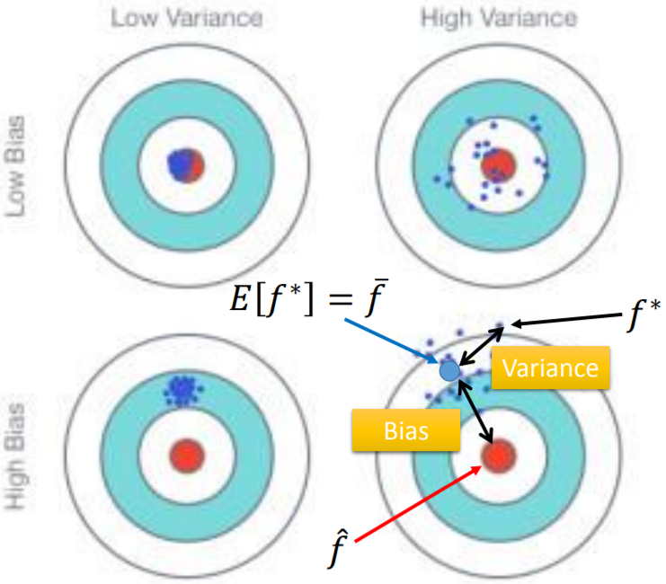
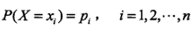

名词表

[https://developers.google.com/machine-learning/glossary](https://developers.google.com/machine-learning/glossary)

# ML架构


# 梯度裁剪 (gradient clipping)

在应用[**梯度**](https://developers.google.com/machine-learning/glossary/#gradient)值之前先设置其上限。梯度裁剪有助于确保数值稳定性以及防止[梯度爆炸](http://www.cs.toronto.edu/~rgrosse/courses/csc321_2017/readings/L15%20Exploding%20and%20Vanishing%20Gradients.pdf)。

# 批次 (batch)

[**模型训练**](https://developers.google.com/machine-learning/glossary/#model_training)的一次[**迭代**](https://developers.google.com/machine-learning/glossary/#iteration)（即一次[**梯度**](https://developers.google.com/machine-learning/glossary/#gradient)更新）中使用的样本集。

# 批次大小 (batch size)

一个[**批次**](https://developers.google.com/machine-learning/glossary/#batch)中的样本数。例如，[**SGD**](https://developers.google.com/machine-learning/glossary/#SGD) 的批次大小为 1，而[**小批次**](https://developers.google.com/machine-learning/glossary/#mini-batch)的大小通常介于 10 到 1000 之间。批次大小在训练和推断期间通常是固定的；不过，TensorFlow 允许使用动态批次大小。

一般来说batch\_size根据显存设置大一点，设为8的倍数，如果用SDG，对于DNN这样的非凸函数，一个样本无法代表整体的梯度方向，因此很容易导致RMSE的值反复抖动，设置大一点的batch\_size能够反映部分整体，保证优化方向朝着整体最有前进。

# tensorflow数据集基本操作

tf.data.Dataset.batch(batch\_size)

对数据集进行分组，最后一组的数据个数可能会小于batch\_size。

tf.data.Dataset.repeat (num\_epochs=none)

数据集的重复次数，默认无限重复数据（默认none不会出问题，也可以指定次数）。

tf.data.Dataset.shuffle (buffer\_size)

按照buffer\_size从数据集中（顺序？）读取到buffer中，然后batch()从buffer中（随机）抽掉一个样本，shuffle()再往buffer中放一个样本。注意：buffer\_size大于数据集样本数，则会对整个数据集重排。详见：[https://blog.csdn.net/qq\_16234613/article/details/81703228](https://blog.csdn.net/qq_16234613/article/details/81703228)

# 有些练习中会出现以下方便变量

**periods**：控制报告的粒度。例如，如果 periods 设为 7 且 steps设为 70，则练习将每 10 步输出一次损失值（即 7 次）。与超参数不同，我们不希望您修改 periods 的值。请注意，修改 periods 不会更改模型所学习的规律。

# 监督式机器学习细则

三项基本假设：

我们从分布中随机抽取**独立同分布 (i.i.d.)** 的样本

分布是**平稳的**：分布不会随时间发生变化（例如节假日的购物行为就不是平稳的）

我们始终从**同一分布**中抽取样本：包括训练集、验证集和测试集

# 更好的工作流程：使用验证集

把数据集只拆分成训练集和测试集，然后根据测试集修正我们的模型，多次重复该流程会导致过拟合，因此需要再分出验证集。这样模型暴露给测试集的信息就少了。

注意：在划分数据集之前一定要使用dataframe = dataframe.reindex(

np.random.permutation(dataframe.index))，不进行随机重排会导致后面划分数据集出现bias。**机器学习中的调试通常是*数据调试*而不是代码调试，**如果数据有误，即使最高级的机器学习代码也挽救不了局面。


# 分桶 (bucketing)

将一个特征（通常是[**连续**](https://developers.google.com/machine-learning/glossary/#continuous_feature)特征）转换成多个二元特征（称为桶或箱），通常根据值区间进行转换。例如加州房价的例子，因为不同地段的房价差异不同，所以可以根据经纬度进行分桶操作，这样对每个桶的学习权重进行调整，预测效果更好。

tensorflow语法如下，首先把特征列转换为数值列，然后再给到bucketized\_column()中，其中边界boundaries是左开右闭

```python
origin = tf.feature_column.numeric_column('origin')
origin_bucketize = tf.feature_column.bucketized_column(origin, boundaries=[1,2,3])
```

# 特征工程 (feature engineering)

一般就是值把原始数据转换为tensorflow能够接受的数据，例如对字符特征进行编码，或者用数值映射枚举类型。


# 独热编码 (one-hot encoding)

一种稀疏向量，其中：

一个元素设为 1。

所有其他元素均设为 0。

独热编码常用于表示拥有有限个可能值的字符串或标识符。例如，假设某个指定的植物学数据集记录了 15000 个不同的物种，其中每个物种都用独一无二的字符串标识符来表示。在特征工程过程中，您可能需要将这些字符串标识符编码为独热向量，向量的大小为 15000。


# 归一化 (normalization)、缩放 (scaling)

将实际的值区间转换为标准的值区间（通常为 -1 到 +1 或 0 到 1）的过程，好处：

可以让梯度下降法更快收敛。

避免"NaN陷阱"，例如运算过程中超出数值表示范围。

调整特征的权重，不会因为数量级差导致bias。例如进行线性回归时，对用了高阶的幂，则特征数值的放大是指数级的，会产生严重的bias。

一般用线性的方式缩放，也可以用非线性方式


# 梯度下降法的问题(Gradient Descent)

在线性回归的情况下，不需要担心这个问题，因为线性回归模型采用的Loss Function基本是凸函数


## 学习率问题（fixed learning rate）


之所常见的公式没有对梯度进行normalize，是因为上图所属，为了保证学习率在根据梯度自适应变化，可以认为eta与梯度的模成正比，这样就得出了fixed learning rate，即常见公式如下：


# 正则化 (regularization)

为了防止复杂模型出现过拟合现象，引入正则项，模型越复杂，惩罚越大。

对于λ，如果设置的比较大，那么训练出来的模型会比较平滑。

平滑函数：输入变化大但输出变化不大。函数越复杂，输出抖动越大。简单的模型，受输入的影响较小。

模型平滑，或许能提高预测正确率。当然，如果实际函数本身就抖动的很厉害，那么加入正则项反而会起到反作用，不过，这种情况一般少见。


# 过拟合(overfitting)、欠拟合(underfitting)、Bias、Variance

简单模型经过不同批次数据训练出来function（f\*），它们之间方差比较小，因为假设空间（function space）比较小，不管怎么训练都在小的空间内，离真实模型（f\^）的偏差比较大，不容易把真实模型包含到假设空间内。

复杂模型训练出来后方差虽然大（易受数据影响），但是因为假设空间大，当训练样本足够的时候，容易训练出与真实模型相近的模型。

当误差来自于偏差（bias）------欠拟合。

当误差来自于方差（variance），即对单一批次数据拟合太好，以致于对测试数据的误差较大------过拟合。

综上，要修正训练出来模型，首先考虑误差来自bias还是variance，要选择一个方向修正，判断方法：

连训练误差都很大，表明model空间没有包含target function，考虑修改model，增加feature，增加模型复杂度。

训练误差小，测试误差大。增加数据量；引入正则项可以减少variance，但是会减少function space，增加bias，所以要λ系数很重，要在bias和variance之间trade-off。




# 学习速率 (learning rate)

在训练模型时用于梯度下降的一个标量。在每次迭代期间，[**梯度下降法**](https://developers.google.com/machine-learning/glossary/#gradient_descent)都会将学习速率与梯度相乘。得出的乘积称为**梯度步长**。学习速率是一个重要的[**超参数**](https://developers.google.com/machine-learning/glossary/#hyperparameter)。

可以针对不同的feature设置不同的学习率。

自适应学习率：一开始距离目标比较远，可以用大的学习率，随着周期（epoch）的增加，逐渐减小学习率。


常见方法：

Adagrad：


实际用二次微分做分母效果更好，但是计算量大，为了妥协，采用如今的方式近似二次微分的值

随机梯度下降（Stochastic Gradient Descent）、小批次随机梯度下降法 (SGD, mini-batch stochastic gradient descent)

一种采用[**小批次**](https://developers.google.com/machine-learning/glossary/#mini-batch)样本的[**梯度下降法**](https://developers.google.com/machine-learning/glossary/#gradient_descent)。也就是说，小批次 SGD 会根据一小部分训练数据来估算梯度。[**Vanilla SGD**](https://developers.google.com/machine-learning/glossary/#SGD) 使用的小批次的大小为 1。也就是取一个样本来计算梯度，而不是所有样本。"天下武功，唯快不破"。


# 特征缩放（Feature Scaling）

跟归一化、标准化差不多一个意思，具体算法很多。


# sigmod函数的推导 (sigmoid function)

来源于贝叶斯后验概率公式，以下推导针对的是两个class的模型，即二分类问题。要求假设样本的特征服从正态分布，才能有P=sigma(z)。

sigmod的输出值作为分类依据。


为了使模型的variance减少，我们选择用一个统一的方差，按样本出现的概率线性组合各特征得出统一的方差，这样上面式子中的sigma1、sigma2就是一样的了（实验得出用统一方差，可以提高模型的准确率，简减少了模型的参数数量、复杂度），化简上面的式子后，得到以下公式，这也解释了为什么采用两个feature做分类时，使用线性组合方差后得到的分界线是线性的，而非曲线。


我们根据后验概率得出的分类模型，就是下面的贝叶斯分类。用概率得出的模型叫(概率)生成模型（(probabilistic)generative model）；若如图中所说，直接找w、b，就用的是判别模型（Discriminative Model）。

**朴素贝叶斯分类器（Naive Bayer Classifier）**

对数据集样本的各个特征，一般我们认为服从多维联合正态分布，如果假设各个特征之间是独立的，那么可以认为各个特征服从一维正态分布，这样的简化就是朴素贝叶斯分类。


# 逻辑斯蒂回归 (logistic regression)

通过将 [**S 型函数**](https://developers.google.com/machine-learning/glossary/#sigmoid_function)应用于线性预测，生成分类问题中每个可能的离散标签值的概率。虽然逻辑回归经常用于[**二元分类**](https://developers.google.com/machine-learning/glossary/#binary_classification)问题，但也可用于[**多类别**](https://developers.google.com/machine-learning/glossary/#multi-class)分类问题（其叫法变为**多类别逻辑回归**或**多项回归**）。

# 卷积神经网络 (convolutional neural network)

一种神经网络，其中至少有一层为[**卷积层**](https://developers.google.com/machine-learning/glossary/#convolutional_layer)。典型的卷积神经网络包含以下几层的组合：

卷积层

池化层

密集层


实际是全连接网络的一个子集，并且同一个filter得到的neuron共享相同的参数，如下图所示：


一般CNN开头的neuron比较少，因为开头部分是对简单模式的识别，到中间就组合成为复杂模式，因此中间、结尾的neuron比较多。在经过n个filter扫描后，得到的image尺寸是变小了，但是一个pixel会由n个chanel来描述。所以下图中的255=25(chanel)\*3\*3。


当一个CNN模型训练好之后，我们可以寻找利用梯度下降一些特殊的输入，使得CNN模型输出一些不可思议的结果：


# 熵 (entropy)

在信息论和概率统计中，熵表示随机变量不确定性的度量。当X服从均匀分布时，熵最大。




# 熵与交叉熵 (cross-entropy)、KL divergence

实际上是2进制编码的期望。如果用估计的熵减去实际编码的熵，就是KL距离，反映了两编码的差异。

详解：

https://www.zhihu.com/question/41252833/answer/108777563

# 线性回归对比逻辑斯蒂回归


之所以要套sigmoid方程，见右图右下角出，线性回归为了减少误差会将原本正确的绿色解调整为紫色解，然而这与实际分布不符（SVM可以避免这个问题）：


所以我们想让线性回归算法输出值非常大的时候，通过sigmoid得到变化不大的值，即饱和。那么输出大于0.5时分给1类，小于0.5时分给0类。sigmoid方程正好满足这个要求。为了让输出值在0-1之间，通过线性计算后再套入sigmoid方程，可得到输入所属类别的概率。

sigmoid方程实际上是让各样本共用协方差相同的高斯分布，有贝叶斯公式得来的：


我们把损失函数定义为`极大似然函数`（为什么不用`rmse`后面下面有讲，凑巧的是，如果用极大似然函数作为loss function，为了计算方便取负对数得到的式子恰好就是cross entropy）。函数f(x)表示属于1类的概率，那么1-f(x)表示属于0类概率，所有概率乘积就是最大似然函数，其中x3在训练数据中属于0类：


取负对数求argmin是一样的，方便后续的计算。根据交叉熵的定义，可知我们最后的损失函数被转化为求两个伯努利分布的交叉熵（即训练数据的分布和实际分布之间的差异），也是所谓的KL divergence：


由第一张图知道，最终推出的公式形式一模一样，只不过一个yhat是离散的，一个是连续的。因此，离散值非0即1，当输出差距较大时，梯度也大。

为什么做分类问题不用rmse作为loss function，因为输出离target远或者近，都会让梯度接近0：


交叉熵不存在这个问题：


# 线性回归模型的正规方程（Normal Equation）

当n\<=10000时，线性回归模型可以解出解析解，并且也不需要归一化。但是n\>10000后，因为算法复杂度问题，还是得用梯度下降法。

如果X\^T\*X不可逆，表明X里面有多余的特征，即有特征线性相关，或者因为参数个数多余训练样本个数。尽量精简特征数量，一般可以使用伪逆计算。


# 生成模型（generative model）

见李宏毅机器学习[Classification: Probabilistic Generative Model](http://speech.ee.ntu.edu.tw/~tlkagk/courses_ML17_2.html)

# Covariate Shift

如果训练集上的数据分布和测试集上的分布不一致，那么训练出来的模型在测试集上的性能就可能不好。例如对于样本$x_i$训练集的分布为$q(x_i)$，测试集为$p(x_i)$，为了指引模型调整权重，对样本加权$w(x)=\frac{p(x)}{q(x)}$。从迁移学习的角度看，这也是一种用source domain的标签数据，结合target domain的无标签数据，指导进行知识的迁移的方法。

* [修正实例](https://blog.csdn.net/mao_xiao_feng/article/details/54317852)

* [判断是否有covariate shift](https://blog.csdn.net/guoyuhaoaaa/article/details/80236500)

# 机器学习经验套路

## 项目开始前的思考

* 确定要预测的目标，找到项目痛点，不追求同时预测多个目标
* 确定解决问题的框架，有限使用监督学习，用无监督发掘新思路
* 结合已有规则，==尝试融合机器学习模型和人为规则==
* 优先尝试分类任务，也可尝试回归转分类
* 从简单模型开始
* ==问题是否是时间相关的==
* 全部数据效果不好就抛弃部分数据再试

## 数据工程

* ==数据并非越多越好，多余的无关特征会因为伪相关影响模型==
* 用可视化做相关性分析
* ==高度相关的特征，移除、合并前要三思，未必能改进性能==
* ==归一化、标准化是”无害的“，属于基本步骤==

# 强化学习细分领域

1. 终生学习Life Long Learning：能够不断通过与环境交互来学习提升决策能力，也就是终生学习
2. 少样本学习Few Shot Learning：能够快速学习，面对新的任务，可以通过少量的训练就掌握
3. 多任务学习Multi Task Learning：可以处理多种任务
4. 多智能体学习Multi Agent Learning：可以实现多智能体的协作完成任务
5. 学会学习Meta Learning/Learning to Learn：能够学会学习，这和快速学习本质是一样的，就是发现学习规律，面对新任务可以快速入手
6. 迁移学习Transfer Learning：这也和快速学习的目标一致，希望通过迁移以往学习的经验来加速新任务的学习。