# key essence of machine learning

* exist underlying pattern to be learned

* no programmable definition

* there is data about pattern


# 划定问题

问老板的第一个问题应该是商业目标是什么？建立模型可能不是最终目标。公司要如何使用、并从模型受益？这非常重要，因为它决定了如何划定问题，要选择什么算法，评估模型性能的指标是什么，要花多少精力进行微调。

# 数据

* 噪声数据，即没有代表性的数据，noise，outlier，一般通过boxplot筛选掉。
* 采样方式不对可能会引进bias。所以数据量越大越好，一方面variance可能增大，但是bias相对会小些。

## 数据污染、偷窥（contamination、snooping）

* 观察数据的时候我们的思考过程为我们将选则的model引入了complexity，这属于data-driven model。选择模型的时候，尽量用我们的经验和知识来做判断选择，而不是通过数据来选择。做决定前尽量不要过多的看数据。 

* 论文改进导致的污染，如果将所有相关论文当做一个大论文，那么总的VC维将等于d~vc~(U~m~H~m~)。

  比如对于某个基准数据集D，某人对它建立了一个模型H1，并发表了论文。第二个人看到这篇论文后，又会对D，建立一个新的好的模型H2。这样，不断地有人看过前人的论文后，建立新的模型。其实，后面人选择模型时，已经被前人影响了，这也是偷窥数据的一种情况。也许你能对D训练很好的模型，但是可能你仅仅只根据前人的模型，成功避开了一些错误，甚至可能发生了overfitting或者bad generalization。所以，机器学习领域有这样一句有意思的话“If you torture the data long enough, it will confess.” 

## 分层采样（stratified sampling）

将人群分成均匀的子分组，称为分层，从每个分层去取合适数量的实例，以保证测试集对总人数有代表性。

例如人口男女比例为6：4，那么调查某个问题时，假设总人数为1000人，则需要保证调查600个男性、400个女性，否则会引入严重采样偏差。

因此在划分数据集的时候，可能需要针对一些重要特征进行分层采样，保证划分前后的特征比例相同，这样在测试的时候不会因为采样偏差导致结果出现偏差。

## 交叉验证（k-fold cross validation）

把**训练集**分为k个fold，k个同种未训练模型，每个模型用k-1个fold训练，1个fold测试，所有模型的测试fold互不相同。

scikit-learn中提供cross_val_score方法，默认采用分层采样。

注意，交叉验证没有用到最终的测试集，最终测试集一定是留在上线前测试用的。


### 理论证明

见`林轩田机器学习基石-L15`


## 相关系数（correlation coefficient）

利用corr()方法可以得出各数值特征的相关系数，下图表示两特征的组合分布与相关系数的关系：


## 人为数据边界

从下图可以看到，在50万、35万处有较明显的人为上界，因此需要从数据集中筛选出来，这些数据可能不具备较好的代表性，即可能是噪声：


## 清洗

* 去除含NA项
* 去除无关属性
* fillna（mean、median、ffill、bfill）

## 特征选择（feature selection）

通用的方法如下：


D^(P)^是在原数据的基础对某个特征i进行洗牌，如果洗牌后导致性能下降严重，那么就说明这个特征很重要。

## 分类属性编码（one-hot code）

对于分类数据的编码，不宜使用连续的数值进行编码，而是应该使用pd.get_dummies()转换为one-hot code，以免让算法认为分类编码的值是该属性的权值。例如编码1与编码2接近，编码1与编码10疏远，而实际各分类是独立的：

```py
df2 = pd.DataFrame({'val':list('ab')*2})
df2
	val
0	a
1	b
2	a
3	b

pd.get_dummies(df2['val'], prefix='cat')
	cat_a	cat_b
0	1		0
1	0		1
2	1		0
3	0		1
```

## 特征缩放（归一化、标准化、Batch normalization）

与归一化不同，标准化不会限定值到某个特定的范围，这对某些算法可能构成问题（比如，神经网络常需要输入值得范围是 0 到 1）。但是，标准化受到异常值的影响很小。

feture scaling是必须要做的，除了给输入数据做之外，在神经网络中，每层的输出都要做，理由如下：

* 特征缩放后有助于提高训练速度。

* 对于整个网络，每次更新参数是整个网络同时更新，因为输入数据经过层层变换后其分布（均值、方差）都会变化，如果只调一层参数而固定其他层参数，那么结果会向好，但是多层组合后就不一定了，这个问题称为Internal Covariate Shift。

  所以，对每层输出做缩放后，有利于让数据转换在同一维度上（类似于z-score），让每层输出数据的分布变化不要太大进而影响整个输出结果。

  最直接的方法是每层输出都做缩放后再传入下一层，不过更好的办法是抽取部分数据做以近似全局数据的统计特性，在TensorFlow中可以添加相应的处理层（内部实现比较复杂）。

  在测试时或者在线学习时，数据是单个输入的，因此要解决均值和标准差的计算问题：

  * 计算整个训练数据的均值和方差，然后在测试时用。
  * 计算训练batch的移动均值和方差，经过多轮更新后近似于全局均值和方差。由于初期网络参数变化较快，所以不采用初期计算值。

* 因为较小的Covariate Shift，我们可以采用较大的学习率。

* 减少梯度消失问题。因为输出落在激活函数斜率较大的地方，如sigmoid、tanh。

* 降低对初始参数的敏感度。参数乘n倍也没影响。

* 减少过拟合的可能。

下图表示Batch normalization的效果（x5表示学习率乘5）。除此之外还有很多normalization方法。


### 代码、使用细节

#### 错误的用法

```python
from sklearn.preprocessing import MinMaxScaler, StandardScaler

mm_scaler = MinMaxScaler()
std_scaler = StandardScaler()

"""
minmax处理后引入非常多的噪声，小噪声被放大（实际问题是因为scaler作用于每个feature column，对于时间序列，如果是裁剪好的，那么每个时间点都被独立当成了一个feature，所以出问题了。要进行transpose才行。）
standard scaler没有什么问题，序列形态和原图差不多，只是峰值无法统一
"""
mm_res = mm_scaler.fit_transform(tmp4)
fig = plt.figure(figsize=(17,5))
ax = fig.add_subplot(1,1,1)
ax.plot(np.arange(mm_res[2].shape[0]), mm_res[2])

std_res = std_scaler.fit_transform(tmp4)
fig = plt.figure(figsize=(17,5))
ax = fig.add_subplot(1,1,1)
ax.plot(np.arange(std_res[2].shape[0]), std_res[2])
```

minmax处理后==（错误用法的结果）==：


standard scaler处理后：


# 评估指标

**真正例（true positive）**是指模型将正类别样本正确地预测为正类别。同样，**真负例（true negative）**是指模型将负类别样本正确地预测为负类别。

**假正例（false positive）**是指模型将负类别样本错误地预测为正类别，而**假负例（false negative）**是指模型将正类别样本错误地预测为负类别。

## 准确率、查准率（precision）

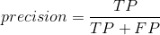

## 召回率、查全率（recall）


## 混淆矩阵（confusion matrix）

二分类的混淆矩阵：


## 折中

有的场景你会绝大程度地关心准确率，而另外一些场景你会更关心召回率。举例子，如果你训练一个分类器去检测视频是否适合儿童观看，你会倾向选择那种即便拒绝了很多好视频、但保证所保留的视频都是好（高准确率）的分类器，而不是那种高召回率、但让坏视频混入的分类器（这种情况下你或许想增加人工去检测分类器选择出来的视频）。另一方面，加入你训练一个分类器去检测监控图像当中的窃贼，有着 30% 准确率、99% 召回率的分类器或许是合适的（当然，警卫会得到一些错误的报警，但是几乎所有的窃贼都会被抓到）。

不幸的是，你不能同时拥有两者。增加准确率会降低召回率，反之亦然。这叫做准确率与召回率之间的折衷。


### F1值（F1-score）

F1 值是准确率和召回率的调和平均。普通的平均值平等地看待所有的值，而调和平均会给小的值更大的权重。所以，要想分类器得到一个高的 F1 值，需要召回率和准确率同时高。

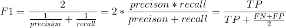


### PR曲线

清晰的反映出不同阈值准确率和召回率的变化，让我们能够选择一个合适的阈值作为折中点。


###  ROC 受试者工作特征曲线（receiver operating characteristic）

不同[**分类阈值**](https://developers.google.com/machine-learning/crash-course/glossary#classification_threshold)下的[**正例率**](https://developers.google.com/machine-learning/crash-course/glossary#TP_rate)和[**假正例率**](https://developers.google.com/machine-learning/crash-course/glossary#FP_rate)构成的曲线。

我们希望曲线越贴近左上角越好，这意味着真正例高的同时产生假正例的比例低。


#### ROC 曲线下面积 (AUC, Area under the ROC Curve)

[ROC 曲线](https://developers.google.com/machine-learning/crash-course/glossary#ROC)下面积是，对于随机选择的正类别样本确实为正类别，以及随机选择的负类别样本为正类别，分类器更确信前者的概率。

### PR与ROC选择

如何决定使用哪一个曲线呢？一个笨拙的规则是，当正例很少优先使用 PR 曲线，或者当你关注假正例多于假反例的时候。其他情况使用 ROC 曲线。主要还是看业务需求，如ieee-cis fraud这种比赛，roc可以平衡公司损失和客户体验，尽管正例只有3.5%。

# 特征工程


# 流水线 （pipeline）

```python
from sklearn.pipeline import Pipeline

#具体用法见Python on Data Analysis笔记
```


一系列的数据处理组件被称为数据流水线。流水线在机器学习系统中很常见，因为有许多数据要处理和转换。

组件通常是异步运行的。每个组件吸纳进大量数据，进行处理，然后将数据传输到另一个数据容器中，而后流水线中的另一个组件收入这个数据，然后输出，这个过程依次进行下去。每个组件都是独立的：组件间的接口只是数据容器。这样可以让系统更便于理解（记住数据流的图），不同的项目组可以关注于不同的组件。进而，如果一个组件失效了，下游的组件使用失效组件最后生产的数据，通常可以正常运行（一段时间）。这样就使整个架构相当健壮。

另一方面，如果没有监控，失效的组件会在不被注意的情况下运行一段时间。数据会受到污染，整个系统的性能就会下降。

# meta-algorithm

## one vs all（one vs rest）

对于一个二元分类器，要想做到多元分类，可以采用如下方法：


假设有K个类，那么就训练K个二元分类器，分别创建K个数据集D~k~，得到K个logistic regression model，最后对每一笔数据都用这K个model算出概率，取最大的那个作为分类结果：


原始OVA这个最大缺陷在于，如果数据不平衡，例如5%的A类，95%的B类，那么训练好的model会把所有输入都判定为B类，因为这样也能保证95%准确率。因此实际上还有multinomial logistic regression，让上面所有K个model 的对一笔数据判定的概率总和为1，以此改善这个问题。

## one vs one


每次抽取两个类的数据进行训练，所以要做C~k~^2^个model，这样可以避免imbalanced data，组中样本给到所有分类器里面，哪个类概率大就加1票，最终在所有类别中找票数最多的那个：


## 对比？？？待实验完成

# 模型

## 模型对比


最后一排最常用。

## 保存模型（joblib）

```python
from sklearn.externals import joblib

joblib.dump(my_model, "my_model.pkl")

my_model_loaded = joblib.load("my_model.pkl")
```

## 线性回归模型

一般公式如下：

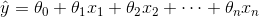


一般采用RMSE或者MSE作为损失函数，用MSE的话可以轻易的得到解析解：


### 解析解（analytical solution）

实际上就是先用向量形式表示MSE，然后类似于一般数学式的求导，得出:


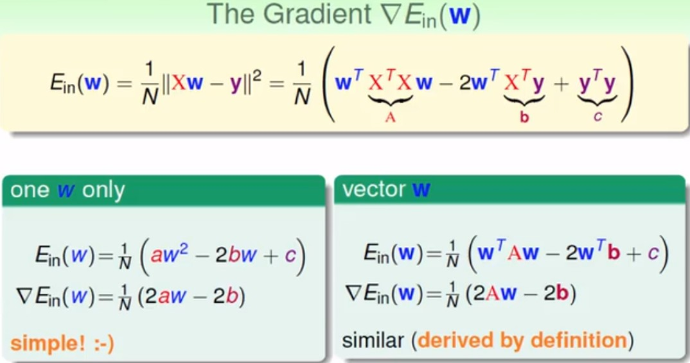


所以最后的解如下，如果矩阵不可逆，那么一般算法会用伪逆矩阵，二者数值相差不大：


```python
%matplotlib inline
import matplotlib
import matplotlib.pyplot as plt
import numpy as np

x = 5 * np.random.rand(100, 1)
y = 1 + 4*x + np.random.randn(100, 1)

X_m =  np.c_[np.ones((100, 1)), x]
X_m_Trans = X_m.T
theta_resolution_res = np.linalg.inv(X_m_Trans.dot(X_m)).dot(X_m_Trans).dot(y)
theta_resolution_res

#theta0≈1，theta1≈4
array([[0.99346782],
       [4.02395113]])

plt.plot(np.array([[0], [5]]), np.c_[np.ones((2, 1)), np.array([[0], [5]])].dot(theta_resolution_res), 'r-')
plt.scatter(x, y)
```


虽然可以得到解析解，算法复杂度为O(n\^2.4)到O(n\^3)之间，但是空间复杂度为O(m)，无法应对大数据。

使用梯度下降可能会更快得到全局最优（线性模型的MSE损失函数是凸函数）

### 批量梯度下降（batch gradient descent）

损失函数的偏导数：


梯度矩阵：


梯度下降步长：

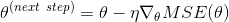

```python
learning_rate = 0.1
n_iter = 1000
m = len(y)

theta = np.random.randn(2,1) #array, [theta0, theta1]

for i in range(n_iter):
    gradients = 2/m * X_m_Trans.dot(X_m.dot(theta) - y)
    theta = theta - learning_rate * gradients
    
theta    
array([[0.99346782],
       [4.02395113]])
```

### 随机梯度下降（stochastic gradient descent）

批量梯度下降问题在于需要全部数据的参与，当然也可以设置采样部分数据（mini batch）。如果只用一个数据update梯度，那么就是SGD。

SGD问题在于

* 随机性，从SGD的源来看，SGD不会判断平均梯度是否接近0，因此需要多次迭代，但是无法确定迭代次数的大小。在sklearn中通常有max_iter参数，这个参数通常设定非常保守，如果loss function选择不合适会导致最终无法收敛。

* learning rate设定，根据经验一般取0.1。

```python
#实际上就是PLA，perceptron learning algorithm
from sklearn.linear_model import SGDClassifier
```


## 多项式回归模型

PolynomialFeatures(degree=d)把一个包含 n个特征的数组转换为一个包含  特征的数组：

```python
from sklearn.preprocessing import PolynomialFeatures
from sklearn.linear_model import LinearRegression
poly_features = PolynomialFeatures(degree=2, include_bias=False)

m = 200
x = 6*np.random.rand(m, 1) - 3
y = 0.5 * x**2 + x + 1 + np.random.randn(m, 1)

"""
PolynomialFeatures会自动算出生成多项式数值
"""
x_poly = poly_features.fit_transform(x)
x[0], x_poly[0]
(array([2.23198288]), array([2.23198288, 4.98174756]))

"""
LinearRegression会根据输入添加当前所有特征的阶数的组合
例如，degree=3,两个特征a、b，则会有a^3,a^2,a^2b,ab,ab^2,b^2,b^3
"""
lin_reg = LinearRegression()
lin_reg.fit(x_poly, y)
lin_reg.intercept_, lin_reg.coef_
(array([1.0498603]), array([[1.00129363, 0.50980077]]))

x_plot = np.linspace(-3, 3, 100*m)
y_plot = lin_reg.coef_.dot(np.matrix([x_plot, x_plot**2])) + lin_reg.intercept_
plt.scatter(x, y)
plt.plot(x_plot,y_plot.T, 'r-')
```


### legendre polynomials

需要注意的是，如果x∈[-1,1]，在transform成高维特征的时候，会导致特征值特别小，如果我们加了regularization项，并且高维特征比较重要的时，需要较大W，这就产生了矛盾，因此在做高维feature transform的时候，我们可以把找出高维空间的正交基：


## 误差

### 绘制学习曲线

### 数据量与误差

```python
from sklearn.metrics import mean_squared_error
from sklearn.model_selection import train_test_split

def plot_learing_curve(model, x, y):
    x_train, x_val, y_train, y_val = train_test_split(x, y, test_size=0.2)
    train_err, val_err = [], []
    for i in range(1, len(x)):
        model.fit(x_train[:i], y_train[:i])
        y_train_pred = model.predict(x_train[:i])
        y_val_pred = model.predict(x_val)
        train_err.append(mean_squared_error(y_train_pred, y_train[:i]))
        val_err.append(mean_squared_error(y_val_pred, y_val))
    plt.plot(np.sqrt(train_err),color='red', label='train')
    plt.plot(np.sqrt(val_err), label='val')    
    plt.legend()

plot_learing_curve(LinearRegression(), x, y)
```


### 模型复杂度与误差

```python
from sklearn.pipeline import Pipeline

poly_reg = Pipeline([
    ('poly_feature', PolynomialFeatures(degree=4, include_bias=False)),
    ('sgd_reg', LinearRegression())
])

plot_learing_curve(poly_reg, x, y)
```

遇上一个模型相比，把阶数提高到4阶，能够显著降低RMSE：


另一个实验如下，负载度低的模型平均误差率高，但是在数据量较小的时候，能够保证Eout≈Ein，而高负载度模型需要大量的数据才能保证Eout收敛至Ein：


公式证明如下（推导见林轩田机器学习基石-L9），其中`d`为数据维度，`N`为数据量：


## 过拟合（overfit）

### 噪声（deterministic、stochastic）


右侧的颜色条表示overfit程度，数值越大越严重。两图都可由VC-bound公式可解释，只不过引入了噪声。

右图在随机噪声固定的情况下，由目标函数复杂度造成的`deterministic noise`也会让结果过拟合。复杂的目标函数在少量数据情况下的波动很大，所以也称之为`noise`。总之，下面四个因素会导致overfit：

* data size N ↓
* stochastic noise sigma^2 ↑
* deterministic noise（target complexity） Q~f~ ↑
* excessive power d~vc~ ↑

### 处理方法

* simple model first
* data cleaning（纠正数据标签）/pruning（剔除错误数据）
* data hinting（对原数据进行简单变化，造出virtual samples以扩充数据集，不过这样可能会破坏`i.i.d.`，要谨慎）
* regularization
* validation

## 正则化（regulation）

### 拉格朗日乘数法（lagrange multiplier）


所以我们希望`W`要与最终的`Wlin`平行：


实际上引入正则项相当于调整hypothesis的d~vc~，其中的`1`指的是W~0~：


### 一般的正则项（general regularization）

我们常见的L2 norm就是由上面`Wreg`与`Wlin`向量平行的思想推出来的。

下图中的symmetry regularization表示如果我们认为target function是偶函数，那么可以对`Wodd`做限制。


### 岭回归（Ridge、Tikhonov ）

岭回归损失函数，注意theta0不在正则项里面：


在使用岭回归前，对数据进行放缩（可以使用StandardScaler）是非常重要的，算法对于输入特征的数值尺度（scale）非常敏感。大多数的正则化模型都是这样的。

左图为一阶线性回归，有图为10阶线性回归，alpha值越大线条越平滑：


岭回归的封闭方程的解析解：


代码：

```python
from sklearn.linear_model import Ridge
ridge_reg = Ridge(alpha=1, solver="cholesky")

sgd_reg = SGDRegressor(penalty="l2") #l2就表示添加l2 norm
```

### Kernel Ridge Regression

由`Representer Theorem`证明所有用了L2正则项的线性模型都可以用kernel：


带入w后得到如下表达式：


求梯度得到：

​										β=(λI+K)^-1^y

由Mercer条件知道kernel表示的矩阵一定只是半正定的，那么(λI+K)一定可逆。

通过引入kernel，我们又可以用线性模型解非线性问题了。训练复杂度是O(N^3^)，预测复杂度是O(N)。

### Lasso 回归（Least Absolute Shrinkage）

公式如下，实际就是添加了l1 norm 的线性回归，该函数不可导：


Lasso 回归子梯度向量：


Lasso 回归的一个重要特征是它倾向于完全消除最不重要的特征的权重，因为当x∈(-1,1)的时候，高阶`w`倾向于大的值，而正则化会压制高阶`w`，因此`L1 norm`对低阶`w`容忍度高。如果在做data transform的时候有用`legendre polynomials  `，那么会平衡高低阶`w`的惩罚程度。

换句话说，Lasso回归自动的进行特征选择同时输出一个稀疏模型（即，具有很少的非零权重）。


代码：

```python
from sklearn.linear_model import Lasso
lasso_reg = Lasso(alpha=0.1)
```

### 弹性网络（ElasticNet）

弹性网络介于 Ridge 回归和 Lasso 回归之间。它的正则项是 Ridge 回归和 Lasso 回归正则项的简单混合，同时你可以控制它们的混合率r，损失函数如下：


岭回归是一个很好的首选项，但是如果你的特征仅有少数是真正有用的，你应该选择 Lasso 和弹性网络。就像我们讨论的那样，它两能够将无用特征的权重降为零。一般来说，弹性网络的表现要比 Lasso 好，因为当特征数量比样本的数量大的时候，或者特征之间有很强的相关性时，Lasso 可能会表现的不规律。

```python
from sklearn.linear_model import ElasticNet
elastic_net = ElasticNet(alpha=0.1, l1_ratio=0.5)
```

### L1 norm与L2 norm

#### 理论

对于右图中的L1 norm，假设`Wlin`在更偏一点，那么负梯度的方向始终与`sign`有夹角，为了让两个向量平行，因此最优解会跑到顶点处，这是大部分`Wi`为0，此时`W`是`sparse`的。因此对于计算能力弱的设备，考虑用L1 norm会更快，更节省资源。


#### 实验

左侧图：

* 黄色表示alpha趋向于正无穷，即损失函数只看正则化项的大小，显然走不到global minima。
* 白色表示采用批量梯度下降走的路径。

右侧图：

* 白色表示alpha=0.5。
* l1 norm把theta2消减近乎为0，只保留theta1。
* l2 norm保留了两个theta，没有刻意消减某项。


### 早停法（Early Stopping）

一旦验证错误达到最小值，便提早停止训练。


```python
from sklearn.base import clone

"""
warm_start=Ture会让模型fit后保留参数，再次fit的时候会继续沿用上次的参数
"""
sgd_reg = SGDRegressor(n_iter=1, warm_start=True, penalty=None,learning_rate="constant", eta0=0.0005)

minimum_val_error = float("inf")
best_epoch = None
best_model = None
for epoch in range(1000):
    sgd_reg.fit(X_train_poly_scaled, y_train)
    y_val_predict = sgd_reg.predict(X_val_poly_scaled)
    val_error = mean_squared_error(y_val_predict, y_val)
    if val_error < minimum_val_error:
        minimum_val_error = val_error
        best_epoch = epoch
        best_model = clone(sgd_reg)
```

## Representer Theorem 与 kernel

只要用了L2正则项的线性模型，都可以用kernel：


## 逻辑斯蒂回归（Logistic Regression）

### 理论

#### 原始逻辑斯蒂回归

见`机器学习基石-L10`。

#### Probabilistic Logistic Regression

先从软间隔SVM的误差出发，看看与LR之间的关系：


取max(ξ,0)作为误差函数，得出hinge loss：


为了结合SVM与Logistic Regression各自优势，即kernel和最大似然，引入下面的函数：


算法很简单，先用SVM求解w和b，然后带入原始Logistic Regression公式中，利用最大似然求解A、B，即`fine-tune`。

#### Kernel Logistic Regression


上图证明了最优的`w`可以被`z`线性表示，因此对于加了L2 norm的线性模型，都可以引入kernel：


从另一个角度看KLR：


注意到这里的kernel作用是`transform`和`regularizer`。

### 二分类

逻辑回归的损失函数（对数损失）:

![J(\theta)=-\frac{1}{m}\sum\limits_{i=1}^m\left[y^{(i)}log\left(\hat{p}^{(i)}\right)+\left(1-y^{(i)}\right)log\left(1-\hat{p}^{(i)}\right)\right]](./images/tex-b6a0de3f265cdeedc2ac1d0687fef2ea.gif)

逻辑回归损失函数的偏导数:


Logistic Regression的起源以及sigmoid（也称之为logistic function）的由来见`machine learning笔记`。

```python
from sklearn import datasets
from sklearn.linear_model import LogisticRegression

iris = datasets.load_iris()
x = iris['data'][:, 3:]
y = (iris['target']==2)

log_reg = LogisticRegression()
log_reg.fit(x, y)

x_plot = np.linspace(0, 3, 1000).reshape(-1, 1)
y_proba = log_reg.predict_proba(x_plot)
plt.plot(x_plot, y_proba[:, 1], 'g-', label='Iris-Virginica')
plt.plot(x_plot, y_proba[:, 0], 'b--', label='Not Iris-Virginica')
plt.legend()
```

决策边界：


### Softmax 回归（多类别 Logistic 回归）

如果结果又k各类，那么依次算出输入对于k个类的分数，公式**theta带k，图片有误**：


Softmax 函数：


最终输出：

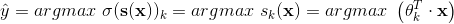

用交叉熵表示损失函数：


k类交叉熵的梯度向量：


```python
x = iris['data'][:, (2, 3)]
y = iris['target']

sm_reg = LogisticRegression(multi_class='multinomial', solver='lbfgs')
sm_reg.fit(x, y)

sm_reg.predict_proba([[1.4, 0.2]])
```

决策边界如下：


## 支持向量机（SVM）

SVM classifer try to find large-margin hyperplanes which seperate different samples of classes.

* Primal SVM is suitable with small data's dimension.
* The kernel SVM can achieve sophisticated decision boundary and numerous feature transform with not many parameters.It also work well in cases where number of dimensions is greater than the number of samples.

### Trick

在使用前做normalization，否则margin会由数值大的SV决定，如图：


### 理论

#### Primal Hard-Margin SVM

找到一条最“胖”的线（large-margin separating hyperplane），能够把所有点正确分开，假设数据有gaussian-like noise，那么能够保证这个模型足够robust:


那么在点到超平面的距离如下：


因为所有点都能正确区分，所以可以摘掉绝对值符号，得到下面的margin公式，这时候没有w~0~，单独拿出来b，为了方便后续微分：

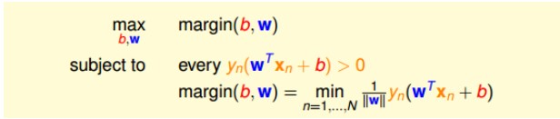

应为`w`和`b`可以同乘以系数进行缩放而不影响一条直线的变化，那么我们让离线最近的点满足y~n~(w^T^x~n~+b)=1，这样的话就把问题变为：


对于上面的问题，一方面我们需要做max，另一方面又要min，所以尝试把条件放宽一点，看看解是不是一样的，那么对于所有的点都满足y~n~(w^T^x~n~+b)>=1：


由上图可知，如果放宽条件后最优解落在外面，那么通过最外圈的最优解缩放，又可以得到更优的max||w||^-1^，这就产生矛盾了，因此最优解依旧落在原条件的范围内。故适当放宽原条件，不会导致最优解变化，并且因为把min转换为了不等式，让求解更简单了。

最终问题转化如下，变成了一个典型的二次规划问题（Quadratic Programming）：


Q是二次项的系数矩阵，p^T^是一次向系数向量，a~n~^T^对应一个约束的系数，c~m~对应一个约束的常数。

调用现成的包，就可以得到`linear hard-margin svm`的解，即严格要求所有点被分开。

#### margin与d~vc~

简单的示例如下：


假设3点位于单位圆上，3点均等分布时相互距离最远为sqrt(3)，如要求margin>sqrt(3)/2，则不论如何都会把两个点囊括在margin内，那么就减少了dichotomies，也减少了d~vc~。从而降低model复杂度并获得更好的泛化能力：


#### Dual SVM（对偶）、非线性SVM

原始的SVM的QP中，变量有d+1个，条件有N个，当数据的特征维度大的时候（例如非线性的feature transform），QP难以求解，因此想找一个等价的问题，获得同样的model并且避开原始条件。

一般在做非线性的feature transform的时候会产生非常大的d~vc~，如果模型过于复杂，对于QP求解会非常困难。因此想通过对偶问题的转换让参数求解摆脱有非线性转换带来的d~vc：~


假设数据集线性可分，那么一定有“feasible”的解，因此最终优化的object依旧是w^T^w，通过拉格朗日乘数法把条件转换为线性约束：


上述推导得出的是**弱对偶问题**，即对偶问题是原问题的下界，如果满足下述条件，那么等号将成立，成为**强对偶问题**：


对于max-min问题的内部，因为有解，那么求出其驻点从而得出相对应的约束条件。通过约束条件变量代换，整理得：


如果要`(b,w,α)`同时是原始问题和对偶问题的最佳解，则需要满足：

* primal feasible：原始问题约束条件
* dual feasible：对偶问题约束条件
* dual-inner：对偶问题内部的约束条件（拉格朗日函数求偏导得出的条件）
* primal-inner：原始问题条件与对偶问题条件的乘积为0，即要求`lagrange terms`全为0

注意到α~n~(1-y~n~(w^T^z~n~+b))=0，前面说过，假设线性可分一定有解，那么对于原primal条件不能违反，因此括号内的项`>=0`，对于拉格朗日乘数法，要求α~n~>=0。因此对于min最优解，必定二者相乘等于0。


把`w`做变量代换后得出上图的QP问题，我们避开了数据的维度`d`，转换成了数据量`N`，做简单系数对应工作：


#### Support Vector的由来

上面的对偶问题中，只有当α~n~>0时，能够计算`b`和`w`，对于这些能够对最终问题求解的点称为`support vector`。在边界上的点称为`candidate`，其中部分点α~n~=0。


#### Primal vs Dual


#### Kernel SVM

可以看到对偶问题似乎已经摆脱了d^~^，先对数据做transform后内积可求出q~n,m~，但是transform后实际上原来的d==变成了d^~^==，并且此时还受制于数据量N，那么z~n~^T^z~m~矩阵可能非常大，无法放入内存。实际上内积计算复杂度为feature transform后的O(d^~^)。为了解决q~n,m~的计算瓶颈，以2次变换为例：

​										z~n~^T^z~m~=φ(x~n~)φ(x~m~)


通过对2次变换的拆解，简单整理后发现最终==只需要计算一次x^T^x^‘^==然后带入上面的公式，就可以得出原变换的内积结果。**这个合并了`transform`和`inner product`的函数称为`kernel function`。**


#### Kernel有效的原因和好处


`#`表示d~vc~或者参数数量等。


#### General Polynomial Kernel

一般化的多项式核，添加了三个系数，分别是常数`ζ`、`γ`、`Q`：


#### Gaussian(RBF) Kernel

高斯核突破上面的次数限制，把feature transform推广到无限维，其核心原理是泰勒展开：


添加一个调节系数后：


相当于计算每个SV对其他数据点的影响，调整`γ`相当于调整方差，越大则函数越尖锐，对周边的影响力衰减越快，实验示例：


#### 自定义Kernel

自定义的核必须满足下面的条件，也称为Mercer定理：


#### Soft-Margin SVM


上面的形式首先不是QP的，不论目标和约束都是非线性的，因此再做进一步转换：


跟Hard-Margin SVM的解法一样，用拉格朗日乘数法：


以下是实验：


关于α、ξ的物理含义：


根据E~loocv~的公式推导，我们可以拿来看看与软间隔SVM的联系，通过下面证明可以得出软间隔SVM的E~loocv~错误率上界：


可见上界是SV的数量占总样本的比例。

#### Support Vector Regression

##### Primal

先引入tube regression:


蓝色区域内不记误判，超出蓝色区域的才计算误差，得到的优化目标如下：


那么对于SVM，可以仿照上面的方式：


其中ε表示tube的宽度，即对错误的容忍程度，而ξ表示犯错的上下界。


这是一个QP，只不过变量数增加了。同样地，可以找到对偶问题进行求解：

##### Dual

依旧是`Lagrange Multiplier`，照着SVM推：


tube内的点|y~n~-w^T^z~n~-b|<ε，此时ξ=0，所以两个complementary slackness等式的括号项≠0，故β=α~n~^∨^+α~n~^∧^=0，因此Dual SVR的解是sparse的。稀疏解可以在存储和计算上进行优化。

###  分类

#### 多分类

对于二分类模型，默认设定`multi_class='ovr'`，所谓ovr（one-vs-rest）就是ova（one-vs-all）。

#### 线性

 SVM 分类器在两种类别之间保持了一条尽可能宽敞的街道（图中平行的虚线），其被称为最大间隔分类。

添加更多的样本点在“街道”外并不会影响到判定边界，因为判定边界是由位于“街道”边缘的样本点确定的，这些样本点被称为“支持向量”。这解决了线性回归模型因为所谓的“outlier”引起的模型误分类，详见`Machine Learning笔记`。

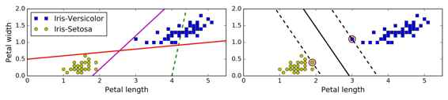

最好做标准化：


##### 软间隔分类

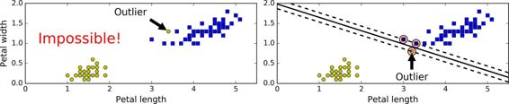

在 Scikit-Learn 库的 SVM 类，你可以用`C`超参数（惩罚系数）来控制，因为有些样本无法实现绝对的线性可分。

通过调小`C`，可以让间隔大一些，避免过拟合。

```python
from sklearn.pipeline import Pipeline
from sklearn.preprocessing import StandardScaler
from sklearn.svm import LinearSVC

x_2 = iris['data'][:, (2, 3)]
y_2 = (iris['target']==2).astype(np.float64)
svm_clf = Pipeline([
    ('scaler', StandardScaler()),
    # hinge loss需要非常大的迭代次数才能收敛
#     ('svm_clf', LinearSVC(C=1, loss='hinge', max_iter=200000))
    ('svm_clf', LinearSVC())
])

svm_clf.fit(x, y)
Pipeline(memory=None,
     steps=[('scaler', StandardScaler(copy=True, with_mean=True, with_std=True)), ('svm_clf', LinearSVC(C=1.0, class_weight=None, dual=True, fit_intercept=True,
     intercept_scaling=1, loss='squared_hinge', max_iter=1000,
     multi_class='ovr', penalty='l2', random_state=None, tol=0.0001,
     verbose=0))])

svm_clf.predict([[5.5, 1.7]])
array([2])
```

#### 非线性

我们可以通过添加高阶的多项式特征，让线性模型能够拟合非线性数据，不过在面临大数据集的时候效率会很低，因为会产生很多无用的高阶特征：

```python
from sklearn.preprocessing import PolynomialFeatures
from sklearn.datasets import make_moons

mm = make_moons()
mm_x = mm[0]
mm_y = mm[1]

poly_svm_clf = Pipeline([
    ('poly_features', PolynomialFeatures(degree=3)),
    ('scaler', StandardScaler()),
    ('svm_clf', LinearSVC())
])

plot_decision_boundaries(mm_x, mm_y, poly_svm_clf)
```


#### 多项式核

核技巧（kernel trick）可以取得就像你添加了许多多项式，甚至有高次数的多项式，一样好的结果。但是不会大量特征导致的组合爆炸，因为你并没有增加任何特征。

```python
from sklearn.svm import SVC
poly_kernel_svm_clf = Pipeline((
        ("scaler", StandardScaler()),
        ("svm_clf", SVC(kernel="poly", degree=3, coef0=1, C=5))
    ))
plot_decision_boundaries(mm_x, mm_y, poly_kernel_svm_clf)
```


#### 径向基函数（Gaussian Radial Basis Function，RBF）

另一种解决非线性问题的方法是使用相似函数（similarity function）计算每个样本与特定地标（landmark，实际就是support vector）的相似度。

RBF公式（就是RBF kernel，原名叫Gaussian kernel）如下，其中γ为自定义系数，l为landmark的坐标值：


从下图可以看到，设置两个landmark分别为x_l1=-2, x_l2=1，那么对于x=-1，带入上述公式，设γ=0.3，则可以算出与两个landmark的相似度，以相似度为坐标，使得图中的三角点和方形点变成线性可分：


```python
from sklearn.svm import SVC

rbf_svm_clf = Pipeline([
    ('scaler', StandardScaler()),
    ('svm_clf', SVC(kernel='rbf'))
])
rbf_svm_clf.fit(mm_x, mm_y)
```


还有其他的核函数，但很少使用。例如，一些核函数是专门用于特定的数据结构。在对文本文档或者 DNA 序列进行分类时，有时会使用字符串核（String kernels）（例如，使用 SSK 核（string subsequence kernel）或者基于编辑距离（Levenshtein distance）的核函数）。

这么多可供选择的核函数，你如何决定使用哪一个？一般来说，你应该先尝试线性核函数（记住`LinearSVC`比`SVC(kernel="linear")`要快得多），尤其是当训练集很大或者有大量的特征的情况下。如果训练集不太大，你也可以尝试高斯径向基核（Gaussian RBF Kernel），它在大多数情况下都很有效。

#### 复杂度


### 回归

SVM 回归任务是限制间隔违规情况下，尽量放置更多的样本在“街道”上。“街道”的宽度由超参数`ϵ`控制。

```python
from sklearn.svm import LinearSVR
svm_reg = LinearSVR(epsilon=1.5)
svm_reg.fit(x, y)
```


处理非线性回归任务，你可以使用核化的 SVM 模型:

```python
from sklearn.svm import SVR

svm_poly_reg = SVR(kernel="poly", degree=2, C=100, epsilon=0.1)
svm_poly_reg.fit(X, y)
```

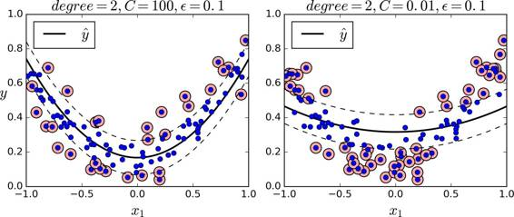

#### Probabilistic Logistic Regression（SVM+LR）

在原始SVC模型中有`probability=False`，设为`True`后，模型默认用rbf核的SVM训练，然后再用LogisticRegression()训练得出概率，用predict_proba() and predict_log_proba() 获取数值。

```python
from sklearn.svm import SVC

SVC()
SVC(C=1.0, cache_size=200, class_weight=None, coef0=0.0,
  decision_function_shape='ovr', degree=3, gamma='auto_deprecated',
  kernel='rbf', max_iter=-1, probability=False, random_state=None,
  shrinking=True, tol=0.001, verbose=False)
```

### 绘制决策边界

```python
def plot_svm_decision_boundary(model, X, y):
    sns.scatterplot(X[:, 0], X[:, 1], hue=y)
    ax = plt.gca()
    xlim = ax.get_xlim()
    ylim = ax.get_ylim()
    
    x = np.linspace(xlim[0], xlim[1], 20)
    y = np.linspace(ylim[0], ylim[1], 20)    
    
    xx, yy = np.meshgrid(x, y)
    xy = np.vstack([xx.flatten(), yy.flatten()]).T
    zz = model.decision_function(xy).reshape(xx.shape)
    
    """
    等高线图需要三个参数，其中xx，yy是坐标，zz是坐标对应的值，两点的值一样就会在同一条线上。
    levels指定了需要画出哪些等高线。
    """
    ax.contour(xx, yy, zz, colors='green', levels=[-1,0,1], alpha=0.5, linestyles=['--','-','--'], )
    ax.scatter(model.support_vectors_[: ,0],model.support_vectors_[: ,1],s=100, linewidth=1, facecolors='none',edgecolors='red')
```


## Aggregation（集成）

### 理论

#### 对比


#### Blending and Bagging

集成的好处在于可以起到了==类似==`feature transform`和`regularization`的作用，例如对于原先线性不可分的data，通过集成后能够得到复杂边界，等效于feature transform，同时因为voting，起到了regularization的作用。

集成各个模型的方式有4种：


集成的好处在于可以根据模型的优劣不同，发挥各自的长处。例如如下线性不可分的数据，可以由两个线性模型整合后分离：


再例如PLA，可以通过集成得到类似SVM的效果：


##### uniform blending

对于分类任务，相当于每个g投一票（权重相同），少数服从多数，不论二分类还是多分类都一样。

对于回归任务，则是对g求平均，从理论上可以证明平均的效果优于单个g：


假设我们进行无穷次迭代，那么可以得到这些g的平均最优g^-^，它代表这组g的bias，g与g^-^的差异反映了variance。==blending的目的就是消除这组g的variance==，如果hypothesis本身有bias，再加上variance那性能就更差了，所以由blending引出的ensemble可以非常强大：


##### linear blending

类似two-level learning，实际上α~t~可以不加约束，因为α~t~<0表示翻转g的输出，如果g的错误率大于50%，那么翻转反而会取得更好的性能：


##### any blending（stacking）

获得所有小g后，在外面套一层model（meta learner），然后让这个model自行学习来做集成工作：


具体方式如下，sklearn不支持stacking，只能自己手动做：

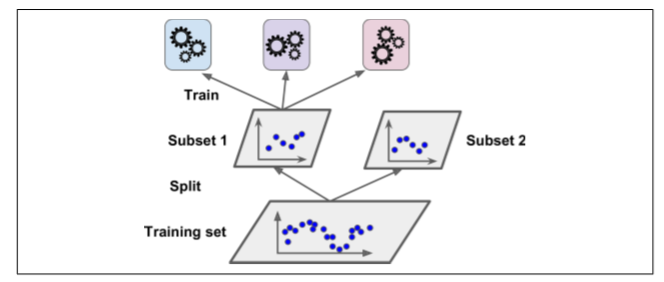

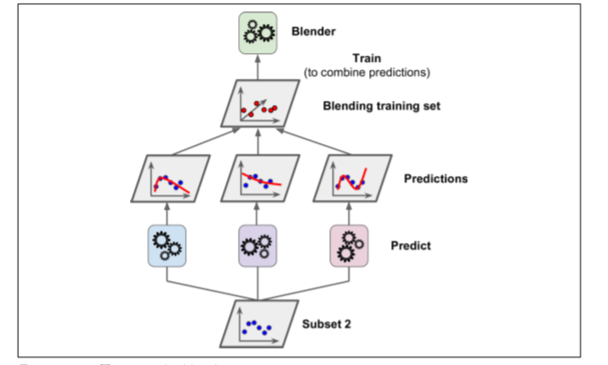

##### bagging（bootstrap+aggregation）

bootstrapping是统计学的一个工具，思想就是从已有数据集D中模拟出其他类似的样本 。

==bootstrapping有效的前提是**算法对数据分布比较敏感**才能得到variance大的一组g~t~。==

假设size(D)=N，那么bootstrapping就是在D中做K次抽取-放回操作，得到一个D~t~，在训练数据上增加了随机性：


##### bootstrap­-weighted error

实际上在bootstrap的过程中，D~t~中可能会有重复的数据，引入一个权重u~i~，表示D中的第i个数据在D~t~中出现的次数，由此引入`bootstrap­-weighted error `：


这样就相当于给这笔数据加了权重。当g~t~（base algorithm）对这笔数据犯错时，其惩罚也会大。故这种算法也叫`Weighted Base Algorithm `，目的就是最小化weighted E~in~。

#### Adaptive Boosting（Adaboost）

Adaboost的核心思想就是每找到一个g~t~就即时调整对数据的权重u~t~，使得新的u~t+1~在g~t~上的E~in~越大越好，这样在新的u~t+1~训练下得到的g~t+1~与原g~t~的差异就大，最后在把这些一组g整合起来得到最终的G：

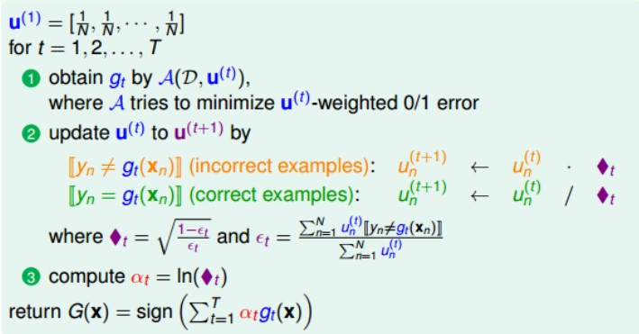

调整u~t~的时候先计算关于u的错误率ε~t~，当==ε~t~<0.5==时通过◆~t~的放大u~t~，如果>0.5，算法就会直接break出for循环，说明base algorithm太差了，不值得继续做下去。

最后如何取得最优G，即如何设定α~t~，==需要借助Gradient Boost==的概念，实际上求出的最优α~t~就是图中所示的值。

整个Adaboost在learning过程中动态调整u~n~，并且可以立即得出每个g~t~的α~t~，这称为`aggregate linearly on the fly `。

#### Decision Tree

##### 基本算法

决策树的基本算法如下，一般用递归表示：


需要决定的要素：

* 终止条件（termination criteria）
* 基本算法（base hypothesis）
* 分支条件（branching criteria）
* 分支个数（number of branches）

##### 计算复杂度

在建立好决策树模型后， 做出预测需要遍历决策树， 从根节点一直到叶节点。决策树通常近似左右平衡，因此遍历决策树需要经历大致 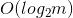 [2] 个节点。==由于每个节点只需要检查一个特征的值，因此总体预测复杂度仅为 ，与特征的数量无关。 所以即使在处理大型训练集时，预测速度也非常快。==

然而，训练算法的时候（训练和预测不同）需要比较所有特征（如果设置了`max_features`会更少一些）

在每个节点的所有样本上。就有了 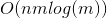 的训练复杂度。对于小型训练集（少于几千例），Scikit-Learn 可以通过预先设置数据（`presort = True`）来加速训练，但是这对于较大训练集来说会显着减慢训练速度。

==Decision tree learners create biased trees if some classes dominate. It is therefore recommended to balance the dataset prior to fitting with the decision tree.	--from sklearn==

##### Classification and Regression Tree(C&RT、CART) 

CART比较简单，其中C=2，b(x)用impurity来计算，==每次只用一个feature做划分，对于类别特征只使用一次==：


对于分类任务和回归任务，有不同的impurity计算方式：


优点如下:

* 可解释性强
* 易用多分类
* 对categorical特征很好划分
* 对缺失值有一定的抵抗能力
* 在非线性模型中算是容易训练的

##### pruned decision tree

对于N个数据，如果最后划分有N个树叶，那么E~in~=0，这样显然overfit了，因此需要砍掉一部分树叶，这种`regularized decision tree`称为`pruned decision tree`。


剪枝方式有两种：

* 预剪枝：如果分裂后没有改善那就不再对这个节点进行分裂。这样可能会导致欠拟合，因为分裂一次可能导致性能下降，但是再分裂可能会改善。
* 后剪枝：从最底层的非叶节点开始，如果去除该节点的分支能够使E~val~提高，那么就剪枝。需要生成完全决策树后遍历所有的非叶节点，开销较大。

##### surrogate branch 

如果有特征缺失，那么在划分的时候有一些替代方法：


找一个与当前有缺失值的feature相似的另一个feature，如果划分结果与原feature相似，那么当遇到有缺失值时，就用这个替代。

#### Random Forest

由实验可知树越多表现越好（当心overfit），random seed会影响model的表现。

随机森林的强化版本是**Extremely Randomized Trees**（sklearn.ensemble.ExtraTreeClassifier\Regressor），对每个特殊的分裂点选择是随机的，然后从中挑一个最好去分裂，进一步加深随机性，但是会引入bias，尽管能消除一些variance。

##### 基础版

回归任务：平均

分类任务：票多者胜，平票随机抽


优点：

* 各个决策树可以并行训练（parallel）
* 继承CART优点
* 因为bagging，消除了完全决策树的缺陷

##### 加强版（random-subspace）

每次学习决策函数时，只用数据部分的特征，相当于数据被降维：


##### 加强版（random-combination）

决策函数不再只采用一个特征，而是用特征进行线性组合：


##### Out-Of-­Bag Estimate 

bootstrap所得数据D~t~只是D中的一部分，所以存在一些没有被抽中的数据，这些数据可以被作为g~t~的==验证集==：


假设bootstrap的N^`^=N，那么OOB的概率是：

​									lim~N->∞~(1-1/N)^N^=e^-1^

最终集成g~t~的方式为，看(x~n~,y~n~)是哪些g~t~d的OOB，然后得到：

​									G~N~^-^(x)=average(g~i~, g~j~, g~k~)

计算最终误差：


==这种self­-validation好处在于得到g~t~后不必再用D重新训练，并且最终表现还不错。==

#### permutation test

对某一个特征i进行洗牌，如果前后性能差异大，就说明特征i重要：


random forest的作者将这个技术用在了OOB上，在做E~oob~时顺便做E~oob~^(P)^，然后得出importance(i)。(sklearn中并没有用permutation test，而是用gini gain或者variance gain，==这是不准确的==，但是计算量少很多，[参考文献](https://explained.ai/rf-importance/))。

#### AdaBoost-DTree


ABDT中一般用的是CART，因为CART的算法在算impurity的时候没有给data加权重u，所以在训练base algorithm前，按照权重u的比例进行sampling，这样就在不改变算法的情况下实现了weighted algorithm。

由于CART可以做到ε=0，这样会导致α趋于无穷，因此得到g~t~时需要剪枝：


#### Gradient Boosted Decision Tree（GBDT）

##### AdaBoost的α设定推导

首先从优化的角度看AdaBoost的u是怎么更新的：


从t=1开始，得到连乘形式：


我们希望voting score越大越好，因为这样ε会低，并且置信度高，这同时表示最终u将会越来越小，这样看来，相当于u从侧面反映了一种error：


为了优化u，我们用一阶泰勒展开（泰勒公式的迭代形式）：


形式和一般的梯度下降法一样：


我们希望找到h，能够减少E~ADA~，这样就要求让第二项（含负号）越小越好，那么经过简单变形：


最终看到如果h的E~in~小，那么最终u也会小，而base algorithm就是在weighted data的情况下去得到最小E~in~，所以从数学上证明了AdaBoost中的g~t~就是让E~ADA~减小的方向，只不过是一个函数而非向量罢了。在找到了g~t~后，怎么确定learning rate η呢：


有二分类的两种情况可以对E~ADA~进行变换：


==最终的得出了为什么AdaBoost要把α设成上面式子的原因。==

##### gradient boost推导正题

除了二分类外，我们对上面的推导做一般化推广：


这是error function就不再是由二分类得出的exponential error，假设在这用regression常用的sqe替代：


注意到h是方向，那么只要与梯度相反就好了，但是要限制h的大小，所以就像L2 regularization一样，把h放进目标函数里面：


经过拼凑变形后，我们让h去拟合余数（残差），用一个线性回归就能得到合适的h。


最终在计算η的时候还是用到了残差(residual)，再做一次线性回归即可，最佳的η就是最终的α。让base algorithm用Decision Tree，就是GBDT：


==ABDT用于解决分类问题，GBDT用于分类、回归问题（看loss怎么定，用exponential loss就是AdaBoost），实际上AdaBoost相当Gradient Boost的特例。==

##### loss function

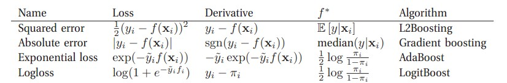

### 分类模型

#### 决策树

在sklearn中，使用的算法是改进后CART。

```python
from sklearn.datasets import make_moons
from sklearn.tree import DecisionTreeClassifier
from sklearn.model_selection import train_test_split, GridSearchCV
from sklearn.metrics import make_scorer, accuracy_score

mm = make_moons(n_samples=10000, noise=0.4)
mm_X = mm[0]
mm_y = mm[1]
mm_X_train, mm_X_test, mm_y_train, mm_y_test = train_test_split(mm_X, mm_y, test_size=0.2, random_state=19)

"""
通过调整叶节点数量（相当于调整高度），对照准确度
"""
dt_reg = DecisionTreeClassifier(random_state=19)
param_grid = [{'max_leaf_nodes':[int(mm_y_train.shape[0]*0.01), int(mm_y_train.shape[0]*0.05), int(mm_y_train.shape[0]*0.1)]}]
scoring = {'acc':make_scorer(accuracy_score)}
gscv_res = GridSearchCV(dt_reg, param_grid, cv=5, scoring=scoring, refit='acc', return_train_score=True)

"""
对照发现叶节点较少的训练平均准确率为88.9%，叶节点数多的准确率在94%以上，过拟合
"""
gscv_res.fit(mm_X_train, mm_y_train)
best_dt = gscv_res.best_estimator_
best_dt
DecisionTreeClassifier(class_weight=None, criterion='gini', max_depth=None,
            max_features=None, max_leaf_nodes=80,
            min_impurity_decrease=0.0, min_impurity_split=None,
            min_samples_leaf=1, min_samples_split=2,
            min_weight_fraction_leaf=0.0, presort=False, random_state=19,
            splitter='best')

y_pred = best_dt.predict(mm_X_test)
accuracy_score(y_pred, mm_y_test)
0.8495

plt.scatter(mm_X_test.T[0], mm_X_test.T[1], c=mm_y_test)
```


##### 概率输出

在sklearn中，对一个样本的概率输出是看该样本被分到的叶节点中，它所属类占的比例。如果这个叶节点只有一个类，那么$P=1$，对于决策树，如果不限制深度，那么会完全过拟合。

#### 随机森林

##### 手动版

```python
from sklearn.model_selection import ShuffleSplit
from scipy.stats import mode

pred_list = []
acc_list = []

"""
接上面的数据，从10000笔数据中抽100笔，做1000次bootstrap，得1000颗树
用抽取的数据训练，并测试，得出小测试集的准确率，以及整个数据集的预测结果
最后用mode()方法对各个树的预测结果做uniform blending，对于单笔数据，票多的类胜
mode——统计各数组相同index中元素的出现次数，取次数最大的元素为结果
"""
rs = ShuffleSplit(n_splits=1000,  train_size=0.01,test_size=0.2, random_state=19)
for train_index, test_index in rs.split(mm_X):
    X_train = mm_X[train_index]
    y_train = mm_y[train_index]
    X_test = mm_X[test_index]
    y_test = mm_y[test_index]
    tmp_tree = DecisionTreeClassifier(max_leaf_nodes=int(X_train.shape[0]*0.1))
    tmp_tree.fit(X_train, y_train)
    pred_test = tmp_tree.predict(X_test)
    acc_list.append(accuracy_score(pred_test, y_test))
    pred_all = tmp_tree.predict(mm_X)
    pred_list.append(pred_all)

"""
由结果看，随机森林是有效的
"""
rf_pred = mode(pred_list).mode.ravel()
accuracy_score(rf_pred, mm_y)
0.8656

np.average(acc_list)
0.8169
```

##### 自动版

```python
from sklearn.ensemble import RandomForestClassifier

"""
默认10颗树，0.22后改为100颗
"""
rf_clf = RandomForestClassifier(random_state=19)
rf_clf.fit(mm_X_train, mm_y_train)
rf_pred2 = rf_clf.predict(mm_X_test)
accuracy_score(rf_pred2, mm_y_test)
0.8405

"""
可以查看特征的重要程度
"""
rf_clf.feature_importances_
array([0.43998189, 0.56001811])
```

##### 概率输出

在sklearn中，随机森林用的基分类器是决策树，其算法是CART。对于每棵树的概率输出，取平均值。

#### Blending

##### 自动版

```python
from sklearn.ensemble import RandomForestClassifier
from sklearn.linear_model import LogisticRegression
from sklearn.svm import SVC
from sklearn.ensemble import VotingClassifier

"""
要用做soft voting，SVC需要设定probability=True
hard voting则没有要求
"""
rf_clf = RandomForestClassifier(random_state=19)
log_reg = LogisticRegression(random_state=19)
svc = SVC(random_state=19, probability=True)
voting_clf = VotingClassifier(estimators=[('rf', rf_clf), ('lr', log_reg), ('svc', svc)], voting='soft')

for clf in (rf_clf, log_reg, svc, voting_clf):
    clf.fit(mm_X_train, mm_y_train)
    y_pred = clf.predict(mm_X_test)
    print(clf.__class__.__name__, accuracy_score(y_pred, mm_y_test))
    
RandomForestClassifier 0.8405
LogisticRegression 0.8305
SVC 0.8605
VotingClassifier 0.8555
```


##### 手动版

用自动版做结果也是一样的。

```python
from keras.datasets import mnist
from sklearn.ensemble import RandomForestClassifier, ExtraTreesClassifier
from sklearn.linear_model import LogisticRegression
from scipy.stats import mode

(X_train, y_train), (X_test, y_test) = mnist.load_data()
X_train = X_train.reshape((len(X_train), 28**2))
X_test = X_test.reshape((len(X_test), 28**2))

rf_clf = RandomForestClassifier(random_state=20)
et_clf = ExtraTreesClassifier(random_state=20)
log_reg_clf = LogisticRegression(random_state=20, multi_class='multinomial', solver='lbfgs')

pred_list = []

for clf in (rf_clf, et_clf, log_reg_clf):
    clf.fit(X_train, y_train)
    res = clf.predict(X_test)
    pred_list.append(res)
    print(clf.__class__.__name__, accuracy_score(res, y_test))
    
uniform_blending = mode(pred_list).mode.ravel()
accuracy_score(uniform_blending, y_test)

RandomForestClassifier 0.9498
ExtraTreesClassifier 0.9523
LogisticRegression 0.9255
0.9567
```

#### Bagging

除了bagging外还有一种抽取不放回的方法——pasting，如果想用就设bootstrap=False：

```python
from sklearn.ensemble import BaggingClassifier

bgg_clf = BaggingClassifier(DecisionTreeClassifier(random_state=19),
                            n_estimators=100, max_samples=100,
                            bootstrap=True, n_jobs=-1)
bgg_clf
BaggingClassifier(base_estimator=DecisionTreeClassifier(class_weight=None, criterion='gini', max_depth=None,
            max_features=None, max_leaf_nodes=None,
            min_impurity_decrease=0.0, min_impurity_split=None,
            min_samples_leaf=1, min_samples_split=2,
            min_weight_fraction_leaf=0.0, presort=False, random_state=19,
            splitter='best'),
         bootstrap=True, bootstrap_features=False, max_features=1.0,
         max_samples=100, n_estimators=100, n_jobs=-1, oob_score=False,
         random_state=None, verbose=0, warm_start=False)

bgg_clf.fit(mm_X_train, mm_y_train)
accuracy_score(bgg_clf.predict(mm_X_test), mm_y_test)
0.856
```

如果想要看OOB验证的效果，可以设置oob_score=True：

```python
bgg_clf2 = BaggingClassifier(DecisionTreeClassifier(random_state=19),
                            n_estimators=100, max_samples=100,
                            bootstrap=True, n_jobs=-1, oob_score=True)

bgg_clf2.fit(mm_X_train, mm_y_train)
bgg_clf2.oob_score_
0.866375

accuracy_score(bgg_clf2.predict(mm_X_test), mm_y_test)
0.8585

"""
可以查看每个oob数据的判定概率，林轩田机器学习技法-L10有讲怎么算
需要base algorithm有predict_proba()方法
"""
bgg_clf2.oob_decision_function_
array([[0.39175258, 0.60824742],
       [0.04040404, 0.95959596],
       [0.64646465, 0.35353535],
       ...,
       [0.98989899, 0.01010101],
       [0.14141414, 0.85858586],
       [1.        , 0.        ]])
```

##### random subspace

对特征采样（`bootstrap_features=True`并且/或者`max_features`小于 1.0）叫做随机子空间。

采样特征导致更多的预测多样性，用高偏差换低方差。

#### Adaboost

```python
from sklearn.ensemble import AdaBoostClassifier

"""
max_depth=1时实际就是decision stump
"""
ada_clf = AdaBoostClassifier(DecisionTreeClassifier(random_state=19, max_depth=1),
                            n_estimators=100)

ada_clf.fit(mm_X_train, mm_y_train)
accuracy_score(ada_clf.predict(mm_X_test), mm_y_test)
0.8525
```

#### Gradient Boost

##### 手动版

在用公式计算的时候，对每个点都有对应的η~n~，平均下来η=1，用自动版的实验对比，发现确实η=1是steepest search，小于或者大于都会导致E增加（小了可能欠拟合，大了可能过拟合，还要看用了多少颗树）。==所以每次算余数的时候，res~t~的系数都是1==：

```python
from sklearn.ensemble import GradientBoostingRegressor
from sklearn.tree import DecisionTreeRegressor
from sklearn.metrics import mean_squared_error

dt_reg = DecisionTreeRegressor(random_state=20, max_depth=2)
dt_reg2 = DecisionTreeRegressor(random_state=20, max_depth=2)
dt_reg3 = DecisionTreeRegressor(random_state=20, max_depth=2)

X = 6*np.arange(0,1,0.01)-2
y = np.sin(X)+2*np.random.rand(100)

dt_reg.fit(X.reshape(-1, 1), y)
res1 = dt_reg.predict(X.reshape(-1, 1))
plt.scatter(X, y)
plt.scatter(X, res1)

y2 = y - res1	#系数alpha为1
dt_reg2.fit(X.reshape(-1, 1), y2)
res2 = dt_reg2.predict(X.reshape(-1, 1))
plt.scatter(X, y2)
plt.scatter(X, res2)

y3 = y2 - res2	#系数alpha为1
dt_reg3.fit(X.reshape(-1, 1), y3)
res3 = dt_reg3.predict(X.reshape(-1, 1))
plt.scatter(X, y3)
plt.scatter(X, res3)

y_pred = res1 + res2 + res3
plt.scatter(X, y)
plt.scatter(X, y_pred)

"""
不断拟合余数后，得到的误差变小了
"""
mean_squared_error(y_pred, y)
0.30299727968032375

mean_squared_error(res1, y)
0.39064125625492374
```


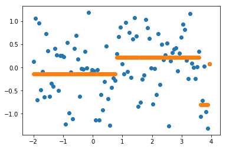


##### 自动版

```python
from sklearn.ensemble import GradientBoostingRegressor

"""
默认n_estimators=100，由手动版计算可得eta=1是让E下降最快的学习率，大于或者小于都不行
"""
gb_reg = GradientBoostingRegressor(random_state=20, max_depth=2, n_estimators=3, learning_rate=1)
gb_reg.fit(X.reshape(-1, 1), y)
res4 = gb_reg.predict(X.reshape(-1, 1))
plt.scatter(X, y)
plt.scatter(X, res4)

mean_squared_error(gb_reg.predict(X.reshape(-1, 1)), y)
0.3029972796803237	#结果和手动版的完全一样
```


#### Early Stopping

##### 事后版

GBDT中有staged_predict()方法，在训练完整个model后，用迭代器遍历g~t~，按个数增量地整合到G里面做一次预测输出，这样就可以根据输出找到最合适的n_estimators：

```python
from sklearn.model_selection import train_test_split

X_train, X_val, y_train, y_val = train_test_split(X, y)

err_list = []
gb_reg2 = GradientBoostingRegressor(random_state=20,max_depth=2,n_estimators=200)
gb_reg2.fit(X_train.reshape(-1, 1), y_train)
err_list = [mean_squared_error(y_pred2, y_val) for y_pred2 in gb_reg2.staged_predict(X_val.reshape(-1, 1))]

"""
根据这个argmin重新训练一个模型
"""
np.argmin(err_list)
19

x_index = [i+1 for i in range(200)]
plt.scatter(x_index, err_list)
```


##### 事前版

及时根据输出结果停止增加g~t~，需要自行设定停止标准：

```python
gb_reg3 = GradientBoostingRegressor(random_state=20,max_depth=2)
upper_bound = 200
err_up = 0
last_err_rate = 1
err_list2 = []

for n_estimators in range(1,upper_bound):
    gb_reg3.n_estimators = n_estimators
    gb_reg3.fit(X_train.reshape(-1, 1), y_train)
    err_rate = mean_squared_error(gb_reg3.predict(X_val.reshape(-1, 1)), y_val)
    err_list2.append(err_rate)
    if(err_rate < last_err_rate):
        last_err_rate = err_rate
        err_up = 0
    else:
        err_up += 1
        if(err_up>=5):
            break

np.argmin(err_list2)
19

plt.scatter([i+1 for i in range(len(err_list2))], err_list2)            
```


#### Stacking\Blending\Aggregation


==线性的blending model效果奇差（仅针对下面的实验数据）==，说明经过整合的数据依旧线性不可分，可以从3d散点图（因为只用了3个模型，所以刚好能用xyz+label标出数据信息）看出。

==这里的数据划分方式有问题，导致实验结果不准确。正确的方式应该是：==

* 有k个一阶model，就把训练集划分为k块，每个一阶model都留出不同的验证集，像K-fold那样
* 一阶model训练完后：
  * 预测验证集，其结果作为二阶model的训练集
  * 预测测试集，k个一阶model的结果平均作为二阶model的测试集
* 二阶model训练完后预测测试集


##### 常见几种一阶融合方法

* mean
* median
* push out + median：根据阈值，超upper_bound直接1，低于lower_bound直接0，中间用median
* minmax + mean：超upper_bound直接max，低于lower_bound直接min，中间用mean
* minmax + median
* minmax + best base：中间用最优模型的值

```python
from sklearn.ensemble import RandomForestClassifier, ExtraTreesClassifier
from sklearn.linear_model import LogisticRegression
from scipy.stats import mode
from sklearn.svm import LinearSVC
from sklearn.svm import SVC

rf_clf = RandomForestClassifier(random_state=20)
et_clf = ExtraTreesClassifier(random_state=20)
log_reg_clf = LogisticRegression(random_state=20, multi_class='multinomial', solver='lbfgs')

pred_list = []
for clf in (rf_clf, et_clf, log_reg_clf):
    clf.fit(X_train, y_train)
    res = clf.predict(X_test)
    pred_list.append(res)

"""
把三个model的预测结果整合后作为blending model训练数据
"""
X_train_stacking = list(zip(pred_list[0].tolist(), pred_list[1].tolist(), pred_list[2].tolist()))
lin_svc.fit(X_train_stacking, y_test)
accuracy_score(lin_svc.predict(X_train_stacking), y_test)
0.3137

svc = SVC(random_state=20)
svc.fit(X_train_stacking, y_test)
accuracy_score(svc.predict(X_train_stacking), y_test)
0.9636
```

绘图如下：

```python
from mpl_toolkits.mplot3d import Axes3D
import plotly
plotly.offline.init_notebook_mode(connected=True)
import plotly.graph_objs as go
"""
首先在范围内生成点集，因为数据是MNIST，label最大为9，所以从0到9之间生成100个点
meshgrid会负责生成100x100的矩阵，覆盖整个xy平面，x-y配对可以得到100x100个点
"""
ls = np.linspace(0,10,100)
x, y = np.meshgrid(ls, ls)

"""
下面计算z的公式很好推，有了x、y以后，令wX+b=0，把里面系数拆开就能得到公式
因为MNIST有10个类，所以线性二分类模型要采用ovo方式，得到10组系数，每个输入都取max score的index最为分类，所以导致后面无法直接算超平面。
因此对于每个点，要算出10个z，然后求平均（有10个超平面，不知道选哪个，无奈之举，要不就用暴力搜索遍历整个空间，得到z=0的点集）
如果是二分类只有1个model，那就可以公式直接得出z=0的点集，得到1个超平面
"""
def getz(x, y, svc_3d):
    z_mesh = []
    z = lambda x,y: (-lin_svc.intercept_[i]-lin_svc.coef_[i][0]*x-lin_svc.coef_[i][1]*y) / lin_svc.coef_[i][2]
    for i in range(len(svc_3d.intercept_)):
        z_mesh.append(z(x, y))
    return np.average(z_mesh, axis=0)

"""
获取stacking后的数据坐标
"""
coordinate = np.array(X_train_stacking).T
xs = coordinate[0]
ys = coordinate[1]
zs = coordinate[2]

"""
绘图
"""
layout = go.Layout(scene=dict(
    zaxis=dict(range=[0, 10])
))

fig = go.Figure(layout=layout)

z_coordinate = getz(x, y, lin_svc)

fig.add_surface(x=x, y=y, z=z_coordinate)
fig.add_scatter3d(x=xs, y=ys, z=zs, mode='markers',
                  marker=dict(
                      size=5,
                      color=y_test,
                      colorscale='Viridis',
                      opacity=0.5
                  ))
plotly.offline.iplot(fig)
```


==可以看到stacking之后依旧线性不可分，所以linear model表现非常差。==

##### 最优化集成权重

```python
from scipy.optimize import minimize

preds = cat_preds  # catboost概率预测，其他模型都可以

def roc_auc_loss(weights):
    """
    scipy minimize will pass weights as a numpy array
    """
    final_prediction = 0
    for weight, pred in zip(weights, preds):
        final_prediction += weight*pred
    fpr, tpr, _ = roc_curve(y_train, final_prediction)
    return 1 - auc(fpr, tpr)

#the algorithms need a starting value, right not we chose 0.5 for all weights
#its better to choose many random starting points and run minimize a few times
starting_values = [0.5] * len(preds)

#adding constraints
constraints = ({'type':'eq','fun':lambda weight: 1-sum(weight)})  # 等式约束，所有权重加起来等于1
#our weights are bound between 0 and 1
bounds = [(0,1)]*len(preds)

res = minimize(roc_auc_loss, starting_values, method='SLSQP', bounds=bounds, constraints=constraints)  # 一般都能正常收敛

res
     fun: 0.020523881100253494
     jac: array([ 0.        ,  0.        , -0.00569908,  0.        , -0.00569908])
 message: 'Optimization terminated successfully.'
    nfev: 8
     nit: 1
    njev: 1
  status: 0
 success: True
       x: array([0.19772037, 0.19772037, 0.20341945, 0.19772037, 0.20341945])
```


### 绘制决策边界

```python
def plot_decisionTree_boundary(model, X, y):
    sns.scatterplot(X[:,0], X[:,1], hue=y)
    ax = plt.gca()
    
    xlim = ax.get_xlim()
    ylim = ax.get_ylim()
    
    xx, yy = np.meshgrid(np.linspace(*xlim, 20), np.linspace(*ylim, 20))
    zz = model.predict(np.vstack([xx.flatten(),yy.flatten()]).T).reshape(xx.shape)
    
    plt.contourf(xx, yy, zz, cmap='rainbow', alpha=0.1,levels=np.arange(len(np.unique(y)) + 1) - 0.5,zorder=1)
```


## 降维（PCA、TSNE）

当数据比较稀疏的时候，先降维再训练。

降维肯定会丢失一些信息（这就好比将一个图片压缩成 JPEG 的格式会降低图像的质量），因此即使这种方法可以加快训练的速度，同时也会让你的系统表现的稍微差一点。降维会让你的工作流水线更复杂因而更难维护。所有你应该先尝试使用原始的数据来训练，如果训练速度太慢的话再考虑使用降维。

降维除了可以加快训练速度外，在数据可视化方面（或者 DataViz）也十分有用。降低特征维度到 2（或者 3）维从而可以在图中画出一个高维度的训练集，让我们可以通过视觉直观的发现一些非常重要的信息，比如聚类。  

* t-分布随机邻域嵌入（t-Distributed Stochastic Neighbor Embedding，t-SNE）可以用于降低维度，同时试图保持相似的实例临近并将不相似的实例分开。

```python
from sklearn.decomposition import PCA
from sklearn.manifold import TSNE #t-Distributed Stochastic Neighbor Embedding
from sklearn.pipeline import Pipeline

"""
先降维再投影速度会快很多
"""
pca_tsne = Pipeline([
    ('pca', PCA(n_components=0.95, random_state=21)),
    ('tsne', TSNE(n_components=2, random_state=21))
])
res2 = pca_tsne.fit_transform(X_train)
executed in 26m 39s

tsne = TSNE(n_components=2, random_state=21)
res3 = tsne.fit_transform(X_train)
executed in 1h 17m 6s
```

## 高斯混合模型（Gaussian Mixture Model）


本身是一个概率模型，模型中包含了多个概率分布。我们首先假设数据实际构成是由多个高斯分布生成的，每笔数据都有一定的概率属于某个高斯分布，通过最大似然估计迭代，可以得到loglikelihood最大的模型。

从中可以得到一笔数据属于各个概率分布的概率。

生成两组高斯分布下的采样数据，seaborn.displot自带kde（用的高斯核，其实还有其他核可以用，见sklearn的kde）方法可以算出混合分布。我们直接根据两组数据分别生成两个高斯分布。


### 对比kmeans

有点soft k-means的意思，效果稍微好一点。

相较于k-means改进的地方在于：

- 可以拟合非圆形分布的数据
- 输出概率

==建议把 GMM 当成一个**密度评估器**， 仅在简单数据集中才将它作为聚类算法使用。==

### one guassian

```python
class Gaussian():
    def __init__(self, mu, sigma):
        self.mu = mu
        self.sigma = sigma
        
    def pdf(self, datum):
        u = (datum - self.mu)/abs(self.sigma)
        y = (1/(np.sqrt(2*np.pi)*abs(self.sigma)))*np.exp(-u*u/2)
        return y
    
    def __repr__(self):
        return "singal gaussian(mu={:3.2f}, sigma={:3.2f})".format(self.mu, self.sigma)
    
xg = np.linspace(-15,15,1000)
yg = [sg.pdf(point) for point in xg]
yg2 = [sg2.pdf(point) for point in xg]
plt.plot(xg, yg)
plt.plot(xg, yg2)
sns.distplot(data0,bins=20)    
```


### multiple gaussian

对于原始数据，如果我们不知道其服从多少个分布，那么只有依靠猜测进行聚类。假设数据服从两个高斯分布，高斯混合模型的代码如下：

```python
class GaussianMixture:
    def __init__(self, data, n=2):
        self.data = data
        self.data_size = len(data)
        self.min = np.min(data)
        self.max = np.max(data)
        self.sigma_min = 0.1
        self.sigma_max = 1.0
        self.alpha = [1.0/n] * n
        self.models = []

        for i in range(n):
            self.models.append(Gaussian(np.random.uniform(self.min, self.max),
                                        np.random.uniform(self.sigma_min, self.sigma_max)))

    def Estep(self):
        self.loglike = 0
        self.p_list = []

        for i, model in enumerate(self.models):
            tmp = []
            for datum in self.data:
                tmp.append(self.alpha[i] * model.pdf(datum))
            self.p_list.append(np.array(tmp))

        self.den_list = np.sum(self.p_list, axis=0)

        for i in range(len(self.p_list)):
            self.p_list[i] /= self.den_list

        self.loglike += np.log(np.sum(self.p_list))

    def Mstep(self):
        for i, model in enumerate(self.models):
            total_p = np.sum(self.p_list[i])
            model.mu = np.sum(p * d / total_p
                              for (p, d) in zip(self.p_list[i], self.data))
            model.sigma = np.sqrt(np.sum(p * ((d - model.mu) ** 2)
                                         for (p, d) in zip(self.p_list[i], self.data)) / total_p)
            self.alpha[i] = total_p / self.data_size

    def iterate(self, n=1):
        for i in range(n):
            self.Estep()
            self.Mstep()

    def pdf(self, x):
        p = 0
        for i, model in enumerate(self.models):
            p += self.alpha[i] * model.pdf(x)
        return p

    def __repr__(self):
        return "m1:{} m2:{} alpha:{}".format(self.models[0], self.models[1], self.alpha)
```

### EM（Expectation-Maximization）算法

* E：用于计算每笔数据在当前各高斯分布下的概率密度和对数似然（log-likelihood）。
* M：由最大似然公式求导得出关键参数$μ、σ、α$的更新公式，迭代更新每个高斯模型的参数。

在EM反复迭代下，最终得到全局收敛（对数似然不再增加、达到最大迭代轮数等）。


### iteration

```python
xg = np.linspace(-15, 15, 1000)

best_model = None
best_loglike = float("-inf")
n_restart = 100
n_iter = 10

for _ in range(n_restart):
    gmm = GaussianMixture(data0, 2)
    for i in range(n_iter):
        try:
            gmm.iterate()
            if gmm.loglike > best_loglike:
                best_loglike = gmm.loglike
                best_model = gmm
        except (ZeroDivisionError, RuntimeWarning):
            pass

yg = [best_model.pdf(point) for point in xg]
plt.plot(xg, yg)
sns.distplot(data0, bins=20)
```


结果如下，其中橙色线为seaborn的估计结果：

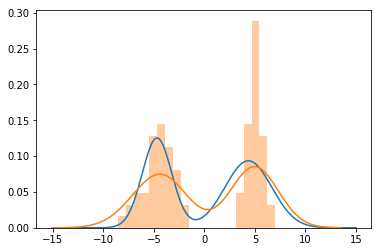


==注意，每次迭代的结果都不同，与每个高斯模型初始化参数（$μ、σ$）相关。==

### decision boundary

```python
x = np.linspace(-20,20,1000)
pg = np.array([(best_model.models[0].pdf(d), best_model.models[1].pdf(d)) for d in x])
x_label = np.argmax(pg, axis=1)
p_highest = [prob[cat] for prob, cat in zip(pg,x_label)]
df = pd.DataFrame({"data":x,"prob_g1":pg.T[0],"prob_g1":pg.T[1],"p_highest":p_highest,"category":x_label})

tmp = df[df["category"]==0][["data","p_highest"]]
tmp2 = df[df["category"]==1][["data","p_highest"]]

plt.scatter(x=tmp["data"],y=tmp["p_highest"],label="gaussian0")
plt.scatter(x=tmp2["data"],y=tmp2["p_highest"],label="gaussian1")
plt.legend()
```


### sklearn API

```python
from sklearn.mixture import GaussianMixture
gmm_clf = GaussianMixture(n_components=5)
gmm_clf.fit(X)

fig, ax = plt.subplots(1,2,figsize=(10,5))
y_pred = gmm_clf.predict(X)
center = gmm_clf.means_

sns.scatterplot(X[:,0], X[:,1], hue=y, legend='full', palette='viridis', ax=ax[0])
sns.scatterplot(X[:,0], X[:,1], hue=y_pred, legend='full', palette='viridis', ax=ax[1])
sns.scatterplot(center[:,0],center[:,1],facecolor='none', linewidth=1, edgecolor='red', ax=ax[1])
```


### 重要参数设定（covariance_type）

covariance_type这个超参数控制了每个簇的形状自由度。 

* covariance_type="diag"， 意思是簇在每个维度的尺寸都可以单独设置， 椭圆边界的主轴与坐标轴平行。
* covariance_type="spherical"， 该模型通过约束簇的形状， 让所有维度相等。 这样得到的聚类结果和 k-means 聚类的特征是相似的。
* covariance_type="tied"。
* covariance_type="full"==（默认参数）==，特别适应于高维度数据，该模型允许每个簇在任意方向上用椭圆建模。 


### 成分数量设定（n_components）

* 赤池信息量准则（Akaike information criterion，AIC）：赤池信息量准则建立在[信息熵](https://zh.wikipedia.org/wiki/熵_(信息论))的概念基础上。AIC鼓励数据拟合的优良性但是尽量避免出现overfitting的情况。所以优先考虑的模型应是AIC值最小的那一个。

  AIC=2（模型参数的个数）-2ln（模型的极大似然函数的最大值）

  注意到**参数个数的惩罚因子却和样本容量没关系**，当样本容量很大时，使用AIC准则选择的模型不收敛，所以BIC进行了修正。

* 贝叶斯信息准则（Bayesian Information Criterion，BIC）：弥补了AIC的缺陷。

  BIC = ln(n)(模型中参数的个数) - 2ln(模型的极大似然函数值)

  其中n是样本数量。

```py
n_components = np.arange(1,15)
models = [GaussianMixture(n, random_state=666).fit(X) for n in n_components]

sns.lineplot(n_components, [m.bic(X) for m in models], label='BIC')
sns.lineplot(n_components, [m.aic(X) for m in models], label='AIC')
```


最优n_components出现在 AIC==或==BIC 曲线最小值的位置， 最终结果取决于我们更希望使用哪一种近似 。

## 朴素贝叶斯

优点：

* 训练和预测的速度非常快。
* 直接使用概率预测。
* 通常很容易解释。
* 可调参数（如果有的话） 非常少。 

适用场景：

* 假设分布函数与数据匹配（实际中很少见） 。
* 各种类型的区分度很高， 模型复杂度不重要。
* 非常高维度的数据， 模型复杂度不重要 。

### 高斯朴素贝叶斯

假设每一类都来自一个高斯分布，直接计算每个类的mean和variance就可以，然后算概率。

```python
from sklearn.naive_bayes import GaussianNB
gnb_clf = GaussianNB()
gnb_clf.fit(X, y)
```

### 多项式朴素贝叶斯

假设特征是由一个简单多项式分布生成的。 多项分布可以描述各种类型样本出现次数的概率， 因此多项式朴素贝叶斯非常适合用于描述出现次数或者出现次数比例的特征。 

```python
from sklearn.naive_bayes import MultinomialNB
```

## k-means

sklearn中的默认算法是k-means++，与原始算法差异在于：

* 在选点的时候，离当前n个聚类中心越远的点会有更高的概率被选为新的聚类中心，n=1时开始这么操作，这很符合直觉。

### 原始版

该算法只适合线性的形状，因为距离计算用的是欧式距离，只考虑离自己近的簇，如下图所示：


并且只对圆形分布的数据较好，想要更好的结果参考下面的==GMM==：


GMM效果：


其缺陷在于结果难以评估是否有效，并且跟随机初始化的中心点位置、数量相关，所以sklearn中默认跑n_init=10次，选择内类点距离簇中心距离和inertia最小的结果返回。

### 评估聚类质量

sklearn官方提供的一种评估方法是[轮廓分析](https://scikit-learn.org/stable/auto_examples/cluster/plot_kmeans_silhouette_analysis.html#sphx-glr-auto-examples-cluster-plot-kmeans-silhouette-analysis-py)。利用的是轮廓系数，给每个簇绘制轮廓图并分析：

```python
from sklearn.metrics import silhouette_score
silhouette_avg = silhouette_score(X, cluster_labels)
...
```

$$s(p)=\frac{b(p)-a(p)}{\max\{a(p)-b(p)\}}$$，其中：

* $b(p)$表示点p到与之最近簇所有点的平均距离。反映该簇与其他簇的分离程度。
* $a(p)$表示点p与同簇中其他点的平均距离。反映所属簇的紧凑程度。


### 判定n_clusters

==一般判断选则n_clusters的方式是手肘法，不断迭代，或者二分法，观察inertia的曲线。见下面代码。==

当数据量大的时候，k-means很慢，sklearn提供MiniBatchKMeans，使用数据的子集进行计算。

```python
from sklearn.datasets import make_blobs
X, y = make_blobs(centers=5, cluster_std=2)
sns.scatterplot(X[:,0], X[:,1], hue=y, legend='full')
```


```python
from sklearn.cluster import KMeans
kms_clf = KMeans(n_clusters=5)
kms_clf.fit(X)

y_pred = kms_clf.predict(X)
center = kms_clf.cluster_centers_
sns.scatterplot(X[:,0], X[:,1], hue=y_pred, legend='full', palette='viridis')
sns.scatterplot(center[:,0],center[:,1],facecolor='none', linewidth=1, edgecolor='red')
```

从图上看，k-means的效果其实很一般。


```python
from sklearn.metrics import accuracy_score

fig, ax = plt.subplots(1,2,figsize=(10,5))

acc_list = []
inertia_list = []
cluster = np.arange(2,10)
for i in cluster:
    kms_clf = KMeans(n_clusters=i)
    kms_clf.fit(X)
    y_pred = kms_clf.predict(X)

    acc = accuracy_score(y, y_pred)
    inertia = kms_clf.inertia_
    acc_list.append(acc)
    inertia_list.append(inertia)
    
sns.lineplot(cluster, acc_list, ax=ax[0], label='acc', color='orange')    
sns.lineplot(cluster, inertia_list, ax=ax[1], label='inertia', color='blue')    
```

从图上看，选择n_clusters为4到5比较稳妥。


### 非线性版

借鉴kernel的思想，可以把数据映射到高维空间中再用k-means进行聚类。可以做到对非线性数据进行聚类：

```python
from sklearn.cluster import SpectralClustering
sc_clf = SpectralClustering(n_clusters=2, 
                            affinity='nearest_neighbors', 
                            assign_labels='kmeans')
```


## 核密度估计（Kernel Density Estimation）

一般在查看数据分布的时候，会用到直方图，其问题在于直方图是用于统计各分段的频数的。如果bins选择有问题，图所展示的结果会差异很大，因此不适合看数据分布，除非有明确的合理的bins设定。如图：


上图的问题在于不能准确反映数据点周边的实际密度。为了解决这个问题，考虑找一个平滑的算法。常见的有两种kernel。

### kernel


#### tophat

x 轴上每个数据点位置的贡献求和：

```python
n = 1000
x = np.random.randn(n)
x[int(0.3*n):] += 5
hist = plt.hist(x, bins=30, density=False)
```


```python
margin = 0.5
x_d = np.linspace(np.min(x), np.max(x), 2000)
density = sum((abs(xi - x_d) < margin) for xi in x)  # 计算坐标点margin内有几个样本点
plt.fill_between(x_d, density, alpha=0.5)
```


#### gaussian

每个点所在位置的高斯分布构成的，这样可以更准确地表现数据分布的形状，并且拟合方差更小（也就是说，进行不同的抽样时，图的变化更小）。 

```python
from scipy.stats import norm
density2 = sum(norm(xi).pdf(x_d) for xi in x)  # 以样本点为中心，计算其对坐标轴所有点的影响力，有点像RBF
plt.fill_between(x_d, density2, alpha=0.5)
```


### sklearn API

为了避免冗余计算，默认使用kd-tree选择近邻以加速计算，因为远的点基本上输出值都是0。

```python
from sklearn.neighbors import KernelDensity
kde = KernelDensity(kernel='gaussian', algorithm='kd_tree')
kde.fit(x[:, None])
log_prob = kde.score_samples(x_d[:, None])  # 注意到返回的是对数概率
plt.fill_between(x_d, np.exp(log_prob), alpha=0.5) # 结果同上，y轴数值除以1000
```

### 重要参数设定（bandwidth）

在 KDE 中，带宽的选择不仅对找到合适的密度估计非常重要，也是在密度估计中控制bias-variance平衡的关键：带宽过窄将导致估计呈现高方差（即过拟合），而且每个点的出现或缺失都会引起很大的不同；带宽
过宽将导致估计呈现高偏差（即欠拟合），而且带宽较大的核还会破坏数据结构。 

一般用GridSearchCV找最优设定。


# 采样方法（resampling）

## 上采样（过采样）

### RandomOverSampler

简单有效

```python
from imblearn.over_sampling import RandomOverSampler
```

### SMOTE(Synthetic Minority Oversampling Technique)

#### 算法

1. 对于少数类的每一个样本x，找kNN。
2. 从NN中随机抽一个样本$\hat{x}$。
3. $X_{new}=x+rand(0,1)*(\hat{x}-x)$

注意，设采样倍率N，原少数类样本T：

* 当N<1时，抽取N*T参与合成，返回N\*T这么多合成的样本。
* 当N>=1时，所有T都参与合成，返回N\*T这么多合成的样本。


#### 缺陷

* 由于负类样本的分布决定了其可选择的近邻,如果一个负类样本处在负类样本集的分布边缘,则由此负类样本和相邻样本产生的“人造”样本也会处在这个边缘,且会越来越边缘化,从而模糊了正类样本和负类样本的边界,而且使边界变得越来越模糊。这种边界模糊性,虽然使数据集的平衡性得到了改善,但加大了分类算法进行分类的难度。

* k不好确定，要自己试。

  


### 类别特征支持（SMOTENC）

对于类别特征，选NN中的众数。

```python
from imblearn.over_sampling import SMOTENC
smote_nc = SMOTENC(categorical_features=[0, 2], random_state=0)
X_resampled, y_resampled = smote_nc.fit_resample(X, y)
```

### 衍生算法（Borderline SMOTE、SVM SMOTE）

对于NN，分为三种：

1. noise：所有NN来自不同类
2. in danger：至少半数NN来自同一类
3. safe：都是同一类

选取2用于合成，但有两种方法：

1. 用同类样本之一进行合成
2. 随机抽一个合成

```python
from imblearn.over_sampling import BorderlineSMOTE
BorderlineSMOTE(sampling_strategy='auto', random_state=None, k_neighbors=5, n_jobs=1, m_neighbors=10, kind='borderline-1')
```


## 下采样（降采样）

待补充


# 多重共线性

一般的线性回归模型可能存在特征之间相关性，导致回归模型的权重（如LR）缺乏可解释性，p-value不高。

例如$y=\beta_{0}+\beta_{1}x_{1}+\beta_{2}x_{2}+\epsilon$，假设$x_{1}=2x_{2}$。如果$x_{1}$增加一个单位，那么$\delta_y=\beta_1+2\beta_2$，所以这时模型参数的解读会出现问题：

* 参数估计不准确
* 该显著的自变量不显著，不该显著的反而p-value大
* 多重共线性使得参数估计值的方差变大，模型参数不稳定

## 判断方法

### 方差膨胀因子（VIF，Variance Inflation Factor）

为了发现某个自变量与其他自变量之间的相关关系，可以把该自变量作为target（也就是因变量），用其他自变量去做一个回归模型，然后通过如下公式：

$R^2=1-\frac{\sum_i^n(y_i-\hat{y_i})^2}{\sum_i^n(y_i-\bar{y_i})^2}$，分子其实就是平方误差，越接近1表示拟合越好，[sklearn-link](https://scikit-learn.org/stable/modules/model_evaluation.html#r2-score)

$VIF=\frac{1}{1-R^2}$，衡量了参数估计值的方差与其他变量之间的相关关系。**一般认为>10（严格的话是5）认为存在严重的共线性问题**

### 相关系数矩阵

相当于将x、y坐标向量各自平移到原点后的余弦夹角。

一般用pearson相关系数**（当$\mu=0$时，等价于余弦相似度,）**：

$p(x,y)=\frac{E[(x-\mu_x)(y-\mu_y)]}{\sqrt{\sum_{i=1}^n(x_i-\mu_x)^2}\sqrt{\sum_{i=1}^n(y_i-\mu_y)^2}}$

缺点：只能两两判断特征之间的线性相关程度。

## 解决方案

### 可忽略的情况

* VIF不大的时候
* 共线性的变量我们不在我们感兴趣的变量范围之内
* 尽管共线性会导致模型参数估计方差变大，但是不影响模型的性能

### 不得不处理的情况

* 增加数据量，可能会消减一些相关性（减少噪声影响）
* 正交试验设计？
* 定义新的变量，组合那些相关性大的变量，如$C=A+B$或$C=A*B$
* PCA（不过这样原来输入的特征就没法对应起来了）
* 加L1正则

# 时间序列专题

* 高维
* 噪声

## 聚类方法

### 基于形状

raw-data->clustering(e.g. SOM)->clusters

raw-data->multi-resolution->hybrid-clustering(e.g. k-Medoid + Hierachichal)

### 基于特征

raw-data->feature-extraction->clustering(k-Medoid)->clusters

### 基于模型

raw-data->model parameters->clustering->clusters

## 衡量距离（相似度similarity）的方法

* shape-based，欧式距离、DTW、LCSS、MVM。欧式距离计算费时，一般先transform，如傅里叶变换、wavelets、piecewise aggregate approximation
* feature-based，HMM、ARMA、facebook prophet（因素分解：trend、season、cyclic、irregular）

从结构上看：

* 短时间序列，单心拍，可用“形状”来度量similarity
* 长时间序列，多心拍，可用”结构“来度量，需要全局、高级别的特征

## 因素分解

facebook prophet

factor:

- trend，长期趋势
- season，季节变动
- cyclic，循环变动
- irregular，不规则运动

# Boost系列

## XGBoost

#### 基础公式

##### 损失函数

一方面是上一轮模型加上本轮模型的损失，另一方面是当前集成模型的复杂度

总的损失函数：$L^{(t)}=\sum_{i=1}^nl(y_i,\hat{y}_i^{t-1}+f_t(x_i))+\sum_t\Omega(f_t)$

树的复杂度：$\Omega(f_t)=\gamma T+\frac{1}{2}\lambda\sum_{j=1}^Tw_j^2$，**原始论文只用了L2正则，实际模型支持L1**。里面的$w_j$就是叶节点的分数，下面的$f_t(x_i)$可以标识为$w_j$；$T$表示数的数量。

使用二阶泰勒展开：$f(x+\Delta x)\approx f(x)+f^{'}(x)\Delta x+\frac{1}{2}f^{''}(x)\Delta^2 x$

$L^{(t)}\approx\sum_{i=1}^n[l(y_i,\hat{y}_i^{t-1})+g_if_t(x_i)+\frac{1}{2}h_if_t^2(x_i)]+\sum_t\Omega(f_t)$

$g_i=\frac{\partial{l(y_i,\hat{y}_i^{t-1})}}{\partial\hat{y}_i^{t-1}}$

$h_i=\frac{\partial{l^2(y_i,\hat{y}_i^{t-1})}}{\partial{\hat{y}_i^{t-1}}^2}$

移除掉常数项：

$L^{(t)}\approx\sum_{i=1}^n[g_if_t(x_i)+\frac{1}{2}h_if_t^2(x_i)]+\sum_t\Omega(f_t)$

替换$f_t(x_i)$为$w_j$，做一下符合整合：

$L^{(t)}=\sum_{j=1}^T[(\sum_{i\in I_j})w_j+\frac{1}{2}(\sum_{i\in I_j}h_i+\lambda)w_j^2]+\gamma T$

其中$I_j$表示叶节点j的样本。对于当前树结构，有最优的L，对w求导：

$\frac{\partial L^{(t)}}{\partial w_j}=\sum_{j=1}^T[(\sum_{i\in I_j})+(\sum_{i\in I_j}h_i+\lambda)w_j]=0$

$w_j^*=-\frac{\sum_{i\in I_j}g_i}{\sum_{i\in I_j}h_i+\lambda}$

令$G=\sum_{i\in I_j}g_i$，$H=\sum_{i\in I_j}h_i$，最优解L为：

$L^{(t)}=-\frac{1}{2}\sum_{j=1}^T\frac{G^2}{H+\lambda}+\gamma T$

这就是xgb里面的impurity。

所以分裂时，可以计算如下增益：

$L_{split}=\frac{1}{2}[\frac{G_L^2}{H_L+\lambda}+\frac{G_R^2}{H_R+\lambda}-\frac{G^2}{H+\lambda}]-\gamma$

## CatBoost

### grow policy

- SymmetricTree（默认）：A tree is built level by level until the specified depth is reached. On each iteration, all leaves from the last tree level are split with the same condition. The resulting tree structure is always symmetric.
- Depthwise（XGB的方式）：A tree is built level by level until the specified depth is reached. On each iteration, all non-terminal leaves from the last tree level are split. Each leaf is split by condition with the best loss improvement.
- Lossguide（LGB的方式）：A tree is built leaf by leaf until the specified maximum number of leaves is reached. On each iteration, non-terminal leaf with the best loss improvement is split.