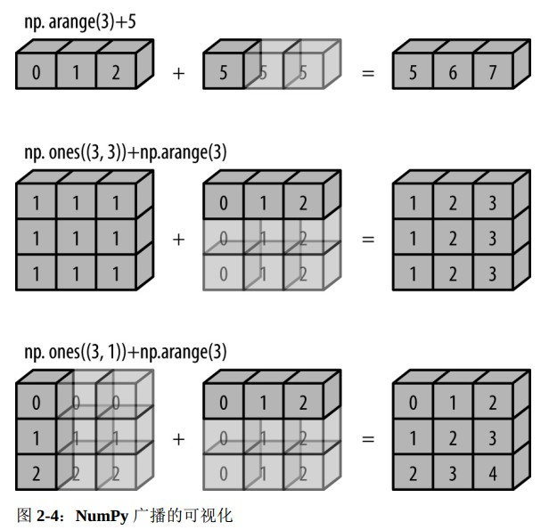

# Python

## 编译与运行速度

为了加速python，目前有一下几个项目：

* PyPy：实时编译
* Cython：编译为C代码
* Numba：转换为LLVM字节码

官方实现为CPython，在每次循环时必须做数据类型的检查和函数的调度。 每次进行倒数运算时， Python 首先检查对象的类型， 并且动态查找可以使用该数据类型的正确函数。 如果我们在编译代码时进行这样的操作， 那么就能在代码执行之前知晓类型的声明， 结果的计算也会更加有效率。 

## 类内命名（下划线作用）


## zip

* list zip方法可以把series组合打包成一条条记录

* 对于多个list组成的list，在用zip()打包成record的时候，可以用*list表示转置：

  ```python
  l = [[1,2,3],[4,5,6]]
  
  for item in zip(*l):
      print(item)
      
  ('1', '4')
  ('2', '5')
  ('3', '6')
  ```

## list

python中看起来像primitive type的数据类型如int、long起始都是底层c的一个结构体，所以维护起来远比纯C的int等要麻烦，而且占用空间。x=1实际上x是一个指针，指向保存1的对象。

对于list，之所以支持异构数据，是因为list维护的是一组指针。

所以在存储同构数据的前提下尽量使用numpy数组，类似于，或者import python自带的array。

```c
struct _longobject {
	long ob_refcnt; // reference count
	PyTypeObject *ob_type;
	size_t ob_size; // size_t --> unsigned int on 32bit sys, long unsigned int on 64bit
	long ob_digit[1];
};
```


## dict

### dict default

* {}.setdefault(key,default_value) 如果key不存在就创建并设默认值,如果存在就返回已有的value，value可以使基本类型或者集合，如果是集合(default_value为list,set等)，那么可以直接编辑

  ```python
  words = ['apple', 'bat', 'bar', 'atom', 'book']
  by_letter = {}
  for word in words:
      letter = word[0]
      by_letter.setdefault(letter, []).append(word)
  
  by_letter 
  {'a': ['apple', 'atom'], 'b': ['bat', 'bar', 'book']}
  ```

* 或者使用defaultdict

  ```python
  from collections import defaultdict
  
  d = defaultdict(list)
  d['a'].append(1)
  d['a'].append(2)
  ```

### OrderedDict

在遍历dict的时候能够保证以插入时的顺序进行遍历，==因为内部需要维护一个双向列表保存插入key的排序，所以要注意内存开销，大小是普通dict的两倍==：

```python
from collections import OrderedDict

d = OrderedDict()
d['foo'] = 1
d['bar'] = 2

for key in d:
    print(key, d[key])
```

### 在dict中查最值

* 用zip获取迭代器，同样，如果第一排序参考相同，那么就参考第二个：

  ```python
  prices = {
      'ACME': 45.23,
      'AAPL': 612.78,
      'IBM': 205.55,
      'HPQ': 37.20,
      'FB': 10.75
  }
  min_price = min(zip(prices.values(), prices.keys()))
  min_price
  (10.75, 'FB')
  ```

* 用lambda函数指定key，**如果想要保持输出和dict中内容一致，那就再执行一次查找**：

  ```python
  min(prices, key=lambda k: prices[k])
  'FB'
  ```

### 合并dict

* 逻辑上合并，相当于创建一个view：

  ```python
  a = {'x': 1, 'z': 3 }
  b = {'y': 2, 'z': 4 }
  
  from collections import ChainMap
  c_map = ChainMap(a, b)
  
  # 如果dict中有相同的key，那么遍历时会返回先遇到的那个key的value
  print('x:{} y:{} z:{}'.format(c_map['x'],c_map['y'],c_map['z']))
  x:1 y:2 z:3
              
  # 对ChainMap做修改时，只能改第一个dict
  del c_map['y']
  KeyError: "Key not found in the first mapping: 'y'"
  
  ```

* 合并为一个新的dict：

  ```python
  m_map = dict(a)
  m_map.update(b)
  m_map
  {'x': 1, 'z': 4, 'y': 2}
  ```

## 集合操作（&、|、-）

```python
prices.keys() & {'AAPL'}
{'AAPL'}

{'AAPL':68, 'IBM':1}.items() & {'AAPL':68}.items()
```

## 保持有序的除重操作

```python
# 该方法不能保证返回结果保持原输入的顺序
np.unique([1, 5, 2, 1, 9, 1, 5, 10])
array([ 1,  2,  5,  9, 10])

def de_duplicate(items):
    s = set()
    for item in items:
        if item not in s:
            yield item
            s.add(item)
            
list(de_duplicate(a))
[1, 5, 2, 9, 10]

# 改进版，可自定义hashkey，相当于用hashcode来判断，而不是原始item
def de_duplicate(items, keys=None):
    s = set()
    for item in items:
        val = item if keys==None else keys(item)
        if val not in s:
            yield item
            s.add(val)
```


## map function

* map函数可以把函数操作映射到一个对象上

  ```python
  l = list(range(5))
  def func(x):
      return x*2
  
  list(map(func,l))
  [0,2,4,6,8]
  ```

## 全局变量

* 想要在函数中使用全局变量，需要在函数中声明

  ```python
  a = 0
  def func():
  	global a
      a = 1
  
  a
  1
  ```

## 函数对象

* 函数也可以作为对象

  ```python
  states = ['   Alabama ', 'Georgia!', 'Georgia', 'georgia', 'FlOrIda',          				'south   carolina##', 'West virginia?']
  
  def remove_punctuation(value):
      return re.sub('[!#?]', '', value)
  
  clean_ops = [str.strip, remove_punctuation, str.title]
  
  def clean_strings(strings, ops):
      result = []
      for value in strings:
          for function in ops:
              value = function(value)
          result.append(value)
      return result
  ```

## with

* 使用with打开文件的时候，代码块运行完会自动关闭文件，不必f.close()

## 字符串

### 字符串批量拼接

```python
val = 'a,b, c'
l = [x.strip() for x in val.split(',')]
':'.join(l)
'a:b:c'
```

### 字符串函数


### 正则表达式

```python
import re
regex = re.compile(pattern)

"""
search()扫描整个字符串, 返回文本中第一个匹配的起始位置和终止位置
"""
m = regex.search(text)
text[m.start():m.stop()] #得到匹配文本

"""
从头开始匹配，只要开头不匹配就返回None
"""
regex.match(text)

"""
如果pattern中加了括号，可以返回group
"""
pattern = r'([A-Z0-9._%+-]+)@([A-Z0-9.-]+)\.([A-Z]{2,4})' 
m = regex.match('yz@163.com')
m.groups()
('yz','163','com')
regex.findall(text) #会返回元组列表

"""
sub()可用正则表达式'\index'匹配对应的group
"""
regex.sub('',text) #替换匹配的文本并返回
print(regex.sub(r'Username: \1, Domain: \2, Suffix: \3', text))
Dave Username: dave, Domain: google, Suffix: com
Steve Username: steve, Domain: gmail, Suffix: com
Rob Username: rob, Domain: gmail, Suffix: com
Ryan Username: ryan, Domain: yahoo, Suffix: com
```

## 星号解压语法

*args：把后续的参数整合为一个列表

**kwargs：传入key-value pair，整合为一个dict

```python
def tmp(*args, **kwargs):
    print(args)
    print(kwargs)
    
tmp(1,2, a=1, b=2)
(1, 2)
{'a': 1, 'b': 2}
```

### 获取多个变量

变量名前面加*****：

```python
first, *middle, last = np.arange(5)

middle
[1, 2, 3]
```

### 字符串分割

```python
l = 'yz@localhost:123:321: User:/var/list:/usr/bin'
host, *field, homedir, sh = l.split(':')

host
'yz@localhost'

homedir
'/var/list'

sh
'/usr/bins'
```

### 字典展开key、val

```python
from collections import Counter

list(zip(*dict(Counter('abddda')).items()))
[('a', 'b', 'd'), (2, 1, 3)]
```


## 集合（collections）

### 队列与栈（deque）

```python
from collections import deque

q = deque(maxlen=3)
for i in range(5):
	q.append(i)
    
q
[2, 3, 4]   

q.pop() # 相当于栈
4
q.popleft() # 相当于队列
2
```

### Counter（自动计数得dict）

```python
from collections import Counter

Counter('abddda')
Counter({'a': 2, 'b': 1, 'd': 3})

dict(Counter('abddda'))
{'a': 2, 'b': 1, 'd': 3}
```


## 简单排序（sorted）

```python
sorted([3,2,1])
[1,2,3]
```

## 堆排序（heapq）

```python
import heapq

ri = np.random.randint(0,10,5)
ri
array([8, 8, 9, 2, 6])

heapq.nlargest(3, ri)
[9, 8, 8]
heapq.nsmallest(3, ri)
[2, 6, 8]

portfolio = [
    {'name': 'IBM', 'shares': 100, 'price': 91.1},
    {'name': 'AAPL', 'shares': 50, 'price': 543.22},
    {'name': 'FB', 'shares': 200, 'price': 21.09},
    {'name': 'HPQ', 'shares': 35, 'price': 31.75},
    {'name': 'YHOO', 'shares': 45, 'price': 16.35},
    {'name': 'ACME', 'shares': 75, 'price': 115.65}
]
cheap = heapq.nsmallest(3, portfolio, key=lambda s: s['price'])
expensive = heapq.nlargest(3, portfolio, key=lambda s: s['price'])

cheap
[{'name': 'YHOO', 'shares': 45, 'price': 16.35},
 {'name': 'FB', 'shares': 200, 'price': 21.09},
 {'name': 'HPQ', 'shares': 35, 'price': 31.75}]

expensive
[{'name': 'AAPL', 'shares': 50, 'price': 543.22},
 {'name': 'ACME', 'shares': 75, 'price': 115.65},
 {'name': 'IBM', 'shares': 100, 'price': 91.1}]

"""
可以把list变成一个堆，可以发现第一个元素始终是最小的
"""
ri = np.random.randint(0,10,10)
ri = ri.tolist()
ri
[2, 8, 6, 8, 6, 4, 0, 6, 0, 0]
heapq.heapify(ri)
ri
[0, 0, 2, 0, 6, 4, 6, 6, 8, 8]
heapq.heappop(ri)
0
ri
[0, 0, 2, 6, 6, 4, 6, 8, 8]
```

### 自定义优先队列

```python
class PriorityQueue:
    def __init__(self):
        self._queue = []
        self._index = 0
        
    def push(self, item, priority):
        heapq.heappush(self._queue, (-priority, self._index, item))
        self._index += 1
        
    def pop(self):
        return heapq.heappop(self._queue)[-1] # pop item
    
class Item:
    def __init__(self, name):
        self.name = name
        
    def __repr__(self):
        return 'Item({!r})'.format(self.name)
    
q = PriorityQueue()
q.push(Item('a'), 1)
q.push(Item('b'), 5)
q.push(Item('c'), 1)

q.pop()
Item('b')
q.pop() # 如果有同级别的就按index顺序pop，heappush的时候相当于给定了排序参考的优先级
Item('a')
```

## 切片变量（slice）

避免硬编码的切片：

```python
sl1 = slice(1,3)
np.arange(5)[sl1]
array([1, 2])
```

## 计数（Counter）

底层实现就是一个字典，不过比较方便：

```python
l = np.random.randint(0,10,5)
l
array([2, 7, 4, 1, 4])

num_counts = Counter(l)
num_counts
Counter({2: 1, 7: 1, 4: 2, 1: 1})

num_counts.most_common(1)
[(4, 2)]

#更新计数
num_counts.update(xxx)
```

## 字典列表排序（key=itemgetter、attrgetter、lambda）

查询数据库返回条目时常见的数据结构。

* 用库函数，速度稍微快点：

  ```python
  u_info = [
      {'fname': 'Brian', 'lname': 'Jones', 'uid': 1003},
      {'fname': 'David', 'lname': 'Beazley', 'uid': 1002},
      {'fname': 'John', 'lname': 'Cleese', 'uid': 1001},
      {'fname': 'Big', 'lname': 'Jones', 'uid': 1004}
  ]
  
  from operator import itemgetter
  sorted(u_info, key=itemgetter('lname','uid'))
  [{'fname': 'David', 'lname': 'Beazley', 'uid': 1002},
   {'fname': 'John', 'lname': 'Cleese', 'uid': 1001},
   {'fname': 'Brian', 'lname': 'Jones', 'uid': 1003},
   {'fname': 'Big', 'lname': 'Jones', 'uid': 1004}]
  ```

* 手动版：

  ```python
  sorted(u_info, key=lambda x: [x['lname'],x['uid']])
  ```

### 非原生对象排序

```python
class User:
    def __init__(self, uid):
        self.uid=uid
        
    def __repr__(self):
        return 'User({})'.format(self.uid)

u_info = [User(i) for i in range(3,0,-1)]
u_info
[User(3), User(2), User(1)]

from operator import attrgetter
sorted(u_info, key=attrgetter('uid'))
[User(1), User(2), User(3)]
```

## 过滤（filter）

### list

一般来说用list推导遍历过滤就可以了，如果要复制一点的，就用自定义函数配合filter：


```python
values = ['1', '2', '-3', '-', '4', 'N/A', '5']

def is_int(val):
    try:
        x = int(val)
        return True
    except ValueError:
        return False
    
list(filter(is_int, values))    
```

### dict

```python
prices = {
    'ACME': 45.23,
    'AAPL': 612.78,
    'IBM': 205.55,
    'HPQ': 37.20,
    'FB': 10.75
}

{key:prices[key] for key,value in prices.items() if value>200}
{'AAPL': 612.78, 'IBM': 205.55}

# 如果再次试图用集合求key与{}的交集，那么要多花1.6倍时间
{key:prices[key] for key,value in prices.items() if key in {'AAPL','IBM'}}
{'AAPL': 612.78, 'IBM': 205.55}
```

## 高效迭代

```python
a = list(range(3))
b = list(range(3,6))

# inefficent
for item in a + b:
    print(item)

from itertools import chain    
# efficient
for item in chain(a, b):
    print(item)
```


# NumPy

* NumPy之于数值计算特别重要的原因之一，是因为它可以高效处理大数组的数据。这是因为：
  * NumPy是在一个连续的内存块中存储数据，独立于其他Python内置对象。NumPy的C语言编写的算法库可以操作内存，而不必进行类型检查或其它前期工作。比起Python的内置序列，NumPy数组使用的内存更少。
  * NumPy可以在整个数组上执行复杂的计算，而不需要Python的for循环。

* array()默认直接复制输入数据；asarray()将输入转换为ndarray。

## 分别获取浮点数的整数和小数（np.modf）

np.modf()是Python divmod()的矢量化（用数组表达式代替循环的做法）版本，会返回数组元素的小数部分和整数部分，分别得到两个数组。

## 条件矢量判断（np.where）

np.where(cond,  x, y)能对数组进行矢量判断，条件cond可以是布尔列表，true则返回x，false则返回y，其中x、y可以使标量也可以是列表。

```python
x = np.array([1,4,6])
y = np.array([2,3,5])
np.where(x>y,x,y)
array([2, 4, 6])
```

## 矩阵计算

### 全1矩阵

```python
np.ones((2, 2))
array([[1., 1.],
       [1., 1.]])
```

### 单位阵

```python
np.eye(2)
array([[1., 0.],
       [0., 1.]])
```

### 乘积

* 一般矩阵乘积

```python
m = np.eye(2)
m.dot(np.matrix(np.arange(4).reshape(2,2)))
matrix([[0., 1.],
        [2., 3.]])
```

* hadamard乘积，element-wise的乘积，元素一一对应乘积

```python
m = 2 * np.eye(2) + 1
m * (np.matrix(np.arange(4).reshape(2, 2)))
matrix([[ 2.,  6.],
        [ 6., 10.]])
```

## 其他

* 利用np.sort()（默认按行排序，输入1为按列排序）对数组排序后可以找数组分位数，如:

```python
arr[int(0.01*len(arr))] #1% quantile
```
* np.unique()提供除重并排序的功能
* np.in1d(values , list)判断values是否在list中：

```
values = np.array([6, 0, 0, 3, 2, 5, 6])
np.in1d(values, [2, 3, 6])
array([ True, False, False,  True,  True, False,  True], dtype=bool)
```

  此外还有intersect1d(x, y)、union1d(x, y),、setdiff1d(x, y)、setxor1d(x, y)。

* np.save()、np.load()、np.savez()、np.savez_compressed()能够把数组保存到本地文件上，以供读取。

* np.count_nonzero()，可以配合条件使用，如：

  ```python
  a = np.arange(3)
  np.count_nonzero(a)
  2
  
  np.count_nonzero(a>1)
  1
  ```

* np.any()、np.all()，同样可以配合条件使用：

  ```python
  np.all(a==0)
  False
  
  np.any(a>0)
  True
  ```

* np.计算函数.outter(a,b)，可以对数组a、b的元素进行成对计算，获得一个矩阵:

  ```python
  x = np.arange(3)
  np.multiply.outer(x, x)
  array([[0, 0, 0],
         [0, 1, 2],
         [0, 2, 4]])
  ```

* np.计算函数.reduce(a)，可以对数组遍历进行连续计算，如：

  ```python
  x = np.arange(3)
  np.add.reduce(x)
  3
  ```

## 节约内存

numpy内置的计算函数能够设定out，将结果输出到某个变量中，这样就不必创建临时变量然后在复制过去，可以节约内存：

```python
x = np.arange(5)
y = np.zeros(5)

np.power(x, 2, out=y)

y[::2] = x * 10 # 这样一定会创建临时变量，浪费内存
np.multiply(x, 10, out=y[::2])
```

## 聚合函数

| 函数名称      | NaN安全版本      | 描述                     |
| ------------- | ---------------- | ------------------------ |
| np.sum        | np.nansum        | 计算元素的和             |
| np.prod       | np.nanprod       | 计算元素的积             |
| np.mean       | np.nanmean       | 计算元素的平均值         |
| np.std        | np.nanstd        | 计算元素的标准差         |
| np.var        | np.nanvar        | 计算元素的方差           |
| np.min        | np.nanmin        | 找出最小值               |
| np.max        | np.nanmax        | 找出最大值               |
| np.argmin     | np.nanargmin     | 找出最小值的索引         |
| np.argmax     | np.nanargmax     | 找出最大值的索引         |
| np.median     | np.nanmedian     | 计算元素的中位数         |
| np.percentile | np.nanpercentile | 计算基于元素排序的统计值 |
| np.any        | N/A              | 验证任何一个元素是否为真 |
| np.all        | N/A              | 验证所有元素是否为真     |

## 广播（broadcast）

对于相同shape的数组进行广播操作就不再说了。

以下是不同形状的array进行广播操作：

```python
a = np.arange(3)
b = np.arange(3).reshape(-1,1)
a
array([0, 1, 2])
b
array([[1],
       [2],
       [3]])
a+b
array([[0, 1, 2],
       [1, 2, 3],
       [2, 3, 4]])
```

一下是不同形状array的广播规则：

* 规则 1： 如果两个数组的维度数不相同， 那么小维度数组的形状将会在最左边补 1。
* 规则 2： 如果两个数组的形状在任何一个维度上都不匹配， 那么数组的形状会沿着维度为 1 的维度扩展以匹配另外一个数组的形状。
* 规则 3： 如果两个数组的形状在任何一个维度上都不匹配并且没有任何一个维度等于 1， 那么会引发异常。 

```python
"""
匹配情况
"""
M = np.ones((2, 3))
a = np.arange(3)

M.shape=(2, 3)
a.shape=(3,)

# 根据规则1
a.shape->(1, 3)
# 根据规则2
a.shape->(2, 3)
# 所以
M + a
array([[ 1., 2., 3.],
	   [ 1., 2., 3.]])

"""
不匹配情况
"""
M = np.ones((3, 2))
a = np.arange(3)

# 根据规则1
a.shape->(1, 3)
# 根据规则2
a.shape->(3, 3)
# 根据规则3，没有等于1的维度，所以
M + a
ValueErrors
```




## 索引

索引结果与索引的shape一致，而非被索引对象的shape：

```python
a = np.arange(3)
idx = np.array([0, 1, 2, 0]).reshape(2, 2)

a[idx]
array([[0, 1],
       [2, 0]])
```

### 随机选择（np.random.choice）

```python
a = np.random.randint(0,10,10)
a
array([9, 6, 1, 6, 3, 7, 8, 7, 1, 5])

np.random.choice(a, size=(2,2))
array([[6, 1],
       [5, 8]])
```

## 分箱（np.digitize）

```python
np.digitize([1,2,3,4,5],[1,3,6])
array([1, 1, 2, 2, 2], dtype=int64)
```


# SciPy

## 出现次数统计（stats.mode）

```python
from scipy.stats import mode

l = [np.random.randint(0,3,5) for i in range(5)]
l
[array([2, 1, 0, 1, 1]),
 array([2, 1, 0, 0, 2]),
 array([0, 0, 2, 1, 2]),
 array([0, 0, 0, 2, 0]),
 array([2, 0, 0, 1, 0])]

mode(l)
ModeResult(mode=array([[2, 0, 0, 1, 0]]), count=array([[3, 3, 4, 3, 2]]))
```

## 插值

因为keras中的upsampling只有repeat、linear、quadratic三种方式，因此考虑自行实现cubic插值，然而因为tensorflow采用的是静态图，因此只能调用keras或tensorflow自己的api来实现。

==tf.image.resize_bicubic(images,size,align_corners=False,name=None)，提供bicubic插值，其中size=(new_h, new_w)==

### 失败代码

```python
class cubic_interpolation():
    def __init__(self, scale=2):
        self.scale = scale
        
    def cal_value(self, p, x):
        a = -0.5*p[0] + 1.5*p[1] - 1.5*p[2] + 0.5*p[3]
        b = p[0] - 2.5*p[1] + 2*p[2] - 0.5*p[3]
        c = -0.5*p[0] + 0.5*p[2]
        d = p[1]
        return a*(x**3) + b*(x**2) + c*x + d
    
    def fit(self, input):
        extend_arr = np.zeros((input.shape[0]*2))
        extend_arr[::2] = input[:]
        extend_arr = np.pad(extend_arr, 1, 'edge')
        extend_arr = extend_arr.tolist() + [0]        
        p = [0]*4
        for i in range(1, input.shape[0]*self.scale+1, self.scale):
            x_index = i+1
#             print(x_index)
            p[0] = extend_arr[x_index-2]
            p[1] = extend_arr[x_index-1]
            p[2] = extend_arr[x_index+1]
            p[3] = extend_arr[x_index+2]
            x = (p[1]+p[2]) / 2
            res = self.cal_value(p, x)
            extend_arr[x_index] = res
        return np.array(extend_arr[1:input.shape[0]*self.scale+1])
    
up1D = cubic_interpolation()
res = up1D.fit(y)
plt.plot(np.arange(res.shape[0]), res)    
```

.png)

### scipy代码

```python
%matplotlib inline
import matplotlib
import matplotlib.pyplot as plt
import numpy as np
from scipy import interpolate

x, y = np.arange(0,8,2), np.array([1, 2, 3, 1])
xvals = np.arange(8)
tck = interpolate.splrep(x, y, s=0)
yinterp = interpolate.splev(xvals, tck, der=0)
plt.plot(x,y,'-o')
plt.plot(xvals,yinterp,'r')
```


# Pandas

## 数据类型


## NaN

全称 Not a Number ， 是一种按照 IEEE 浮点数标准设计、 在任何系统中都兼容的特殊浮点数。

其转换规则如下：

| 类型             | 缺失值转换规则     | NA标签值       |
| ---------------- | ------------------ | -------------- |
| floating 浮点型  | 无变化             | np.nan         |
| object 对象类型  | 无变化             | None 或 np.nan |
| integer 整数类型 | 强制转换为 float64 | np.nan         |
| boolean 布尔类型 | 强制转换为 object  | None 或 np.nan |

## Series编辑

* pd.Series有点像定长的有序字典，index可以是自动生成的序列号，也可以自行制定。可以把dict传出Series()，默认index为dict 的key。

  ```python
  ses = pd.Series(list(range(0,20,2)), index=[chr(i+65) for i in range(0,20,2)])
  
  ses
  A     0
  C     2
  E     4
  G     6
  I     8
  K    10
  M    12
  O    14
  Q    16
  S    18
  dtype: int64
  
  'A' in ses
  Ture
  ```

* pd.isnull()或pd.Series.isnull()、pd.notnull()返回布尔型Series，index同原Series。

* pd.Series.replace([],[])可以以list方式传入多个被替换值和替换值，或者传入一个dict，replace({})。
### 字符串处理

* pd.Series.str中同样也有与Python相似的正则表达式功能，如match()、findall() ，并且是矢量化操作，可以自动跳过NaN项。

```python
data = {'Dave': 'dave@google.com', 'Steve': 'steve@gmail.com',
   'Rob': 'rob@gmail.com', 'Wes': np.nan}
data = pd.Series(data)
data
Dave     dave@google.com
Steve    steve@gmail.com
Rob        rob@gmail.com
Wes                  NaN
dtype: object

data.str[0]
Dave       d
Steve      s
Rob        r
Wes      NaN
dtype: object

# 调用re.match，返回布尔值    
pattern = r'([a-z0-9]+)@([a-z0-9]+).([a-z]{2,4})'
mat = data.str.match(pattern,flags=re.IGNORECASE)
mat
Dave     True
Steve    True
Rob      True
Wes       NaN
dtype: object    
    
se
0     yz
1    ygc
2     ch
3     zt
Name: name, dtype: object

# 等价于用re.match，如果有多个group则返回多列        
se.str.extract('^([y])([z]*[gc]*)$')  
	 0    1
0    y    z
1    y   gc
2  NaN  NaN
3  NaN  NaN

# split后可以提取列表中的值
se.str.split('y')
0     [, z]
1    [, gc]
2      [ch]
3      [zt]
Name: name, dtype: object
        
se.str.split('y').str.get(-1)
se.str.split('y').str[-1]
0     z
1    gc
2    ch
3    zt
Name: name, dtype: object
```

* 其他方法：

### 函数映射（map）

pd.Series.map()用于Series，可映射函数，与apply不同的是apply映射整行，二者可变通使用:

```python
	k1	k2
0	one	1
1	two	1
2	one	2
3	two	3

t['k3'] = t['k1'].map(lambda x: {'one':11,'two':22}[x])
t['k2'] = t['k2'].map(lambda x: x*2)
t['k2'] = t['k2'].apply(lambda x: x*2) 与上一行等效

t
	k1	k2	k3
0	one	2	11
1	two	2	22
2	one	4	11
3	two	6	22
```
```python
def f(x):
 return pd.Series([x.min(), x.max()], index=['min', 'max'])
frame.apply(f)
		b         d         e
min -0.555730  0.281746 -1.296221
max  1.246435  1.965781  1.393406
```

### 越过NaN值（asof）

```python
s = pd.Series(list(range(5))+[np.nan,1,np.nan])
s
0    0.0
1    1.0
2    2.0
3    3.0
4    4.0
5    NaN
6    1.0
7    NaN
dtype: float64

"""
如果索引到的值时NaN，那么会向上查找最近的有效值并返回
"""
s.asof(5)
4.0
s.asof(6)
1.0
s.asof(7)
1.0
```

### 判断是否在集合中（isin）

```python
hotname
['John', 'Mary', 'Robert', 'James', 'Linda', 'Michael', 'David', 'Jacob', 'Isabella']

"""
通过集合、列表筛选
"""
df[df['name'].isin(hotname)]
	name	sex	birth	year
0	Mary	F	7065	1880
214	Isabella	F	50	1880
228	John	F	46	1880
304	Linda	F	27	1880
343	James	F	22	1880
...	...	...	...	...
1676658	David	M	14042	2010
1676662	James	M	13714	2010
1676669	John	M	11424	2010
1676697	Robert	M	7471	2010
1680176	Isabella	M	30	2010
```

### 类别统计

```python
pd.Series.value_count()
```

## 百分位数

```python
pd.Series.quantile([])
```


## DataFrame基础编辑（rename、NA、fillna、loc、append、insert、set_index、reset_index、map、columns.difference）

* pd.DataFrame.rename(index={}, columns={}, copy=True)传入字典更新轴标签，传入函数也行。可以让copy=False以节省内存。

* pd.DataFrame.drop_duplicates()默认检查所有列是否重复，也可以传入list指定列。默认保留第一个值，可以设置keep='last'保留最后一个值。

* pd.DataFrame.drop()可以根据index或者columns决定删除行或者列。

* pd.DataFrame.dropna(axis=[0|1], how=['any'|'all'])可以清除含NaN的行或者列。如果涉及时间序列，想要保留一部分数据而不是全部舍弃，可以设置thresh=。

* pd.DataFrame.fillna()可以传入字典，对不同的列设置不同的填充值。注意有inplace=选项。填充方法method则由几种，一般为'ffill'、'bfill'，可设定limit=。先算出填充值，然后再传入用inplace=True。其次还可以设置axis，一般默认axis=0，很少用axis=1。

* DataFrame定位：

* pd.DataFrame.append()用于插入行

* pd.DataFrame.insert()用于插入列。

* pd.DataFrame.set_index([])可以接受list，指定多层索引，默认制定后删除列，可以设定drop=False。

* pd.DataFrame.reset_index()则会把之前的索引变成列，新建从0开始的索引。

* pd.DataFrame.info()

* pd.DataFrame.describe()

* pd.DataFrame.map()可传入dict映射相应的值，然后生成新的column。

  ```python
  df3 = pd.DataFrame({'name':list('abc')},columns=['name'])
  df3['val'] = df3['name'].map({'a':1,'b':2,'c':3})
  df3
  	name	val
  0	a		1
  1	b		2
  2	c		3
  ```

* pd.DataFrame.columns.difference()可以返回需要排除的列的索引，可用于筛选列。

## 数据一阶差分（diff）

* pd.DataFrame.diff()可以做一阶差分，逐行计算插值，对处理时间序列常用。

  ```python
  df = pd.DataFrame(np.random.randn(3,4), columns=list('abcd'))
  df.index = ['a','a','a']
  
  		a			b			c			d
  a	-0.094523	-0.328891	0.904665	1.059745
  a	-0.974705	1.364472	1.676872	1.120161
  a	0.487545	-0.214489	-0.448830	0.566737
  
  df.diff()
  
  		 a			b			c			d
  a		NaN			NaN			NaN			NaN
  a	-0.880182	1.693363	0.772207	0.060416
  a	1.462250	-1.578961	-2.125702	-0.553424
  ```

## 归一化、标准化（MinMaxScaler、StandardScaler）

与归一化不同，标准化不会限定值到某个特定的范围，这对某些算法可能构成问题（比如，神经网络常需要输入值得范围是 0 到 1）。但是，标准化受到异常值的影响很小。

可以手动用apply计算，也可以用sklearn的组件：

```python
from sklearn.preprocessing import MinMaxScaler, StandardScaler
scaler1 = MinMaxScaler()
scaler2  = StandardScaler()
dff.insert(loc=len(dff.columns),value=scaler1.fit_transform(dff['val'].to_frame()), column='nor_val')
dff.insert(loc=len(dff.columns),value=scaler2.fit_transform(dff['val'].to_frame()), column='std_val')
dff
	val	nor_val	std_val
0	5	0.26	-0.57
1	15	0.79	0.93
2	2	0.11	-1.02
3	11	0.58	0.33
4	6	0.32	-0.42
5	19	1.00	1.53
6	2	0.11	-1.02
7	19	1.00	1.53
8	9	0.47	0.03
9	0	0.00	-1.32
```


## 计算占比（div+sum）

```python
"""
先对一项数据所有列值求合，再按行除以各自的总值
"""
df = df.div(df.sum(axis=1), axis=0)
```

## 相关系数（corr）

* pd.DataFrame.corr()能够得出相关系数矩阵

## 频数表（crosstable）

获取频数表后进行归一化，再绘制bar图可以反映两个关联数据的频数占比关系。

```python
df = pd.DataFrame({'value':np.random.rand(3),'catagory':list('abc')})
df
	value	catagory
0	0.122368	a
1	0.254452	b
2	0.169990	c

pd.crosstab(df['value'], df['catagory'])
catagory	a	b	c
value			
0.122368	1	0	0
0.169990	0	0	1
0.254452	0	1	0
```


## 读取文件（read、from_records）


* 读文件的时候未必有header，可以令header=None或者给出列名names=[]。

* 读取文件时可以指定索引列index_col=[]

* 对于异形文件可以跳过指定行：

  ```python
  In [23]: !cat examples/ex4.csv
  # hey!
  a,b,c,d,message
  # just wanted to make things more difficult for you
  # who reads CSV files with computers, anyway?
  1,2,3,4,hello
  5,6,7,8,world
  9,10,11,12,foo
  In [24]: pd.read_csv('examples/ex4.csv', skiprows=[0, 2, 3])
  Out[24]: 
     a   b   c   d message
  0  1   2   3   4   hello
  1  5   6   7   8   world
  2  9  10  11  12     foo
  ```

* 各列可以使用不同的NA标记值：

  ```python
  In [31]: sentinels = {'message': ['foo', 'NA'], 'something': ['two']}
  
  In [32]: pd.read_csv('examples/ex5.csv', na_values=sentinels)
  Out[32]:
  something  a   b     c   d message
  0       one  1   2   3.0   4     NaN
  1       NaN  5   6   NaN   8   world
  2     three  9  10  11.0  12     NaN
  ```

* 按records构造

  ```python
  path2_users = 'F:/movielens/users.dat'
  unames = ['user_id', 'gender', 'age', 'occupation', 'zip']
  # pd.read_table(path2_users, sep='::', header=None, names=unames)	无法正确读取
  tmp = pd.read_html(path2_users) #读取html中的表格，但没有sep选项，需要人工处理
  tmp[0][1]
  0           1::F::1::10::48067
  1          2::M::56::16::70072
  2          3::M::25::15::55117
  3           4::M::45::7::02460
  4          5::M::25::20::55455
                   ...          
  6035    6036::F::25::15::32603
  6036     6037::F::45::1::76006
  6037     6038::F::56::1::14706
  6038     6039::F::45::0::01060
  6039     6040::M::25::6::11106
  Name: 1, Length: 6040, dtype: object
  
  tmp2 = tmp.transform(lambda x: x.split('::'))
  df = pd.DataFrame.from_records(tmp2.tolist(),columns=unames)
  df
  user_id	gender	age	occupation	zip
  0	1	F	1	10	48067
  1	2	M	56	16	70072
  2	3	M	25	15	55117
  3	4	M	45	7	02460
  4	5	M	25	20	55455
  ...	...	...	...	...	...
  6035	6036	F	25	15	32603
  6036	6037	F	45	1	76006
  6037	6038	F	56	1	14706
  6038	6039	F	45	0	01060
  6039	6040	M	25	6	11106
  6040 rows × 5 columns
  ```


## 数据集划分

### 随机采样（reindex+permutation）

为了保证重复运行所有程序时能够得到相同的数据集，以免让模型接触到所有数据，可以固定一个random seed：

```python
# np.random.seed(23)
# df = df.reindex(np.random.permutation(df.index))
# def split_data(data, test_ratio):
#     test_size = int(len(data)*test_ratio)
#     training_set = data[test_size:]
#     testing_set = data[:test_size]
#     return training_set, testing_set

# df_train, df_test = split_data(df, 0.20)

from sklearn.model_selection import train_test_split

df_train, df_test = train_test_split(df, test_size=0.2, random_state=23)
```

### 哈希划分（hashlib）

但是如果数据集更新，这两个方法都会失效。一个通常的解决办法是使用每个实例的ID来判定这个实例是否应该放入测试集（假设每个实例都有唯一并且不变的ID）。例如，你可以计算出每个实例ID的哈希值，只保留其最后一个字节，如果该值小于等于 51（约为 256 的 20%），就将其放入测试集。这样可以保证在多次运行中，测试集保持不变，即使更新了数据集。新的测试集会包含新实例中的 20%，但不会有之前位于训练集的实例。：

```python
import hashlib

def test_set_check(identifier, test_ratio, hash):
    return hash(np.int64(identifier)).digest()[-1] < 256 * test_ratio

def split_train_test_by_id(data, test_ratio, id_column, hash=hashlib.md5):
    ids = data[id_column]
    in_test_set = ids.apply(lambda id_: test_set_check(id_, test_ratio, hash))
    return data.loc[~in_test_set], data.loc[in_test_set]
```

### 分层采样划分（StratifiedShuffleSplit）

避免引入采样偏差，划分后使得训练集和测试集的分类特征占比尽可能相同：

```python
from sklearn.model_selection import StratifiedShuffleSplit
split = StratifiedShuffleSplit(n_splits=1, test_size=0.2, random_state=23)
for train_index, test_index in split.split(df, df['cat']):
    tr = df.loc[train_index]
    te = df.loc[test_index]    
```


## 数据分段（cut、qcut）

  * pd.cut()可以接受自定义划分边界pd.cut(data, bins)，或者指定划分区间个数和精度pd.cut(data, 4, precision=2)（取极差再均分段）。返回的对象包含codes和categories，通过指定labels=[]得到相应的codes。

  ```python
  """
  区间为左闭右开(a,b]
  """
  bins = [1,5,10]
  l = [0,1,3,5,6,10,11]
  labels = ['a','b']
  cats = pd.cut(l,bins,labels=labels)
  
  cats
  [NaN, NaN, a, a, b, b, NaN]
  Categories (2, object): [a < b]
      
  cats.code
  array([-1, -1,  0,  0,  1,  1, -1], dtype=int8)
  
  pd.Series(cats)
  0    NaN
  1    NaN
  2      a
  3      a
  4      b
  5      b
  6    NaN
  dtype: category
  Categories (2, object): [a < b]
  ```

  * pd.qcut(data, cat_num)按百分位数进行划分，所以每段样本数都相同。也可以自行传入分位数pd.qcut(data, [])。

  ## 分类特征转换（get_dummies）

### 单类

  * pd.get_dummies()

  ```python
  df = pd.DataFrame({'location':[1,2,3]*2})
  
  df
  location
  0	1
  1	2
  2	3
  3	1
  4	2
  5	3
  
  dummies = pd.get_dummies(df['location'], prefix='location')
  dummies
  	location_1	location_2	location_3
  0	1			0			0
  1	0			1			0
  2	0			0			1
  3	1			0			0
  4	0			1			0
  5	0			0			1
  
  df.join(dummies) #join用索引进行连接，是merge的简化版，最好不要用了
  	location	location_1	location_2	location_3
  0	1			1			0			0
  1	2			0			1			0
  2	3			0			0			1
  3	1			1			0			0
  4	2			0			1			0
  5	3			0			0			1
  ```

### 多类

  * 如果一个record属于多个类，则需要构建全0矩阵，然后遍历每条record给矩阵相应列（对应的类）打标记1，对于很大的数据，这样的效率会比较低（有待实验）：

  ```python
  movies[:2]
     movie_id                               title                        genres
  0         1                    Toy Story (1995)   Animation|Children's|Comedy
  1         2                      Jumanji (1995)  Adventure|Children's|Fantasy
  
  all_genres = []
  for x in movies.genres:
  	all_genres.extend(x.split('|'))
  genres = pd.unique(all_genres)
  
  zero_matrix = np.zeros((len(movies), len(genres)))
  dummies = pd.DataFrame(zero_matrix, columns=genres)
  
  for i, gen in enumerate(movies.genres):
     indices = dummies.columns.get_indexer(gen.split('|'))
     dummies.iloc[i, indices] = 1
  movies_windic = movies.join(dummies.add_prefix('Genre_'))
  ```

## 多层索引（level、stack、unstack、pivot、melt）

### Series

```python
data = pd.Series(np.random.randn(9),
                 index=[['a', 'a', 'a', 'b', 'b', 'c', 'c', 'd', 'd'],
                        [1, 2, 3, 1, 3, 1, 2, 2, 3]])
data
a  1   -0.603994
   2   -0.831141
   3   -1.040966
b  1    2.660838
   3    0.017088
c  1    0.198220
   2   -0.651307
d  2   -0.215880
   3   -1.037637
dtype: float64

data.index
MultiIndex(levels=[['a', 'b', 'c', 'd'], [1, 2, 3]],
           labels=[[0, 0, 0, 1, 1, 2, 2, 3, 3], [0, 1, 2, 0, 2, 0, 1, 1, 2]])

"""
内层取数
"""
data.loc[:,1]
a   -0.603994
b    2.660838
c    0.198220
dtype: float64

"""
将分层索引的Series变为DataFrame
"""
data.unstack()
	1			2			3
a	-0.603994	-0.831141	-1.040966
b	2.660838	NaN			0.017088
c	0.198220	-0.651307	NaN
d	NaN			-0.215880	-1.037637
```

### DataFrame

```python
frame = pd.DataFrame(np.arange(12).reshape((4, 3)),
                     index=[['a', 'a', 'b', 'b'], [1, 2, 1, 2]],
                     columns=[['Ohio', 'Ohio', 'Colorado'],
                              ['Green', 'Red', 'Green']])
frame.index.names = ['index1', 'index2']
frame.columns.names = ['state', 'color']

frame
state			Ohio			Colorado
color			Green	Red		Green
index1	index2			
a		1		0		1		2
		2		3		4		5
b		1		6		7		8
		2		9		10		11
    
"""
交换索引层级
"""
frame.swaplevel('index1', 'index2')

"""
压缩多层索引，转换为Series，被压缩的level变成index
默认从内部开始压缩，先压缩color层，再到state层，也可输入指定的level
"""
frame.stack().stack()
index1  index2  color  state   
a       1       Green  Colorado     2.0
                       Ohio         0.0
                Red    Ohio         1.0
        2       Green  Colorado     5.0
                       Ohio         3.0
                Red    Ohio         4.0
b       1       Green  Colorado     8.0
                       Ohio         6.0
                Red    Ohio         7.0
        2       Green  Colorado    11.0
                       Ohio         9.0
                Red    Ohio        10.0
dtype: float64
```

### 按层级求合

```python
frame.sum(level='state',axis=1)
		state	Ohio	Colorado
index1	index2		
a		1		1		2
		2		7		5
b		1		13		8
		2		19		11
    
frame.sum(level='index1')    
state	Ohio			Colorado
color	Green	Red		Green
index1	    
a		3		5		7
b		15		17		19
```

### pivot、melt

相当于set_index和unstack的组合，详见原书第08章。

### 索引条件查询（query）

[详细用法链接](https://stackoverflow.com/questions/53927460/select-rows-in-pandas-multiindex-dataframe/53927461#53927461)

```python
df
        a
id cat
a  0    1
   1    2

# 抽取指定行
df.loc[('a',0)]
df.loc[('a',0), :]
val    1
Name: (a, 1), dtype: int32
        
df.loc[[('a',0),('a',1)]]
		a
id cat
a  0    1
   1    2
    
# 单条件查询，两个简洁等效用法
df.query('cat == 0') # 1
idx = pd.IndexSlice # 2
df.loc[idx[:, 0], :] # 2

 		a
id cat
a  0    1

# 多条件范围查询
df.query('cat in [0,1] and id=="a"')

# 奇葩查询
df2
		 val
one two
a   0      0
    1      1
    2      2
    3      3
b   0      4
    1      5
    2      6
    3      7

df3.query('one=="a" or two==3')    
		 val
one two
a   0      0
    1      1
    2      2
    3      3
b   3      7
    
```


## DataFrame合并（merge）

可以实现SQL中的各种join，如inner（默认）、left、right、outer：

```python
df1 = pd.DataFrame({'key': ['b', 'b', 'a', 'c', 'a', 'a', 'b'],
                    'data': range(7)})
df2 = pd.DataFrame({'key': ['a', 'b', 'd'],
                    'data': range(3)})                   

"""
如果两个df有同名的列，不指定suffixes的话默认用x、y后缀
"""
pd.merge(df1, df2, how='outer', on='key', suffixes=['_1', '_2'])             
	key	data_1	data2_2
0	b	0.0		1.0
1	b	1.0		1.0
2	b	6.0		1.0
3	a	2.0		0.0
4	a	4.0		0.0
5	a	5.0		0.0
6	c	3.0		NaN
7	d	NaN		2.0

"""
如果key名字不一样，可以分别指定
"""
df3 = pd.DataFrame({'lkey': ['b', 'b', 'a', 'c', 'a', 'a', 'b'],
			        'data1': range(7)})
df4 = pd.DataFrame({'rkey': ['a', 'b', 'd'],
                    'data2': range(3)})			        
pd.merge(df3, df4, left_on='lkey', right_on='rkey')     
	data1 lkey  data2 rkey
0      0    b      1    b
1      1    b      1    b
2      6    b      1    b
3      2    a      0    a
4      4    a      0    a
5      5    a      0    a

"""
如果key用的是index，则让left_index=True或right_index=True
"""
le = pd.DataFrame({'key':list('abcd'), 'value':range(4)})
ri = pd.DataFrame({'value':range(4,6)}, index=list('bc'))
pd.merge(le, ri, left_on='key', right_index=True, how='outer', suffixes=['_left','_right'])
	key	value_left	value_right
0	a		0		NaN
1	b		1		4.0
2	c		2		5.0
3	d		3		NaN

"""
多个key组合合并
"""
left = pd.DataFrame({'key1': ['foo', 'foo', 'bar'],
                     'key2': ['one', 'two', 'one'],
                     'lval': [1, 2, 3]})
right = pd.DataFrame({'key1': ['foo', 'foo', 'bar', 'bar'],
                      'key2': ['one', 'one', 'one', 'two'],
                      'rval': [4, 5, 6, 7]})
pd.merge(left, right, on=['key1', 'key2'], how='outer')
   key1 key2  lval  rval
0  foo  one   1.0   4.0
1  foo  one   1.0   5.0
2  foo  two   2.0   NaN
3  bar  one   3.0   6.0
4  bar  two   NaN   7.0
```

## 轴向拼接（concat）

```python
"""
 横轴向拼接可以接受list，容纳DataFrame、Series
"""
pieces = []
concat(pieces, ignore_index=True)
```

### Series

```python
s1 = pd.Series([0, 1], index=['a', 'b'])
s2 = pd.Series([2, 3], index=['c', 'd'])

"""
默认是在横轴上拼接，返回一个Series
"""
pd.concat([s1,s2])
a    0
b    1
c    2
d    3
dtype: int64

"""
在纵上拼接则返回一个DataFrame，默认join='outer'，可指定为'inner'，keys用于指定列名
"""
pd.concat([s1,s2], axis=1, keys=['x', 'y'])
	x	y
a	0.0	NaN
b	1.0	NaN
c	NaN	2.0
d	NaN	3.0
```

### DataFrame

```python
df1 = pd.DataFrame(np.arange(6).reshape(3, 2), index=['a', 'b', 'c'],
                   columns=['one', 'two'])
df2 = pd.DataFrame(5 + np.arange(4).reshape(2, 2), index=['a', 'c'],
                   columns=['three', 'four'])
                   
df1
	one	two
a	0	1
b	2	3
c	4	5

df2
	three	four
a	5	6
c	7	8

"""
若DataFrame中已有列名，再指定keys则会变成层次索引，通过names给层次索引命名
如果索引是默认的range(total_length)，则需要让ignore_index=True，重新生成索引
"""
pd.concat([df1,df2], sort=False, axis=1, keys=['Df1','Df2'], names=['L1', 'L2'])
L1	Df1		Df2
L2	one	two	three	four
a	0	1	5.0		6.0
b	2	3	NaN		NaN
c	4	5	7.0		8.0
```

## 缺失数据互补（combine_first）

### Series

```python
s1 = pd.Series([np.nan, 2.5, np.nan, 3.5, 4.5, np.nan],
           index=list('abcdef'))
s2 = pd.Series(np.arange(len(s1), dtype=np.float64),
           index=list('abcdef'))
s1
a    NaN
b    2.5
c    NaN
d    3.5
e    4.5
f    NaN
dtype: float64

s2
a    0.0
b    1.0
c    2.0
d    3.0
e    4.0
f    5.0
dtype: float64

s1.combine_first(s2)
a    0.0
b    2.5
c    2.0
d    3.5
e    4.5
f    5.0
dtype: float64
```

### DataFrame

```python
df1 = pd.DataFrame({'a': [1., np.nan, 5., np.nan],
                    'b': [np.nan, 2., np.nan, 6.],
                    'c': range(2, 18, 4)})
df2 = pd.DataFrame({'a': [5., 4., np.nan, 3., 7.],
                    'b': [np.nan, 3., 4., 6., 8.]})
df1
	a	b	c
0	1.0	NaN	2
1	NaN	2.0	6
2	5.0	NaN	10
3	NaN	6.0	14

df2
	a	b
0	5.0	NaN
1	4.0	3.0
2	NaN	4.0
3	3.0	6.0
4	7.0	8.0

df1.combine_first(df2)
	a	b	c
0	1.0	NaN	2.0
1	4.0	2.0	6.0
2	5.0	4.0	10.0
3	3.0	6.0	14.0
4	7.0	8.0	NaN
```

## 绘图

DataFrame和Series有简单绘图函数，内部调用matplotlib实现。

### 线形图（plot）

* pd.Series.plot()

* pd.DataFrame.plot()

 对于分类数据的线形图，建议使用pd.DataFrame.pivot_table()，设置参数的过程中可以起到label命名的作用，如果自行用GroupBy对象的unstack()，由于层次化索引的存在，图的label不尽如人意：

```python
df_list = []
for year in range(1880, 2011):
    path = 'F:/babynames/yob%d.txt' % year
    df_tmp = pd.read_csv(path, names=['name', 'sex', 'birth'])
    df_tmp['year'] = year
    df_list.append(df_tmp)
df = pd.concat(df_list, ignore_index=True)
df.head(5)
	name	sex	birth	year
0	Mary	F	7065	1880
1	Anna	F	2604	1880
2	Emma	F	2003	1880
3	Elizabeth	F	1939	1880
4	Minnie	F	1746	1880

df2 = df.groupby(['year','sex']).sum().unstack()
df2.head(5) #可见有一个层次索引birth
		birth
sex		F		M
year		
1880	90993	110493
1881	91955	100748
1882	107851	113687
1883	112322	104632
1884	129021	114445

df2.plot() #见下图1

df.pivot_table(values='birth', index='year', columns='sex', aggfunc='sum').head(5) #没有层次索引
sex		F		M
year		
1880	90993	110493
1881	91955	100748
1882	107851	113687
1883	112322	104632
1884	129021	114445

df.pivot_table(values='birth', index='year', columns='sex', aggfunc='sum').plot() #见下图2
```


### 柱状图（bar）

```python
df = pd.DataFrame(np.random.rand(3, 3),
                  index=['one', 'two', 'three', ],
                  columns=pd.Index(['A', 'B', 'C'], name='example'))
df.plot.bar(stacked=True)
```


### 直方图（hist）

* pd.Series.plot.hist()默认计算频率

### 密度图（density）

* pd.Series.plot.density()计算“可能会产生观测数据的连续概率分布的估计”。一般的过程是将该分布近似为一组核（即诸如正态分布之类的较为简单的分布）。因此，密度图也被称作KDE（Kernel Density Estimate，核密度估计）图。见seaborn的distplot。

### 散点图（scatter)

```python
"""
alpha——密度
s——散点大小
c——程度
cmap——着色集
"""

df.plot(kind='scatter', x='longitude', y='latitude', alpha=0.2,
       s=df['population']/100, label='population',
       c='median_house_value', cmap=plt.get_cmap('jet'), colorbar=True)
```


## 聚合（groupby）

变量grouped是一个GroupBy对象。它实际上还没有进行任何计算，只是含有一些有关分组键的中间数据而已。可以调用该对象的方法进行一些计算。

聚合后的数值计算，如百分比，可以做一些有效性检测，如sum()=1。

### 常规方法（sum、size）

```python
df = pd.DataFrame({'key1': ['a', 'a', 'b', 'b', 'a'],
                   'key2': ['one', 'two', 'one', 'two', 'one'],
                   'data1': np.random.randint(0,5,5),
                   'data2': np.random.randint(5,10,5)})
df
	key1	key2	data1	data2
0	a		one		1		5
1	a		two		0		8
2	b		one		1		6
3	b		two		3		9
4	a		one		0		8

"""
可以传入多个key进行聚合
"""
gp = df['data1'].groupby([df['key1'], df['key2']])
gp.sum()
	  key1    key2
a     one     1
      two     0
b     one     1
      two     3
Name: data1, dtype: int32

"""
可以使用临时key进行聚合，不必向DataFrame中添加Series
"""
tmp_key = list('effef')
gp2 = df['data2'].groupby(tmp_key)
gp2.size() #得到分组的数据个数
e    2
f    3
Name: data2, dtype: int64
```


### 返回最值对应的record（idxmax、idxmin）

一般groupby后可以获取分组的最值，但是要获取相应的record，则需要用idxmax()、idxmin()，可以设置axis=：

```python
df_list = []
for year in range(1880, 2011):
    path = 'F:/babynames/yob%d.txt' % year
    df_tmp = pd.read_csv(path, names=['name', 'sex', 'birth'])
    df_tmp['year'] = year
    df_list.append(df_tmp)
df = pd.concat(df_list, ignore_index=True)
df.head(5)

name	sex	birth	year
0	Mary	F	7065	1880
1	Anna	F	2604	1880
2	Emma	F	2003	1880
3	Elizabeth	F	1939	1880
4	Minnie	F	1746	1880

"""
查找每年的命名最多的姓名
"""
names = df.groupby(['year', 'name']).sum()
names
names.reset_index(inplace=True) #需要通过这一步让year成为column，方便后续排序
def get_topname(df):
    return df.loc[df['birth'].idxmax()]
    
df2 = names.sort_values(by=['year','birth']).groupby(['year']).apply(get_topname)
df2
		year	name	birth
year			
1880	1880	John	9701
1881	1881	John	8795
1882	1882	John	9597
1883	1883	John	8934
1884	1884	John	9427
...	...	...	...
2006	2006	Jacob	24834
2007	2007	Jacob	24250
2008	2008	Jacob	22536
2009	2009	Isabella	22248
2010	2010	Isabella	22761

df2['name'].unique()
array(['John', 'Mary', 'Robert', 'James', 'Linda', 'Michael', 'David',
       'Jacob', 'Isabella'], dtype=object)
```

### 迭代与分组方式（axis=0|1）

GroupBy对象包含key和group数据，遍历时要分别获取。默认分组是在axis=0上划分（横切），也可以用axis=1（纵切）：

```python
"""
多个key的分组，获取分组名要用元组形式
"""
for (key1, key2), group in gp:
    print((key1, key2))
    print(group)
('a', 'one')
0    1
4    1
Name: data1, dtype: int32
('a', 'two')
1    1
Name: data1, dtype: int32
('b', 'one')
2    4
Name: data1, dtype: int32
('b', 'two')
3    4
Name: data1, dtype: int32    

"""
axis=1纵切示例
"""
for key, group in df.groupby(df.dtypes, axis=1):
    print(key)
    print(group)
int32
   data1  data2
0      1      8
1      1      6
2      4      5
3      4      8
4      1      7
object
  key1 key2
0    a  one
1    a  two
2    b  one
3    b  two
4    a  one    
```

### 通过dict分组

```python
people = pd.DataFrame(np.random.randint(0, 4, 4*4).reshape(4, 4),
                      columns=['a', 'b', 'c', 'd'],
                      index=['Joe', 'Steve', 'Wes', 'Jim'])
people.iloc[2,2] = np.nan
people
		a	b	c	d
Joe		0	0	1.0	3
Steve	3	3	2.0	2
Wes		1	1	NaN	3
Jim		2	2	3.0	3

mapping = {'a':'red', 'b': 'red', 'c': 'green', 'd': 'green', 'f':'useless'} #dict中有多余的key:value也不要紧
people.groupby(mapping, axis=1).sum()
		green	red
Joe		4.0		0.0
Steve	4.0		6.0
Wes		3.0		2.0
Jim		6.0		4.0
```

### 通过函数分组

```python
"""
用函数分组时，函数会作用于索引
"""
people.groupby(len).size()
3    3
5    1
dtype: int64

"""
同样可用组合key分组
"""
people.groupby([len, 'd']).size()
	d
3   3    3
5   2    1
dtype: int64
```
### 通过层次化索引分组（level）

```python
columns = pd.MultiIndex.from_arrays([['US', 'US', 'US', 'JP', 'JP'],
                                     [1, 3, 5, 1, 3]],
                                    names=['cty', 'tenor'])
hier_df = pd.DataFrame(np.random.randn(2, 5), columns=columns)
hier_df.groupby(level='cty', axis=1).count()
cty	JP	US
0	2	3
1	2	3
```

### 自定义函数（agg）

自定义函数效率要比内置函数低得多，因为在构造中间分组数据块时存在非常大的开销（函数调用、数据重排等）。若让groupby中的as_index=False，则返回结果中的key不再为索引，等效于对结果用reset_index，但避免了不必要的计算。

```python
df = pd.DataFrame({'key1': ['a', 'a', 'b', 'b', 'a'],
                   'key2': ['one', 'two', 'one', 'two', 'one'],
                   'data1': np.random.randint(0,5,5),
                   'data2': np.random.randint(5,10,5)})
df
	key1	key2	data1	data2
0	a		one		0		9
1	a		two		0		8
2	b		one		1		8
3	b		two		3		7
4	a		one		2		6

def dfunc(series):
    return series.max()-series.min()
"""
调用GroupBy对象的agg方法传入自定义函数，作用于Series（面向列）
允许以列表形式传入多个函数
由于返回结构有层次化索引，因此可单独索引部分数据
"""
tmp = df.groupby('key1').agg([dfunc, 'size'])
tmp
	data1			data2
	dfunc	size	dfunc	size
key1				
a	2		3		3		3
b	2		2		1		2

tmp['data1']
data1
	dfunc	size
key1				
a	2		3	
b	2		2

"""
如果以元组形式传入，则会重命名结果的列名
此外，分组后可以抽取部分列参与聚合操作
"""
df.groupby('key1')['data1'].agg([('distance',dfunc)])
		distance
key1	
a		2
b		2

"""
对不同列采取不同的聚合函数可以用dict
同样支持多函数映射以及结果重命名
"""
df.groupby('key1').agg({'data1':'size', 'data2':[('distance',dfunc)]})
	data1	data2
	size	distance
key1		
a	3		3
b	2		1
```

### 更一般化的自定义函数（apply）

对分组数据调用函数。


top函数在DataFrame的各个分组上调用，然后结果由pandas.concat组装到一起，并以分组名称进行了标记。于是，最终结果就有了一个层次化索引，其内层索引值来自原DataFrame：

```python
def top(df, column, n=1):
    return df.sort_values(by=column)[-n:]

"""
apply依次传入自定义函数以及函数参数
"""
df.groupby('key2').apply(top,'data2', n=2)
		key1	key2	data1	data2
key2					
one	2	b		one		1		8
	0	a		one		0		9
two	3	b		two		3		7
	1	a		two		0		8
    
#上面的结果默认保留group key（分组键），因为有重复的key2，所以可以让group_keys=False
df.groupby('key2', group_keys=False).apply(top,'data2', n=2)
	key1	key2	data1	data2
2	b		one		1		8
0	a		one		0		9
3	b		two		3		7
1	a		two		0		8
```

### 通过Categorical对象（pd.cut）

```python
df
	key1	key2	data1	data2
0	a		one		0		9
1	a		two		0		8
2	b		one		1		8
3	b		two		3		7
4	a		one		2		6

"""
用一个特征进行分类后，可以再对关联特征进行分析
"""
bins = [-1,1,3]
cat = pd.cut(df['data1'],bins=bins)
cat
0    (-1, 1]
1    (-1, 1]
2    (-1, 1]
3     (1, 3]
4     (1, 3]
Name: data1, dtype: category
Categories (2, interval[int64]): [(-1, 1] < (1, 3]]

def get_stats(df):
    return {'min':df.min(), 'max':df.max()}

df.groupby(cat)['data2'].apply(get_stats).unstack()
		max	min
data1		
(-1, 1]	9	8
(1, 3]	7	6
```

### 基于分组的fillna

```python
l = list('ab')*5
np.random.shuffle(l)
df2 = pd.DataFrame({'cat':l, 'val':np.random.randint(0,10,10)})
df2.iloc[::2,1] = np.nan
df2
	cat	val
0	a	NaN
1	b	4.0
2	a	NaN
3	b	2.0
4	b	NaN
5	b	2.0
6	a	NaN
7	b	4.0
8	a	NaN
9	a	8.0

"""
用于groupby的key默认为index，此时apply针对的是column
对GroupBy对象再操作实际是用对象中的信息操作原DataFrame
"""
df2.groupby('cat').apply(lambda x: x.fillna(x.mean()))
		cat	val
cat			
a	0	a	8.0
	2	a	8.0
	6	a	8.0
	8	a	8.0
	9	a	8.0
b	1	b	4.0
	3	b	2.0
	4	b	3.0
	5	b	2.0
	7	b	4.0
    
"""    
用GroupBy对象操作的DataFrame含有分组名
可预设dict用于映射填充值
"""
fill_dict = {'a':-1, 'b':-2}
df2.groupby('cat').apply(lambda x: x.fillna(fill_dict[x.name]))
cat	val
0	a	-1.0
1	b	4.0
2	a	-1.0
3	b	2.0
4	b	-2.0
5	b	2.0
6	a	-1.0
7	b	4.0
8	a	-1.0
9	a	8.0
```

### 分组加权平均

```python
df = pd.DataFrame({'category': ['a', 'a', 'a', 'a',
                                'b', 'b', 'b', 'b'],
                   'data': np.random.randn(8),
                   'weights': np.random.rand(8)})
df
	category	data	weights
0	a		0.499365	0.353849
1	a		-1.331332	0.981780
2	a		0.697970	0.604358
3	a		-0.331958	0.789014
4	b		-0.707076	0.319494
5	b		-1.327661	0.240287
6	b		0.439432	0.482476
7	b		-0.496641	0.642236

df.groupby('category').apply(lambda x: np.average(x['data'], weights=x['weights']))
category
a   -0.355614
b   -0.386984
dtype: float64
```

### 透视表（pivot_table）

```python
df = pd.DataFrame({'key1': ['a', 'a', 'b', 'b', 'a'],
                   'key2': ['one', 'two', 'one', 'two', 'one'],
                   'data1': np.random.randint(0,5,5),
                   'data2': np.random.randint(5,10,5)})
df
	key1	key2	data1	data2
0	a		one		1		6
1	a		two		2		6
2	b		one		4		7
3	b		two		2		5
4	a		one		3		8

"""
下面两个的结果基本相同，知识透视表提供margins选项，多了“All”列
透视表默认计算均值,参数aggfunc='mean'
第一个参数为列名，index用于分组，可给出多个key，columns用于列的分组
如果有NaN值，可设置fill_value=
"""
df.pivot_table('data1' ,index='key1', columns='key2', margins=True)
key2	one	two	All
key1			
a		2	2	2
b		4	2	3
All		2	2	2

df.groupby(['key1', 'key2'])['data1'].mean().unstack()
key2	one	two
key1		
a		2	2
b		4	2
```


该表同样支持plot():

```python
df_hotname = df[df['name'].isin(hotname)]
df_hotname = df.set_index('name').loc[hotname] #与上一行等效

hotname_pt = df_hotname.pivot_table(values='birth', index='year', columns=['name'])
hotname_pt
name	David	Isabella	Jacob	James	John	Linda	Mary	Michael	Robert
year									
1880	869.00	50.00	404.00	2974.50	4850.50	27.00	3546.00	354.00	1213.50
1881	750.00	50.00	381.00	2733.00	4397.50	38.00	3474.00	298.00	1074.50
1882	838.00	44.00	390.00	2955.00	4798.50	36.00	4089.50	321.00	1256.00
1883	371.00	54.00	356.00	2624.50	4467.00	49.00	4022.00	307.00	1172.50
1884	761.00	76.00	381.00	2863.00	4713.50	33.00	4626.50	373.00	1238.00
...	...	...	...	...	...	...	...	...	...
2006	8806.50	9109.00	12417.00	8129.50	7587.50	696.00	2041.50	11328.00	4942.50
2007	8746.00	9562.50	12125.00	7970.50	7213.50	658.00	1837.00	10983.00	4676.00
2008	8134.00	9295.50	11268.00	7569.50	6647.00	609.00	3478.00	10289.50	4400.50
2009	7693.00	11124.00	10531.50	7086.00	6029.50	546.00	3132.00	9431.50	3894.00
2010	7032.50	11380.50	10951.00	6870.50	5716.50	467.00	2826.00	8585.00	3741.00

hotname_pt.plot(subplots=True, figsize=(7, 12), grid=False, title='hottest name trend')
```


### 交叉表（crosstab, cross-tabulation）

用于计算分组频率的特殊透视表。

```python
"""
第一个参数用于聚合，可以传入列表
第二个参数用于列分组
"""
pd.crosstab(df['key1'], df['key2'], margins=True)
key2	one	two	All
key1			
a		2	1	3
b		1	1	2
All		3	2	5
```

### 筛选分组（filter）

可用利用条件筛选不符合要求的分组：

```python
df3
		 val
one two
a   0      0
    1      1
    2      2
    3      3
b   0      4
    1      5
    2      6
    3      7
    
df3.groupby('one').filter(lambda x: x['val'].mean() > 4)
 		 val
one two
b   0      4
    1      5
    2      6
    3      7
```

### 加工组内样本（transform）

```python
# 注意到x是一个Series，针对整组进行操作
df3.groupby('one').transform(lambda x: (x - x.mean())/x.std())
		 val
one two
a   0   -1.161895
    1   -0.387298
    2    0.387298
    3    1.161895
b   0   -1.161895
    1   -0.387298
    2    0.387298
    3    1.161895
```

## 日期

### 生成索引

```python
pd.date_range('2019-07-01', periods=8)
DatetimeIndex(['2019-07-01', '2019-07-02', '2019-07-03', '2019-07-04',
               '2019-07-05', '2019-07-06', '2019-07-07', '2019-07-08'],
              dtype='datetime64[ns]', freq='D')
```

### 生成Series（to_datetime、date_range、np.arange）

```python
# 以下为两种等效方法
pd.Series(pd.to_datetime(np.arange('2019-07-01', '2019-07-10', dtype=np.datetime64)))
pd.Series(pd.date_range('2019-07-01', periods=9))
0   2019-07-01
1   2019-07-02
2   2019-07-03
3   2019-07-04
4   2019-07-05
5   2019-07-06
6   2019-07-07
7   2019-07-08
8   2019-07-09
dtype: datetime64[ns]
```

### 重采样（resample）

```python
se4 = pd.Series(pd.date_range('2019-07-01', periods=9))
se4
0   2019-07-01
1   2019-07-02
2   2019-07-03
3   2019-07-04
4   2019-07-05
5   2019-07-06
6   2019-07-07
7   2019-07-08
8   2019-07-09
dtype: datetime64[ns]
    
df5 = pd.DataFrame(np.arange(9), index=se4, columns=['val'])
df5
 			val
2019-07-01    0
2019-07-02    1
2019-07-03    2
2019-07-04    3
2019-07-05    4
2019-07-06    5
2019-07-07    6
2019-07-08    7
2019-07-09    8

df5['val'].resample('W').sum()
2019-07-07    21
2019-07-14    15
Freq: W-SUN, Name: val, dtype: int32
```

## 高性能计算（eval、query）

通过eval、query指令对Dataframe之间进行简单计算可以加速、节约内存（不需要为中间过程分配全部内存）。

其底层是基于[Numexpr](https://github.com/pydata/numexpr)。

关于query的使用见[索引条件查询（qeury）](#索引条件查询（query）)

### 基础运算

* +-*/

* 比较

* 位运算

* 列间运算

  ```python
  df = pd.DataFrame(np.random.randn(3,3), columns=list('abc'))
  df
   		a         b         c
  0 -0.005109 -0.199332 -1.942231
  1  1.571101 -2.055146  0.704071
  2  0.517405  1.650946  0.594279
  
  pd.eval('(df.a+df.b)/df.c')
  0    0.105261
  1   -0.687494
  2    3.648708
  dtype: float64
  ```

### 新增列

```python
df.eval('d = (a+b)/c', inplace=True)
 		a         b         c         d
0 -0.005109 -0.199332 -1.942231  0.105261
1  1.571101 -2.055146  0.704071 -0.687494
2  0.517405  1.650946  0.594279  3.648708    
```

## 减少内存占用

```python
def reduce_mem_usage(df, verbose=True):
    numerics = ['int16', 'int32', 'int64', 'float16', 'float32', 'float64']
    start_mem = df.memory_usage().sum() / 1024**2    
    for col in df.columns:
        col_type = df[col].dtypes
        if col_type in numerics:
            c_min = df[col].min()
            c_max = df[col].max()
            if str(col_type)[:3] == 'int':
                if c_min > np.iinfo(np.int8).min and c_max < np.iinfo(np.int8).max:
                    df[col] = df[col].astype(np.int8)
                elif c_min > np.iinfo(np.int16).min and c_max < np.iinfo(np.int16).max:
                    df[col] = df[col].astype(np.int16)
                elif c_min > np.iinfo(np.int32).min and c_max < np.iinfo(np.int32).max:
                    df[col] = df[col].astype(np.int32)
                elif c_min > np.iinfo(np.int64).min and c_max < np.iinfo(np.int64).max:
                    df[col] = df[col].astype(np.int64)  
            else:
                if c_min > np.finfo(np.float16).min and c_max < np.finfo(np.float16).max:
                    df[col] = df[col].astype(np.float16)
                elif c_min > np.finfo(np.float32).min and c_max < np.finfo(np.float32).max:
                    df[col] = df[col].astype(np.float32)
                else:
                    df[col] = df[col].astype(np.float64)    
    end_mem = df.memory_usage().sum() / 1024**2
    if verbose: print('Mem. usage decreased to {:5.2f} Mb ({:.1f}% reduction)'.format(end_mem, 100 * (start_mem - end_mem) / start_mem))
    return df
```


# Matplotlib

当数据变大到几千个散点时， plt.plot 的效率将大大高于plt.scatter。 这是由于 plt.scatter 会对每个散点进行单独的大小与颜色的渲染， 因此渲染器会消耗更多的资源。 而在 plt.plot 中， 散点基本都彼此复制， 因此整个数据集中所有点的颜色、 尺寸只需要配置一次。 由于这两种方法在处理大型数据集时有很大的性能差异， 因此面
对大型数据集时， plt.plot 方法比 plt.scatter 方法好。 

```python
%matplotlib notebook #如果用inline模式绘图后没有交互
import matplotlib.pyplot as plt
```

## 中文显示问题

```python
plt.rcParams['font.sans-serif']=['SimHei']
# 中文前面加u，如u"中文"
```

## figure、subplot

```python
fig = plt.figure()
ax1 = fig.add_subplot(2,2,1) #表示2x2个子图，选中第1一个
ax2 = fig.add_subplot(2,2,2)
ax3 = fig.add_subplot(2,2,3)

x = np.linspace(0, 10, 500)
y = np.sin(x)

ax1.plot(np.linspace(0, 10, 500),np.sin(np.linspace(0, 10, 500)), 'k--') #k--表示黑色虚线,相当于linestyle='--'，color='k'
ax2.scatter(np.arange(50),np.arange(50)+np.random.randn(50))
ax3.hist(np.random.randint(0,101,100), bins=100) #bins设定每个轴有多少个柱
```


更简便的方法是获取subplots数组对象，如下所示，得到一个二维数组：

```python
fig, axes = plt.subplots(2, 3)
axes
array([[<matplotlib.axes._subplots.AxesSubplot object at 0x0000022BAA9E70B8>,
        <matplotlib.axes._subplots.AxesSubplot object at 0x0000022BAAA2E518>,
        <matplotlib.axes._subplots.AxesSubplot object at 0x0000022BAAA59978>],
       [<matplotlib.axes._subplots.AxesSubplot object at 0x0000022BAAA81EF0>,
        <matplotlib.axes._subplots.AxesSubplot object at 0x0000022BAAAB14A8>,
        <matplotlib.axes._subplots.AxesSubplot object at 0x0000022BAAAD7A20>]],
      dtype=object)
```

plt.subplots参数：


## subplot间距

```python
fig, axes = plt.subplots(2, 2, sharex=True, sharey=True)
for i in range(2):
    for j in range(2):
        axes[i, j].hist(np.random.randn(500), bins=50, color='k', alpha=0.5)
plt.subplots_adjust(wspace=0, hspace=0)
```


## plot（线型图）参数

### 线型、绘制方式、颜色、标记、图例

在线型图中，非实际数据点默认是按线性方式插值的。可以通过drawstyle选项修改:

```python
"""
一系列参数按顺序可以简化为字符串，k属于color参数，o属于marker参数，'--'属于linestyle参数
legend即图例，不传入该参数就不会有相应的图例
"""
data = np.random.randn(30).cumsum()
plt.plot(data, 'ro--', label='Default')
plt.plot(data, 'k-', drawstyle='steps-post' ,label='steps-post')
plt.legend(loc='best')
```


### 轴标签、标记及其间距、标题、注解、轴极值

```python
fig = plt.figure()
ax = fig.add_subplot(1, 1, 1)
ticks = ax.set_xticks(list(range(0, 1001, 250)))
labels = ax.set_xticklabels(
    ['one', 'two', 'three', 'four', 'five'], rotation=-30, fontsize='small')
ax.set_title('plot_example')
ax.set_xlabel('stage')
ax.set_ylabel('value')
data = pd.Series(np.random.randn(1000).cumsum())
ax.plot(data)
notation = [(250, 'annotation1'), (750, 'annotation2')]
for x, note in notation:
    ax.annotate(note, xy=(x, data.asof(x)-5),
                xytext=(x, data.asof(x)-10),
                arrowprops=dict(facecolor='green', headwidth=4, width=2,
                                headlength=4),
                horizontalalignment='left', verticalalignment='top')
ax.set_ylim([-50, 50])
```

  

### 绘制图形（Rectangle、Circle、Polygon）

matplotlib有一些表示常见图形的对象。这些对象被称为块（patch）。其中有些（如Rectangle和Circle），可以在matplotlib.pyplot中找到，但完整集合位于matplotlib.patches。

```python
fig = plt.figure()
ax = fig.add_subplot(1, 1, 1)

rect = plt.Rectangle((0.2, 0.75), 0.4, 0.15, color='k', alpha=0.3)
circ = plt.Circle((0.7, 0.2), 0.15, color='b', alpha=0.3)
pgon = plt.Polygon([[0.15, 0.15], [0.35, 0.4], [0.2, 0.6]],
                   color='g', alpha=0.5)

ax.add_patch(rect)
ax.add_patch(circ)
ax.add_patch(pgon)
```


### 保存图像到文件

```python
plt.savefig('figpath.png', dpi=400, bbox_inches='tight')
```


## 连续误差线

见《Python数据科学手册》4.5.2。

## 密度图、等高线图

见《Python数据科学手册》4.6。

## 颜色配置（cmap、colorbar）

[官方文档](https://matplotlib.org/1.4.1/users/colormaps.html)。

见《Python数据科学手册》4.9.1。

# Seaborn

在matplotlib上开发，能够有机的结合pandas。

```python
%matplotlib notebook #如果用inline模式绘图后没有交互
import seaborn as sns
sns.set() # 设置matplotlib的风格为seaborn式
```

## 分类均值以及95%置信区间（bar）

```python
"""
seaborn自动求合分类值，并算出均值和95%置信区间
"""
dff = pd.DataFrame({'val':[1,2,3,2,3,1,3,2,1], 'cat':list('abcabcabc')})
dff = pd.crosstab(dff['val'], dff['cat'])
dff
cat	a	b	c
val			
1	1	0	2
2	1	2	0
3	1	1	1
sns.barplot(x='val', y='cat', data=dff, orient='h')
```


## 密度图与直方图（distplot:density+histogram）

```python
comp1 = np.random.normal(0, 1, size=200)
comp2 = np.random.normal(10, 2, size=200)
values = pd.Series(np.concatenate([comp1, comp2]))
sns.distplot(values, bins=100)
```


## 回归线图（regplot：scatter+line）

```python
x = np.arange(100)
y = x + np.random.randn(100)
df = pd.DataFrame({'x':x, 'y':y})
sns.regplot(x='x',y='y',data=df)
```


## 多变量图（pairplot）

EDA常用的图，挖掘变量之间的关系

```python
sns.pairplot()
```

## 多分类图（catplot）、分面网格（facet grid）

### bar

最多能够到4个分类，根据需求使用：

```python
l1 = list('ab')*5
l2 = list('cd')*5
l3 = list('ef')*5
np.random.shuffle(l1)
np.random.shuffle(l2)
np.random.shuffle(l3)
df = pd.DataFrame({'value': np.random.randint(0, 10, 10),
                   'cat1': l1,
                   'cat2': np.random.randint(0, 2, 10),
                   'cat3': l2,
                   'cat4': l3
                   })
df	
    value	cat1	cat2	cat3	cat4
0	3		a		1		d		f
1	4		b		0		d		f
2	3		a		1		d		e
3	3		b		1		d		f
4	7		a		1		c		e
5	7		b		1		c		f
6	8		a		1		c		e
7	5		a		1		c		f
8	5		b		0		d		e
9	7		b		0		c		e
sns.catplot(x='cat1', y='value', hue='cat2', col='cat3', row='cat4', data=df, kind='bar')
```


### box

```python
"""
数据同上
"""
sns.catplot(x='cat1', y='value', data=df, kind='box')
```


# Plotly

## 3d散点图

若不清楚代码含义详见hands on ML笔记中的Stacking章节。

```python
import plotly
plotly.offline.init_notebook_mode(connected=True)
import plotly.graph_objs as go

ls = np.linspace(0,10,100)
x, y = np.meshgrid(ls, ls)

def getz(x, y, svc_3d):
    z_mesh = []
    z = lambda x,y: (-lin_svc.intercept_[i]-lin_svc.coef_[i][0]*x-lin_svc.coef_[i][1]*y) / lin_svc.coef_[i][2]
    for i in range(len(svc_3d.intercept_)):
        z_mesh.append(z(x, y))
    return np.average(z_mesh, axis=0)

coordinate = np.array(X_train_stacking).T

xs = coordinate[0]
ys = coordinate[1]
zs = coordinate[2]

layout = go.Layout(
    width=1000,
    height=700,
    scene=dict(
        zaxis=dict(range=[0, 10])
    )
)
fig = go.Figure(layout=layout)

z_coordinate = getz(x, y, lin_svc)
fig.add_surface(x=x, y=y, z=z_coordinate)

fig.add_scatter3d(x=xs, y=ys, z=zs, mode='markers',
                  marker=dict(
                      size=5,
                      color=y_test,
                      colorscale='Viridis',
                      opacity=0.5
                  ))
plotly.offline.iplot(fig)
```


# 时间序列（time series）

## datetime

```python
from datetime import datetime

"""
常规日期
"""
t = datetime.now()
t
datetime.datetime(2019, 2, 14, 10, 41, 18, 716256) #最后为microsecond

"""
时间差
"""
delta = t - datetime(2019,1,1)
delta
datetime.timedelta(44, 38478, 716256) #day,second,microsecond

from datetime import timedelta
t - timedelta(1) 
datetime.datetime(2019, 2, 13, 10, 41, 17, 716256)

"""
字符串、格式化
"""
val = '2019-2-14'
fmat = '%Y-%m-%d'
datetime.strptime(val,'%Y-%m-%d')
datetime.datetime(2019, 2, 14, 0, 0)

t.strftime(fmat)
'2019-02-14'

pd.to_datetime('14+2+2014',format='%d+%m+%Y')
Timestamp('2014-02-14 00:00:00')
```


## 日期解析（dateutil.parser、pd.to_datetime）

```python
from dateutil.parser import parse
import pandas as pd

"""
parser能解析很多种格式的日期
pandas同样支持多格式日期解析，并且支持矢量化操作
"""
parse('Jan 31, 1997 10:45 PM')
datetime.datetime(1997, 1, 31, 22, 45)
pd.to_datetime('Jan 31, 1997 10:45 PM')
Timestamp('1997-01-31 22:45:00')

parse('6/12/2011', dayfirst=True)
datetime.datetime(2011, 12, 6, 0, 0)
pd.to_datetime('6/12/2011', dayfirst=True)
Timestamp('2011-12-06 00:00:00')

"""
pandas支持判断空值，NaT（Not a Time）可用isnull()检出
"""
dt = pd.to_datetime(['2019.2.14',None])
dt
DatetimeIndex(['2019-02-14', 'NaT'], dtype='datetime64[ns]', freq=None)
dt.isnull()
array([False,  True])
```

## 日期索引

```python
t = datetime.now()
dates = [(datetime(t.year, t.month, t.day)-timedelta(i)) for i in range(5)]
#dates = pd.date_range(end='2019.02.14', periods=5)
dates
[datetime.datetime(2019, 2, 14, 0, 0),
 datetime.datetime(2019, 2, 13, 0, 0),
 datetime.datetime(2019, 2, 12, 0, 0),
 datetime.datetime(2019, 2, 11, 0, 0),
 datetime.datetime(2019, 2, 10, 0, 0)]

s = pd.Series(np.random.randint(0,10,5), index=dates)
s.sort_index(inplace=True)
s
2019-02-10    2
2019-02-11    1
2019-02-12    6
2019-02-13    4
2019-02-14    7
dtype: int32

"""
日期作为索引在执行矢量操作时也会自动对齐
"""
s+s[::3]
2019-02-10    4.0
2019-02-11    NaN
2019-02-12    NaN
2019-02-13    8.0
2019-02-14    NaN
dtype: float64
    
"""
索引时可以解析各种格式的日期
"""    
s['20190214']
7
s['Feb 14th 2019']
7

"""    
剔除时间信息
"""    
pd.date_range(end=datetime.now(), periods=5, normalize=True)
DatetimeIndex(['2019-02-10', '2019-02-11', '2019-02-12', '2019-02-13',
               '2019-02-14'],
              dtype='datetime64[ns]', freq='D')
```

### pd.date_range生成频率（freq）

```python
pd.date_range(end=datetime.now(), periods=5, normalize=True, freq='4H')
DatetimeIndex(['2019-02-13 08:00:00', '2019-02-13 12:00:00',
               '2019-02-13 16:00:00', '2019-02-13 20:00:00',
               '2019-02-14 00:00:00'],
              dtype='datetime64[ns]', freq='4H')
```

freq默认为“D”，下表为其他设定：


#### WOM（Week Of Month）日期

```python
"""
“WOM-1MON”表示每个月的第1个星期一
"""
pd.date_range(end=datetime.now(), periods=5, normalize=True, freq='WOM-1MON')
DatetimeIndex(['2018-10-01', '2018-11-05', '2018-12-03', '2019-01-07',
               '2019-02-04'],
              dtype='datetime64[ns]', freq='WOM-1MON')
```

### 处理重复日期索引

对于重复日期索引可以用groupby(level=0)聚合后求mean。

## 日期平移（pd.Series.shift）

* pd.Series.shift(periods=1, freq=None, axis=0)
* from pandas.tseries.offsets import Day, MonthEnd的偏移量可以对日期进行算术运算。

```python
s
2019-02-10    2
2019-02-11    1
2019-02-12    6
2019-02-13    4
2019-02-14    7
dtype: int32

"""
如果不传入freq，则移动的数据而不是index，因此产生NaN
"""
s.shift(1)
2019-02-10    NaN
2019-02-11    2.0
2019-02-12    1.0
2019-02-13    6.0
2019-02-14    4.0
dtype: float64

s.shift(1, 'D')
2019-02-11    2
2019-02-12    1
2019-02-13    6
2019-02-14    4
2019-02-15    7
Freq: D, dtype: int32
```

## 重采样、聚合（resample）

重采样（resampling）指的是将时间序列从一个频率转换到另一个频率的处理过程。将高频率数据聚合到低频率称为降采样（downsampling），而将低频率数据转换到高频率则称为升采样（upsampling）。

```python
"""
示例表示按“月”聚合，也可理解为转换时间频率
"""
s.resample('M').size()
2019-02-28    5
Freq: M, dtype: int64
        
s2.resample('M', kind='period').size() #自动转换为Period        
2019-02    5
Freq: M, dtype: int64      
        
"""
更细粒度的聚合：分钟
resample()默认closed='left'，即认为从00:00到00:05，不含00:00而包含00:05
如果closed='right'，则包含00:00，不包含00:05
"""
dates = pd.date_range(datetime.now().date(), periods=10, freq='T')
s2 = pd.Series(np.random.randint(0,10,10), index=dates)
s2
2019-02-15 00:00:00    4
2019-02-15 00:01:00    9
2019-02-15 00:02:00    1
2019-02-15 00:03:00    3
2019-02-15 00:04:00    6
2019-02-15 00:05:00    6
2019-02-15 00:06:00    2
2019-02-15 00:07:00    1
2019-02-15 00:08:00    3
2019-02-15 00:09:00    5
Freq: T, dtype: int32

s2.resample('5min').size()
2019-02-15 00:00:00    5
2019-02-15 00:05:00    5
Freq: 5T, dtype: int64

s2.resample('5min', closed='right').size()
2019-02-14 23:55:00    1
2019-02-15 00:00:00    5
2019-02-15 00:05:00    4
Freq: 5T, dtype: int64
```


参数表：


### 提取区间关键值（开始、最高、最低、结束，ohlc）

```python
s2.resample('5min').ohlc()
					open	high	low	close
2019-02-15 00:00:00	4		9		1	6
2019-02-15 00:05:00	6		6		1	5
```

### 多键的时间聚合（Grouper）

Grouper要求用datetime做索引生成time_key，然后再与其他键组合进行聚合操作：

```python
dates = pd.date_range(end=datetime.now(), periods=9, freq='1min', normalize=True)
df = pd.DataFrame({'key':list('abc')*3, 'time':dates, 'val':np.random.randint(0,9,9)})
df
key	time	val
0	a	2019-02-15 23:52:00	8
1	b	2019-02-15 23:53:00	4
2	c	2019-02-15 23:54:00	0
3	a	2019-02-15 23:55:00	5
4	b	2019-02-15 23:56:00	6
5	c	2019-02-15 23:57:00	4
6	a	2019-02-15 23:58:00	3
7	b	2019-02-15 23:59:00	2
8	c	2019-02-16 00:00:00	7

"""
常规多key聚合无法做到resample的效果，需要引入Grouper
"""
df.groupby(['key', 'time']).size()
key  time               
a    2019-02-15 23:52:00    1
     2019-02-15 23:55:00    1
     2019-02-15 23:58:00    1
b    2019-02-15 23:53:00    1
     2019-02-15 23:56:00    1
     2019-02-15 23:59:00    1
c    2019-02-15 23:54:00    1
     2019-02-15 23:57:00    1
     2019-02-16 00:00:00    1
dtype: int64
    
time_key = pd.Grouper(freq='5min')
resampled = df.set_index('time').groupby(['key', time_key]).size()
resampled
key  time               
a    2019-02-15 23:50:00    1
     2019-02-15 23:55:00    2
b    2019-02-15 23:50:00    1
     2019-02-15 23:55:00    2
c    2019-02-15 23:50:00    1
     2019-02-15 23:55:00    1
     2019-02-16 00:00:00    1
dtype: int64
```


## 时区问题

见原书11章

## 时间区间（pd.Period、pd.Series.asfreq）

可以控制日期的生成粒度，是更一般化的日期索引生成工具，生成对象为Period。

pd.date_range()生成日期包含年月日，生成对象为datetime。

```python
pd.period_range(end=datetime.now(), freq='D', periods=5)
PeriodIndex(['2019-02-11', '2019-02-12', '2019-02-13', '2019-02-14',
             '2019-02-15'],
            dtype='period[D]', freq='D')
pd.date_range(end=datetime.now(), periods=5, normalize=True, freq='D')
DatetimeIndex(['2019-02-11', '2019-02-12', '2019-02-13', '2019-02-14',
               '2019-02-15'],
              dtype='datetime64[ns]', freq='D')

dates = pd.period_range(end='201902', freq='M', periods=5)
dates
PeriodIndex(['2018-10', '2018-11', '2018-12', '2019-01', '2019-02'], dtype='period[M]', freq='M')

s = pd.Series(np.random.randint(0, 10, 5), index=dates)
s
2018-10    1
2018-11    0
2018-12    1
2019-01    0
2019-02    8
Freq: M, dtype: int32
        
"""
频率（粒度）转换
"""
s.asfreq('D',how='end')
2018-10-31    1
2018-11-30    0
2018-12-31    1
2019-01-31    0
2019-02-28    8
Freq: D, dtype: int32

"""
转换为datetime
"""
s.to_timestamp('M').index
DatetimeIndex(['2018-10-31', '2018-11-30', '2018-12-31', '2019-01-31',
               '2019-02-28'],
              dtype='datetime64[ns]', freq='M')       
```

### 构建PeriodIndex

```python
quarter = list(range(1,5))
year = list(range(2018,2020))
df = pd.DataFrame({'year':year*4, 'quarter':quarter*2, 'value':np.random.randint(0,10,8)})
df.sort_values(['year','quarter'], inplace=True)
df
	year	quarter	value
0	2018	1		0
4	2018	1		0
2	2018	3		1
6	2018	3		4
1	2019	2		5
5	2019	2		2
3	2019	4		5
7	2019	4		6

index = pd.PeriodIndex(year=df.year, quarter=df.quarter)
df.index = index
df
		year	quarter	value
2018Q1	2018	1		0
2018Q1	2018	1		0
2018Q3	2018	3		1
2018Q3	2018	3		4
2019Q2	2019	2		5
2019Q2	2019	2		2
2019Q4	2019	4		5
2019Q4	2019	4		6
```

## 移动窗口函数（rolling、expanding、ewm）

表达式rolling()与groupby很像，但不是对其进行分组，而是创建一个按照窗口大小分组的滑动窗口对象。默认情况下，rolling函数需要窗口中所有的值为非NA值。

expanding()意味着，从时间序列的起始处开始窗口，增加窗口直到它超过所有的序列。

```python
dates = pd.date_range(end=datetime.now(), periods=100, freq='D', normalize='True')
s3 = pd.Series(np.arange(0,100)+5*np.random.randn(100), index=dates)
"""
rolling窗口为n时，结果的前n-1个值为NaN，因此需要填充，否则不会绘制开头部分曲线，看需求决定是否fillna
注意，两图的数据不同
"""
rolling_line = s3.rolling(5).mean()
#rolling_line = s3.rolling(5).mean().fillna(method='bfill')
expanding_line = s3.expanding().mean()

fig = plt.figure()
ax = fig.add_subplot(1,1,1)
ax.set_title('moving window function')
ax.plot(s3,label='default')
ax.plot(rolling_line,label='rolling')
ax.plot(expanding_line,label='expanding')
ax.legend(loc='best')
ax.set_xticks(dates[::10])
ax.set_xticklabels(dates.to_period()[::10], rotation=-30, fontsize='small',horizontalalignment='left')
```


指数加权函数有几种加权方式，下面示例采用“span”，对近期的值加权大，因此对近期变化反应更敏感：

```python
ewm = s3.ewm(span=5).mean()

rolling_line.plot(label='rolling with fillna')
ewm.plot(label='exponential weighted')
plt.legend()
```


## 二元移动窗口函数

见原书11章

## 自定义移动窗口函数

见原书11章

# 分类数据

pd.Categorical([], categories=[])创建Categorical对象。

## 编码转文字（take，code to word）

```python
val = pd.Series(np.random.randint(0,2,10))
cat = pd.Series(['a', 'b'])
cat.take(val)
0    a
1    b
1    b
0    a
0    a
0    a
0    a
1    b
1    b
0    a
dtype: object
```

## 文字转编码（astype('category')，word to code）

```python
val = pd.Series(['c', 'd']*2)
cats = val.astype('category') #dtype为category的Series

cats.values
[c, d, c, d]
Categories (2, object): [c, d]

cats.values.codes
array([0, 1, 0, 1], dtype=int8)

"""
常见示例
转换的分类编码有自动排序编号功能，如下所示
"""
l = ['a', 'b', 'c']*2
np.random.shuffle(l)
df = pd.DataFrame({'some_feature':l})
df['feature_code'] = df['some_feature'].astype('category').values.codes
df
	some_feature	feature_code
0	c				2
1	b				1
2	b				1
3	a				0
4	a				0
5	c				2
```

## 分类类的操作（category.cat）

category有类似于pd.Series.str这样的工具，可以对分类进行一些操作：

```python
df[df['some_feature'].isin(list('ab'))]['some_feature']
1    b
2    b
3    a
4    a
Name: some_feature, dtype: category
Categories (3, object): [a, b, c]
    
df[df['some_feature'].isin(list('ab'))]['some_feature'].cat.remove_unused_categories()
1    b
2    b
3    a
4    a
Name: some_feature, dtype: category
Categories (2, object): [a, b]
```

## 

## 分类计算（cut+groupby+agg）

```python
l = np.random.randn(500)
bins = pd.qcut(l, 4, labels=['Q'+str(i) for i in range(1,5)])
bins
[Q3, Q4, Q2, Q4, Q2, ..., Q2, Q4, Q4, Q4, Q4]
Length: 500
Categories (4, object): [Q1 < Q2 < Q3 < Q4]
    
bins.codes[:5]
array([2, 3, 1, 3, 1], dtype=int8)

pd.Series(l).groupby(bins).agg(['count', 'min', 'max'])
	count	min			max
Q1	125		-2.975717	-0.643584
Q2	125		-0.639799	0.027160
Q3	125		0.027258	0.642335
Q4	125		0.644060	2.872189
```

### 解开groupby（transform）

```python
df
	some_feature	feature_code	val
0	c				2				0
1	b				1				1
2	b				1				2
3	a				0				3
4	a				0				4
5	c				2				5

df.groupby('some_feature').agg('mean')
			feature_code	val
some_feature		
a			0				3.5
b			1				1.5
c			2				2.5

"""
transform得到和原DataFrame相同结构的DataFrame
"""
df.groupby('some_feature').transform('mean')
	feature_code	val
0	2				2.5
1	1				1.5
2	1				1.5
3	0				3.5
4	0				3.5
5	2				2.5

"""
计算分组内排名
用apply也可以实现
"""
df.groupby('some_feature').transform(lambda x: x.rank(ascending=False))
	some_feature	feature_code	val
0	1.5				1.5				2.0
1	1.5				1.5				2.0
2	1.5				1.5				1.0
3	1.5				1.5				2.0
4	1.5				1.5				1.0
5	1.5				1.5				1.0
```

# Scikit-learn

## 数据处理

尽管pandas提供了许多数据处理方法，但是为了用上sklearn的pipeline，要是需要采用以下方法。

### 缺失值插补（imputer.SimpleImputer）

```python
from sklearn.impute import SimpleImputer
imp = SimpleImputer(strategy="median")
df = pd.DataFrame(np.arange(12).reshape(3,4),columns=list('abcd'))
df.iloc[1,2:4]=np.nan
df
	a	b	c			d
0	0	1	2.000000	3.000000
1	4	5	nan			nan
2	8	9	10.000000	11.000000

pd.DataFrame(imp.fit_transform(df), columns=df.columns)
	a			b			c			d
0	0.000000	1.000000	2.000000	3.000000
1	4.000000	5.000000	6.000000	7.000000
2	8.000000	9.000000	10.000000	11.000000
```

### 独热编码（preprocessing.OneHotEncoder）

```python
from sklearn.preprocessing import OneHotEncoder
encoder = OneHotEncoder()
df = pd.DataFrame({'cat':list('abcd')*2, 'val':np.arange(8)})
df
	cat	val
0	a	0
1	b	1
2	c	2
3	d	3
4	a	4
5	b	5
6	c	6
7	d	7

df2 = pd.concat([df, pd.DataFrame(encoder.fit_transform(df['cat'].to_frame()).toarray().astype(np.int8), columns=['cat_'+ i for i in df['cat'].unique()])], axis=1)
df2
	cat	val	cat_a	cat_b	cat_c	cat_d
0	a	0	1		0		0		0
1	b	1	0		1		0		0
2	c	2	0		0		1		0
3	d	3	0		0		0		1
4	a	4	1		0		0		0
5	b	5	0		1		0		0
6	c	6	0		0		1		0
7	d	7	0		0		0		1
```

### 自定义转换器（base.TransformerMixin）

自定义转换器需要提供三个基本方法，引入BaseEstimator可以获得get_params() 和set_params()，TransformerMixin可以提供fit_transform()（构造器中不使用*args和**kargs）。

```python
from sklearn.base import BaseEstimator, TransformerMixin

class Adder(BaseEstimator, TransformerMixin):
    def __init__(self, num=0):
        self.num = num
    def fit(self, X, y=None):
        return self
    def transform(self, X, y=None):
        add_res = X + self.num
        return np.c_[add_res]
    
adder = Adder(1)
pd.concat([df,pd.DataFrame(adder.fit_transform(df['val']), columns=['add_res'])], axis=1)
	cat	val	add_res
0	a	0	1
1	b	1	2
2	c	2	3
3	d	3	4
4	a	4	5
5	b	5	6
6	c	6	7
7	d	7	8
```

### 归一化、标准化（MinMaxScaler、StandardScaler）

见pandas子目录。

### 流水线（pipeline.Pipeline、pipeline.FeatureUnion）

流水线的组件要输入正确的数据类型，因此针对DataFrame中的文本和数值属性，要分开处理，并且处理后还需要拼接会原DataFrame或者新建一个。

可以根据需求，建立文本流水线、数值流水线等。

* 属性选择器：

```python
class DataFrameSelector(BaseEstimator, TransformerMixin):
    def __init__(self, attribute_names):
        self.attribute_names = attribute_names
    def fit(self, X, y=None):
        return self
    def transform(self, X):
        return X[self.attribute_names]
```

* 数值流水线、分类编码流水线：

```python
df = pd.DataFrame({'cat':list('ababa'),'val1':np.random.randint(0,10,5), 'val2':np.random.randint(0,10,5)})
df.iloc[::2,1:]=np.nan
df
	cat	val1		val2
0	a	nan			nan
1	b	5.000000	2.000000
2	a	nan			nan
3	b	6.000000	8.000000
4	a	nan			nan

"""
数值流水线
"""
num_attr_list = ['val1','val2']
numerical_pl = Pipeline([
    ('selector', DataFrameSelector(attribute_names=cat_attr_list)),
    ('imputer', SimpleImputer(strategy='median')),
#     ('std_scaler', StandardScaler()),
    ('adder', Adder(1)) #见自定义转换器中的codeblock
])
numerical_pl.fit_transform(df).toarray()
array([[6.5, 6. ],
       [6. , 3. ],
       [6.5, 6. ],
       [7. , 9. ],
       [6.5, 6. ]])

"""
分类编码流水线
"""
cat_attr_list = ['cat']
categorical_pl = Pipeline([
    ('selector', DataFrameSelector(attribute_names=cat_attr_list)),
    ('encoder',OneHotEncoder())
])
categorical_pl.fit_transform(df).toarray()
array([[1., 0.],
       [0., 1.],
       [1., 0.],
       [0., 1.],
       [1., 0.]])
```

* 整合所有流水线：最终结果是各流水线输出的拼接，之后可再进行DataFrame处理（合并、新建）：

```python
from sklearn.pipeline import FeatureUnion

full_pipeline = FeatureUnion(transformer_list=[
        ("numerical_pl", numerical_pl),
        ("categorical_pl", categorical_pl)
    ])

full_pipeline.fit_transform(df).toarray()
array([[6.5, 6. , 1. , 0. ],
       [6. , 3. , 0. , 1. ],
       [6.5, 6. , 1. , 0. ],
       [7. , 9. , 0. , 1. ],
       [6.5, 6. , 1. , 0. ]])
```

### 针对Dataframe转换

```python
from sklearn.compose import ColumnTransformer

# 类别属性
categorical_features = ['job','marital','education','default','housing','loan','contact','month','day','isfirst']
categorical_transformer = Pipeline(steps=[
    ('onehot',preprocessing.OneHotEncoder())
])

#连续型属性
numeric_features = ['age','balance','duration','campaign','pdays','previous']
numeric_transformer = Pipeline(steps=[
    ('scalar',preprocessing.StandardScaler())
])

# 属性转换
preprocessor = ColumnTransformer(
    transformers=[
        ('num', numeric_transformer, numeric_features),
        ('cat', categorical_transformer, categorical_features)])

x_ = preprocessor.fit_transform(x)
```


## 模型

### 交叉验证、分层采样（model_selection.cross_val_score、StratifiedKFold）

* 封装好的版本：

```python
from sklearn.model_selection import cross_val_score
sgd_clf2 = SGDClassifier(random_state=3)
cvs = cross_val_score(sgd_clf2, X_train.reshape(
    (len(X_train), 28**2)), y_train, cv=3, scoring='accuracy')
cvs
array([0.85732853, 0.86534327, 0.87323098])
```

* 人工实现版：

```python
from sklearn.model_selection import StratifiedKFold
from sklearn.base import clone
skfolds = StratifiedKFold(n_splits=3, random_state=42)
cvs = []
for train_index, test_index in skfolds.split(X_train, y_train):
    clone_clf = clone(sgd_clf)
    X_train_folds = X_train[train_index]
    y_train_folds = (y_train[train_index])
    X_test_fold = X_train[test_index]
    y_test_fold = (y_train[test_index])
    clone_clf.fit(X_train_folds, y_train_folds)
    y_pred = clone_clf.predict(X_test_fold)
    n_correct = sum(y_pred == y_test_fold)
    cvs.append(n_correct / len(y_pred))
cvs    
```

### 评估指标

* average参数说明：
  * macro——混淆矩阵上面两两计算score再平均
  * micro——先算各混淆矩阵TP、FP、FN的平均，再带入公式算score

#### 准确率、查准率（metrics.precision_score）

```python
from sklearn.metrics import precision_score
precision_score(y_train, train_pred, average='macro') #多分类时用macro，返回各类准确率的均值
0.8656110511687032
```

#### 召回率、查全率（metrics.recall_score）

```python
from sklearn.metrics import recall_score
recall_score(y_train, train_pred, average='macro')
0.8635459715890974
```

#### F1值（metrics.f1_score）

````python
from sklearn.metrics import f1_score
f1_score(y_train, train_pred, average='macro')
0.8637537373772931
````

#### 混淆矩阵（metrics.confusion_matrix）

```python
from sklearn.metrics import confusion_matrix

"""
以下矩阵为mnist分类，行表示0到9的真实分类，列表示预测分类
对角线表示正确的分类数量
对于二分类的混淆矩阵，见hands on ml笔记
"""
confusion_matrix(y_train, train_pred)
array([[5662,    2,   39,   10,    4,   22,   65,    4,   68,   47],
       [   1, 6481,   45,   17,    6,   31,   25,   16,  111,    9],
       [  49,   59, 5164,   83,   52,   26,  114,   94,  249,   68],
       [  48,   31,  294, 4898,    9,  301,   52,   87,  252,  159],
       [  30,   32,   47,   30, 4797,   39,   63,   64,  124,  616],
       [  69,   31,   55,  222,   53, 4363,  175,   37,  266,  150],
       [  32,   17,   48,    3,   34,   96, 5639,    1,   44,    4],
       [  35,   24,   78,   27,   54,   13,    4, 5426,   58,  546],
       [  40,  145,  166,  170,   62,  394,   68,   44, 4557,  205],
       [  33,   24,   30,  120,  152,   95,    6,  428,  130, 4931]],
      dtype=int64)

"""
观察误分率，让对角线为0（因为对角线是准确率），这样才能观察到其他区域
亮度高的地方误分率较高
"""
row_sum = cm.sum(axis=1, keepdims=True)
norm_cm = cm/row_sum
np.fill_diagonal(norm_cm, 0)
plt.matshow(norm_cm, cmap=plt.cm.gray)

# 用seaborn的heatmap更方便
```


#### PR曲线

```python
def plot_precision_recall_vs_threshold(precisions, recalls, thresholds):
    plt.plot(thresholds, precisions[:-1], "b--", label="Precision")
    plt.plot(thresholds, recalls[:-1], "g-", label="Recall")
    plt.xlabel("Threshold")
    plt.legend(loc="upper left")
    plt.ylim([0, 1])
plot_precision_recall_vs_threshold(precisions, recalls, thresholds)
```


#### ROC曲线

```python
from sklearn.metrics import roc_curve
fpr, tpr, thresholds = roc_curve(y_train_0, zero_pre_score)
def plot_roc_curve(fpr, tpr, label=None):
    plt.plot(fpr, tpr, linewidth=2, label=label)
    plt.plot([0, 1], [0, 1], 'k--')
    plt.axis([0, 1, 0, 1])
    plt.xlabel('False Positive Rate')
    plt.ylabel('True Positive Rate')
plot_roc_curve(fpr, tpr)
```


##### AUC分数

对ROC曲线积分。积分表示对于随机选择的正类别样本确实为正类别，以及随机选择的负类别样本为正类别，分类器更确信前者的概率。

```python
from sklearn.metrics import roc_auc_score
roc_auc_score(y_train_0,zero_pre_score)
0.9940775665801623
```

#### 分类综合评分（classification_report）

```python
from sklearn.metrics import classification_report
print(classification_report(y_true, y_pred))

				precision    recall  f1-score   support

           0       0.98      1.00      0.99        50
           1       1.00      0.98      0.99        50

   micro avg       0.99      0.99      0.99       100
   macro avg       0.99      0.99      0.99       100
weighted avg       0.99      0.99      0.99       100
```


### 参数搜索

#### 网格搜索（GridSearchCV）

param_grid可以有多个字典，搜索时依次尝试每个字典，对字典内的参数做组合，返回refit指定的评价指标。

如果最佳参数落在：

* 网格中间，可以细化搜索参数
* 网格边缘，需要调整搜索范围

```python
from sklearn.model_selection import GridSearchCV
from sklearn.metrics import make_scorer
from sklearn.metrics import accuracy_score
param_grid = [{'loss':['hinge', 'log', 'perceptron']}]
scoring = {'acc': make_scorer(accuracy_score)}
sgd_clf = SGDClassifier(random_state=3)
gscv_res = GridSearchCV(sgd_clf, param_grid, cv=5, scoring = scoring, refit='acc', return_train_score=True )
gscv_res.fit(X_train.reshape((len(X_train), 28**2)), y_train)

gscv_res.best_params_
{'epsilon': 0.1, 'loss': 'hinge'}

gscv_res.best_estimator_
SGDClassifier(...)

gscv_res.cv_results_
{'mean_fit_time': array([2.63501234, 2.79389439, 2.6822825 , 2.77842989, 2.7970603 ,
        2.61957068]),
 'std_fit_time': array([0.04072275, 0.01627228, 0.04953977, 0.07725035, 0.02184422,
        0.01864696]),
 'mean_score_time': array([0.03767648, 0.03448825, 0.03512678, 0.03430572, 0.03122406,
        0.03719912]),
 'std_score_time': array([9.53867694e-03, 2.89695369e-03, 2.52033526e-03, 8.06091923e-03,
        2.76221686e-05, 6.55427243e-03]),
 'param_epsilon': masked_array(data=[0.1, 0.1, 0.1, 1, 1, 1],
              mask=[False, False, False, False, False, False],
        fill_value='?',
             dtype=object),
 'param_loss': masked_array(data=['hinge', 'log', 'perceptron', 'hinge', 'log',
                    'perceptron'],
              mask=[False, False, False, False, False, False],
        fill_value='?',
             dtype=object),
 'params': [{'epsilon': 0.1, 'loss': 'hinge'},
  {'epsilon': 0.1, 'loss': 'log'},
  {'epsilon': 0.1, 'loss': 'perceptron'},
  {'epsilon': 1, 'loss': 'hinge'},
  {'epsilon': 1, 'loss': 'log'},
  {'epsilon': 1, 'loss': 'perceptron'}],
 'split0_test_acc': array([0.85947522, 0.88529779, 0.85947522, 0.85947522, 0.88529779,
        0.85947522]),
 'split1_test_acc': array([0.86518914, 0.85844026, 0.86510582, 0.86518914, 0.85844026,
        0.86510582]),
 'split2_test_acc': array([0.87383333, 0.854     , 0.87383333, 0.87383333, 0.854     ,
        0.87383333]),
 'split3_test_acc': array([0.8221222 , 0.82170543, 0.8221222 , 0.8221222 , 0.82170543,
        0.8221222 ]),
 'split4_test_acc': array([0.88396132, 0.88037679, 0.88396132, 0.88396132, 0.88037679,
        0.88396132]),
 'mean_test_acc': array([0.86091667, 0.85996667, 0.8609    , 0.86091667, 0.85996667,
        0.8609    ]),
 'std_test_acc': array([0.02108407, 0.02262678, 0.02108072, 0.02108407, 0.02262678,
        0.02108072]),
 'rank_test_acc': array([1, 5, 3, 1, 5, 3]),
 'split0_train_acc': array([0.86792374, 0.89046776, 0.86792374, 0.86792374, 0.89046776,
        0.86792374]),
 'split1_train_acc': array([0.88024501, 0.87193216, 0.8807867 , 0.88024501, 0.87193216,
        0.8807867 ]),
 'split2_train_acc': array([0.8869375 , 0.86529167, 0.8869375 , 0.8869375 , 0.86529167,
        0.8869375 ]),
 'split3_train_acc': array([0.84115576, 0.84200987, 0.84115576, 0.84115576, 0.84200987,
        0.84115576]),
 'split4_train_acc': array([0.87998917, 0.8771769 , 0.87998917, 0.87998917, 0.8771769 ,
        0.87998917]),
 'mean_train_acc': array([0.87125024, 0.86937567, 0.87135857, 0.87125024, 0.86937567,
        0.87135857]),
 'std_train_acc': array([0.01624874, 0.01598647, 0.01631004, 0.01624874, 0.01598647,
        0.01631004])}
```

#### 随机搜索（RandomizedSearchCV）

从一个分布中产生随机数用于超参数。

### 多分类标签（multilabel）

```python
from sklearn.neighbors import KNeighborsClassifier

y_train_large = (y_train >= 7)
y_train_odd = (y_train % 2 == 1)
y_multilabel = np.c_[y_train_large, y_train_odd]
knn_clf = KNeighborsClassifier()
knn_clf.fit(X_train, y_multilabel)

knn_clf.predict([some_digit])
array([[False, True]], dtype=bool)
```

#### 用多分类器清理噪声

```python
noise = rnd.randint(0, 100, (len(X_train), 784))
noise = rnd.randint(0, 100, (len(X_test), 784))
X_train_mod = X_train + noise
X_test_mod = X_test + noise
y_train_mod = X_train
y_test_mod = X_test

"""
左图为输入，右图为输出
但是要求本身具备干净的图= =。。。
"""
knn_clf.fit(X_train_mod, y_train_mod)
clean_digit = knn_clf.predict([X_test_mod[some_index]])
plot_digit(clean_digit)
```


### validation curve（with pipeline）

主要用于挑选超参数：

```python
from sklearn.preprocessing import PolynomialFeatures
from sklearn.linear_model import LinearRegression
from sklearn.pipeline import make_pipeline

def PolynomialRegression(degree=2, **kwargs):
    return make_pipeline(PolynomialFeatures(degree),
                        LinearRegression(**kwargs))

def make_data(N, err=1.0, random_seed=666):
    X = np.random.rand(N, 1) ** 2
    y = 10 - 1.0 / (X.ravel() + 0.1)
    if err > 0:
        y += err * np.random.randn(N)
    return X, y

X, y = make_data(50)
X_test = np.linspace(-0.1, 1.1, 500)[:, None]

sns.scatterplot(X.flatten(), y)

for degree in [1,3,5]:
    y_pred = PolynomialRegression(degree).fit(X, y).predict(X_test)
    sns.lineplot(X_test.flatten(), y_pred, label='degree={}'.format(degree))
plt.legend(loc='best')
```


```python
from sklearn.model_selection import validation_curve
degree = np.arange(0, 20)
# 对于pipeline组合成的estimator，需要用“__”来指定内部的具体成员参数，如果只是一个单estimator，直接用参数名就可以
train_score, val_score = validation_curve(PolynomialRegression(), X, y, 'polynomialfeatures__degree', degree, cv=7)
sns.lineplot(degree, np.median(train_score, 1), color='blue', label='train')
sns.lineplot(degree, np.median(val_score, 1), color='red', label='validation')
```


由上面的曲线观察最佳超参数，选则后重新fit并制图：

```python
y_pred = PolynomialRegression(2).fit(X, y).predict(X_test)
sns.scatterplot(X.flatten(), y)
sns.lineplot(X_test.flatten(), y_pred, color='red')

train_score.shape
(20, 7)
```


### learning curve

主要用于判断训练数据量是否满足模型：

```python
from sklearn.model_selection import learning_curve

fig, ax = plt.subplots(1,2,figsize=(10, 6))

# data的数量为50，见上面的validation curve
for i, degree in enumerate([2,5]):
    N_data, train_lc, val_lc = learning_curve(PolynomialRegression(degree), X, y, cv=7, train_sizes=np.linspace(0.5, 1, 5))
    
    sns.lineplot(N_data, np.mean(train_lc, 1), color='blue', label='training_score', ax=ax[i])
    sns.lineplot(N_data, np.mean(val_lc, 1), color='red', label='validation_score', ax=ax[i])
    ax[i].set_title('degree={}'.format(degree))
    ax[i].set_xlabel('#data')
    ax[i].set_ylabel('R^2 score')    
```


## 绘制决策边界（decision boundary）

### 分类

```python
def plot_decision_boundaries(X, y, model):
    """Function to plot the decision boundaries of a classification model.
    This uses just the first two columns of the data for fitting 
    the model as we need to find the predicted value for every point in 
    scatter plot.
    
    One possible improvement could be to use all columns fot fitting
    and using the first 2 columns and median of all other columns
    for predicting.
    
    Adopted from:
    http://scikit-learn.org/stable/auto_examples/ensemble/plot_voting_decision_regions.html
    http://scikit-learn.org/stable/auto_examples/cluster/plot_kmeans_digits.html
    """
    reduced_data = X[:, :2]
    model.fit(reduced_data, y)

    # Step size of the mesh. Decrease to increase the quality of the VQ.
    h = .02     # point in the mesh [x_min, m_max]x[y_min, y_max].    

    # Plot the decision boundary. For that, we will assign a color to each
    x_min, x_max = reduced_data[:, 0].min() - 1, reduced_data[:, 0].max() + 1
    y_min, y_max = reduced_data[:, 1].min() - 1, reduced_data[:, 1].max() + 1
    xx, yy = np.meshgrid(np.arange(x_min, x_max, h), np.arange(y_min, y_max, h))

    # Obtain labels for each point in mesh using the model.
    Z = model.predict(np.c_[xx.ravel(), yy.ravel()])    

    x_min, x_max = X[:, 0].min() - 1, X[:, 0].max() + 1
    y_min, y_max = X[:, 1].min() - 1, X[:, 1].max() + 1
    xx, yy = np.meshgrid(np.arange(x_min, x_max, 0.1),
                         np.arange(y_min, y_max, 0.1))

    Z = model.predict(np.c_[xx.ravel(), yy.ravel()]).reshape(xx.shape)

    plt.contourf(xx, yy, Z, alpha=0.4)
    plt.scatter(X[:, 0], X[:, 1], c=y, alpha=0.8)
    return plt
```

### 回归

回归模型比较简单，直接把原X交给model去predict，然后散点图或者linespace绘制都可以。

```python
from sklearn.tree import DecisionTreeRegressor

m = 500
x = 6 * np.random.rand(m, 1) - 3
y = x**2

dt_reg = DecisionTreeRegressor(random_state=18, max_depth=3)
dt_reg.fit(x, y)
y_p = dt_reg.predict(x)
plt.scatter(x, y)
plt.scatter(x, y_p)
```

